# Calibration Module

## Complete Technical, Mathematical and Metrological Documentation

**System:** Cirqen Labs Biomedical Engineering Platform
**Modules covered:** `CalSoft` (calibration execution, calculation, certification), `calSchedules` (calibration planning and scheduling), `hq_server` (central certificate authority)
**Document class:** Engineering handbook and software specification
**Intended readership:** calibration laboratory staff, biomedical engineers, quality assurance auditors, ISO/IEC 17025 assessors, software engineers maintaining the codebase, and new developers joining the project

### How to read this document

This document is written to be read in two different ways at once. A metrologist can read Chapters 3 to 10 and 16 to 18 as a standalone treatment of measurement mathematics, with every equation derived from first principles rather than quoted. A software engineer can read Chapters 1, 2, 11, 12, 13 and 14 as a specification of what the code does, line by line, with file and function references throughout. An auditor will normally want Chapters 2, 5, 6, 7, 9, 12, 13 and 17, which together establish what the system computes, on what authority, and where the residual risks lie.

Every claim in this document was derived by reading the source. Where the implementation departs from accepted metrological practice, or where two code paths in the system disagree with one another, that fact is stated plainly in a subsection titled **Implementation note** or **Divergence**. Those notes are not editorial opinion. They exist because a calibration document that hides a defect is worse than no document at all, and because an auditor who discovers such a thing independently will reasonably distrust everything else.

Notation is consistent throughout and is tabulated in Appendix A.

### Table of contents

| Chapter | Title |
|---|---|
| 1 | Calibration Module Overview |
| 2 | The Calibration Workflow |
| 3 | Mathematical Foundations |
| 4 | Resolution: Theory, Derivation and Consequences |
| 5 | Tolerance Calculations |
| 6 | Measurement Error |
| 7 | Uncertainty Analysis |
| 8 | Probability Theory Used in Calibration |
| 9 | The Rectangular Distribution |
| 10 | Resolution Modelled as a Rectangular Distribution |
| 11 | Calibration Algorithms |
| 12 | Business Logic |
| 13 | Decision Trees |
| 14 | Software Logic and Architecture |
| 15 | Illustration Index |
| 16 | Worked Examples |
| 17 | Engineering Notes |
| 18 | Appendices |

# Chapter 1. Calibration Module Overview

## 1.1 Purpose of the module

A calibration is a documented comparison. An instrument whose behaviour is unknown, called the Unit Under Test or UUT, is made to indicate a quantity while a second instrument whose behaviour is known within stated limits, called the reference standard, establishes the true value of that same quantity. The comparison produces three products: a number describing how far the instrument departs from truth, a number describing how well that first number is itself known, and a judgement about whether the departure is acceptable for the instrument's intended use.

The Calibration Module exists to produce those three products reliably, repeatedly, and in a form that survives audit. Concretely it must:

1. Hold a machine readable definition of how a given class of equipment is to be calibrated, including which quantities are measured, at what nominal values, how many times each nominal value is repeated, what error is permitted, and which reference standard supplies traceability.
2. Capture raw measurement data from a technologist at the bench without permitting the technologist to modify the acceptance criteria.
3. Reduce raw data to statistics, error, and an uncertainty budget using a documented and unchanging computational procedure.
4. Apply a deterministic pass or fail rule to every measured point and to the session as a whole.
5. Route the completed session through an independent review and approval step performed by a person other than the person who took the readings.
6. Mint a unique, gapless, non reusable certificate number at the moment of approval, and only at that moment.
7. Render a certificate document that a third party can read, verify, and trace back to the raw data.
8. Persist the complete record, including the raw readings, so that a later auditor can recompute every derived number independently.
9. Schedule the next calibration and keep an estimate of the population of equipment falling due.
10. Record who did what and when, in an append only audit log.

## 1.2 Objectives and design philosophy

Five principles govern the design. They are stated here because they explain most of the structural decisions documented in later chapters.

**Principle 1: raw data is sacred, derived data is disposable.**
The ten reading columns on `CalibrationReading` hold what the technologist actually saw on the instrument's display. Every other numeric field on that model (`mean`, `standard_deviation`, `error`, the four uncertainty components, `passes_tolerance`) is a cached derivation. If the calculation engine is ever corrected, the entire historical population can in principle be recomputed from the raw columns without loss. This is why readings are stored as ten discrete `DecimalField` columns rather than as a serialised array or a computed summary.

**Principle 2: decimal arithmetic, not binary floating point, wherever a number will be shown to a human or compared against a limit.**
`CalSoft/utils.py` sets `getcontext().prec` and performs statistics in `decimal.Decimal`. The reason is that tolerance comparison is an equality sensitive operation near the boundary. A value of 3.0000000000000004 against a tolerance of 3 is a false failure that a technologist cannot explain and an auditor cannot accept. Decimal arithmetic makes the stored numbers identical to the numbers a person would obtain with a calculator following the same written procedure.

**Principle 3: the acceptance criterion is a property of the procedure, never of the session.**
`tolerance` lives on `CalibrationParameter` and `SubParameter`. It is not a field on `CalibrationSession` or `CalibrationReading`. A technologist performing a calibration therefore cannot widen the limit that their own work will be judged against. Only `resolution` is captured per session, and that is because resolution is a property of the specific physical instrument being tested, not of the procedure.

**Principle 4: authority to certify is centralised and is exercised once.**
Certificate numbers are minted by a single serialised allocator. When the site is connected to headquarters the allocator is the `hq_server` PostgreSQL advisory lock path. When the site is isolated the session is held in an intermediate state and no number is issued at all. The system will never invent a local number that might later collide.

**Principle 5: scheduling is calendar based and group aware, and a scheduled month is never rewritten by an actual event.**
`calSchedules.models.CalibrationSchedule.save` contains an explicit comment and an explicit absence of code to this effect. A machine calibrated early or late in its window is still recorded against the month it was planned for. The actual date lives in `completed_date`. This preserves interval integrity across years.

## 1.3 Architecture

The module is a Django application split across two Django apps and one external service.

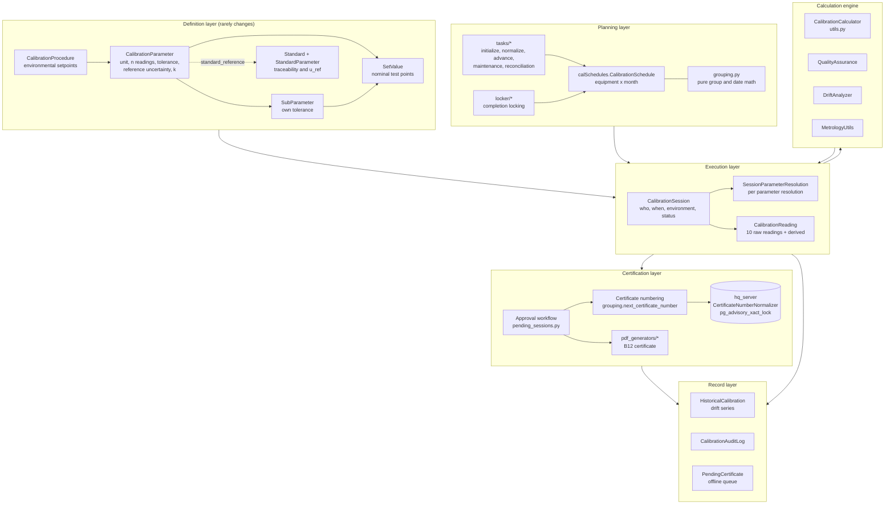

### 1.3.1 Layer responsibilities

| Layer | Files | Responsibility | Mutability |
|---|---|---|---|
| Definition | `CalSoft/models.py` classes `CalibrationProcedure`, `CalibrationParameter`, `SubParameter`, `SetValue`, `Standard`, `StandardParameter` | Declares what a calibration of a given equipment class consists of | Changed only by a procedure author, versioned by cloning |
| Planning | `calSchedules/` entire app | Decides which equipment is due in which month, and in what groups | Changed continuously by background tasks |
| Execution | `CalibrationSession`, `SessionParameterResolution`, `CalibrationReading` | Captures one physical calibration event | Append only in practice; readings are not edited after submission |
| Engine | `CalSoft/utils.py` | Pure computation, no database writes of its own | Stateless |
| Certification | `CalSoft/view_modules/pending_sessions.py`, `certificates.py`, `CalSoft/pdf_generators/` | Independent review, number allocation, document rendering | Status transitions only |
| Record | `HistoricalCalibration`, `CalibrationAuditLog`, `PendingCertificate` | Long term evidence and drift series | Append only |

### 1.3.2 Why the calculation engine is a separate stateless class

`CalibrationCalculator` in `CalSoft/utils.py` takes numbers and returns numbers. It performs no queries and holds no session state beyond the single boolean `reference_is_expanded`. Three benefits follow. The engine is unit testable without a database. The same engine can be invoked from a model method, from a view, and from a JSON API endpoint without duplication. And an auditor can be handed a single file of roughly two hundred lines and told, truthfully, that this is where all the arithmetic lives.

## 1.4 Data flow

The following two diagrams trace one measured point from the technologist's fingertips to the certificate. The first covers capture, the second covers reduction and judgement.

**Figure 1.2a. Capture of one measured point.**


**Figure 1.2b. Reduction of that point to a verdict and an uncertainty.**

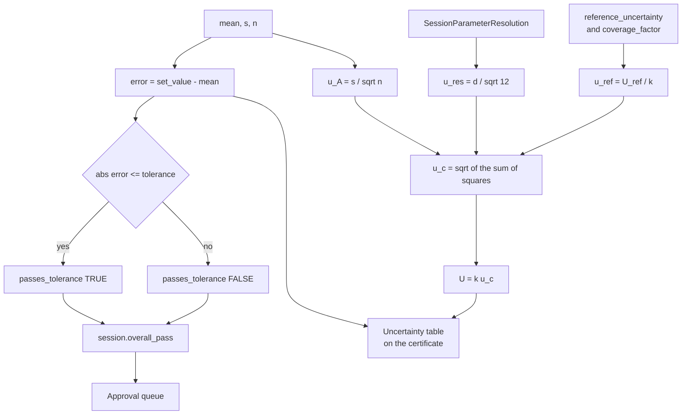

## 1.5 Module interactions

| From | To | Mechanism | Purpose |
|---|---|---|---|
| `calSchedules` | `CalSoft` | Foreign key `CalibrationSession.schedule` | Ties a physical event to its planned slot |
| `CalSoft` | `calSchedules` | `_mark_schedule_for_session_approval` in `pending_sessions.py` | Advances the schedule state machine when a session is approved or rejected |
| `CalSoft.models` | `calSchedules.grouping` | Local import inside `generate_certificate_number` | Reuses the pure numbering function without a circular import |
| `CalSoft` | `Inventory` | `Equipment`, `Department`, `Manufacturer`, `EquipmentDescription` | Identity of the device under test and the grouping keys used by the planner |
| `CalSoft` | `workshop` | `Workshop` | Ownership and access control scope |
| Site instance | `hq_server` | HTTP health probe plus the sync agent | Certificate number authority when online |

**Implementation note on the circular import.** `calSchedules.models` imports `CalSoft.models.CalibrationProcedure` at module scope. `CalSoft.models.CalibrationSession.generate_certificate_number` therefore imports `calSchedules.grouping` lazily, inside the method body, with an explanatory comment. This is deliberate and must be preserved. Moving that import to the top of `CalSoft/models.py` will break application startup.

## 1.6 A note on the two schedule models

There are two classes named `CalibrationSchedule` in this codebase: one in `CalSoft/models.py` and one in `calSchedules/models.py`. They are not the same model and they do not share a table.

| | `CalSoft.CalibrationSchedule` | `calSchedules.CalibrationSchedule` |
|---|---|---|
| Related name on Equipment | `calsoft_schedules` | `calschedules_schedules` |
| Status vocabulary | pending, completed, pushed, in_progress | pending, pushed, in_progress, pending_approval, completed, overdue |
| Generation tracking | absent | `generation_source`, `parent_schedule`, `is_locked`, `expected_calibration_date` |
| State transition validation | none | enforced in `save()` |
| Used by the live workflow | no | yes |

The live calibration workflow in `CalSoft/view_modules/calibration.py` imports `from calSchedules.models import CalibrationSchedule`. The `CalSoft` copy is legacy. New code must not use it. This is recorded here because an auditor tracing a foreign key will otherwise reach the wrong table.

# Chapter 2. The Calibration Workflow

## 2.1 The workflow in full

The workflow is presented in two parts. Part 1 runs from the registration of a device to the storage of a completed session. Part 2 runs from independent review to the issue of a certificate and the opening of the next cycle.

**Figure 2.1a. Part 1, from registration to a stored session.**

```mermaid
flowchart TB
    A[Equipment registered<br/>in Inventory] --> B[Equipment mapped to a<br/>CalibrationProcedure]
    B --> C[Schedule generated<br/>initialize, normalize or advance]
    C --> D[Schedule becomes due<br/>status pending or pushed]
    D --> E[Technologist opens<br/>perform_calibration_global]
    E --> F[Procedure loaded via api_procedure<br/>parameters, set values, tolerances]
    F --> G[Environmental conditions<br/>entered: T, RH, p]
    G --> H[Resolution entered<br/>per parameter]
    H --> I[Readings entered,<br/>n per set value]
    I --> J{Client side validation<br/>all required fields present}
    J -->|no| I
    J -->|yes| K[POST submitted]
    K --> L[CalibrationSession created<br/>status pending_review]
    L --> M[SessionParameterResolution rows]
    M --> N[CalibrationReading rows]
    N --> O[Calculation engine]
    O --> P[Error computed]
    P --> Q[Tolerance evaluated]
    Q --> R[overall_pass set<br/>on the session]
    R --> S[HistoricalCalibration<br/>rows written]
    S --> T[Audit log entry<br/>complete_calibration]
    T --> U[Schedule status<br/>pending_approval]
```

**Figure 2.1b. Part 2, from review to certification and the next cycle.**

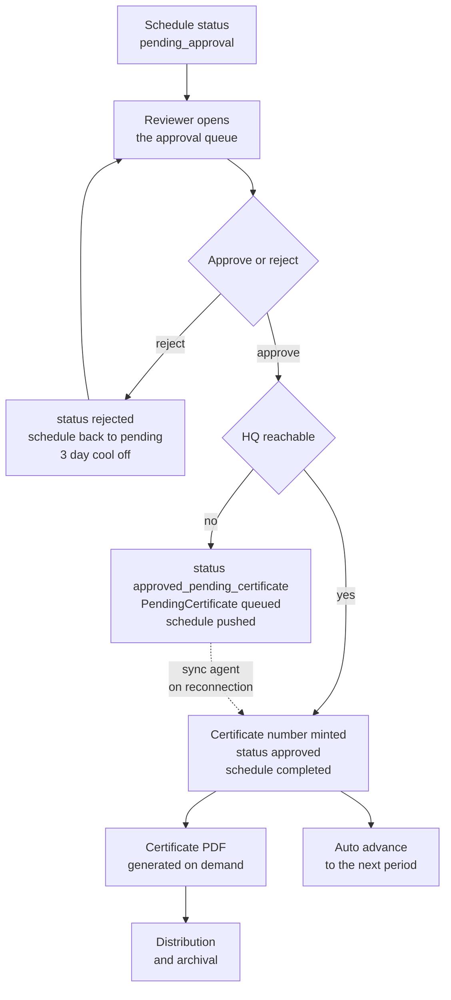

## 2.2 Step 1: Equipment registration

Equipment is registered in the `Inventory` application. Three attributes of the registration are load bearing for calibration.

`serial_number` is the identity used to link a session back to a physical device. It is denormalised onto `CalibrationSession.device_serial` as a plain character field at session creation time. This denormalisation is deliberate: a certificate must remain readable and meaningful even if the equipment record is later deleted or re-keyed. `HistoricalCalibration` likewise keys on `device_serial` rather than on a foreign key, so that a drift series survives inventory churn.

`description` is a foreign key to `EquipmentDescription`. It is the equipment class, for example "Infusion Pump" or "Patient Monitor". It carries two responsibilities: it is one of the two possible grouping keys for the scheduler, and it is the key used to recommend procedures. In `_handle_calibration_get` the system finds every previously approved session performed on equipment with the same description, collects the procedures used, and presents those as recommended. The mechanism is a learned association rather than a declared one.

`department` is a foreign key to `Department`, which in turn belongs to a `Workshop`. It is the other possible grouping key, and it determines who can see the resulting certificate.

## 2.3 Step 2: Reference standard selection

Traceability is declared on `CalibrationParameter` in two fields that must be understood together.

`standard_reference` is a free text character field holding the serial number of the reference standard. It is not a foreign key. `CalibrationProcedure.get_standards_used` resolves it by querying `Standard.objects.get(serial_number=param.standard_reference)` and logs a warning when no match is found.

`reference_uncertainty` is a decimal field whose help text reads `k=2`. It is the expanded uncertainty of the reference standard, quoted at a coverage factor of two, expressed in the same unit as the parameter.

**Implementation note on the loose coupling.** Because `standard_reference` is a string rather than a foreign key, four consequences follow and must be managed procedurally rather than by the database.

1. A procedure can name a standard that does not exist. The failure is silent at procedure authoring time and appears only as a missing row in the "Standards Used" table of the certificate.
2. Deleting or renumbering a `Standard` record does not cascade. Historical procedures continue to name the old serial number.
3. The uncertainty actually used in the calculation is the copy stored on `CalibrationParameter.reference_uncertainty`, not the value stored on `StandardParameter.uncertainty`. If a reference standard is recalibrated and its uncertainty changes, procedures do not update themselves. `get_parameters_with_standards` will report the `StandardParameter` value for display purposes while the engine continues to use the `CalibrationParameter` value for arithmetic. These two numbers can disagree.
4. The system does not verify that `Standard.calibration_due_date` is in the future at the moment a calibration is performed. A calibration performed against an out of calibration reference standard will be accepted and certified.

Item 4 is the most serious of the four from an ISO/IEC 17025 standpoint and is discussed again in Chapter 12 and Chapter 17.

## 2.4 Step 3: Calibration point generation

Calibration points are not generated algorithmically. They are declared, as `SetValue` rows, by the procedure author. A `SetValue` carries a `value` (the nominal quantity the reference will be commanded to produce), an `order` (display sequence), a mandatory foreign key to `CalibrationParameter`, and an optional foreign key to `SubParameter`.

The optional sub-parameter link creates two distinct topologies within a single parameter.

**Flat topology.** The parameter has no sub-parameters. Set values are attached with `sub_parameter = NULL`. Example: a temperature parameter with set values 25, 37 and 42 degrees Celsius.

**Nested topology.** The parameter has sub-parameters, each with its own tolerance, and each set value is attached to exactly one of them. The canonical example, visible in the model docstring, is non invasive blood pressure, where the parameter is "NIBP" in millimetres of mercury and the sub-parameters are "Systolic" and "Diastolic". Systolic carries set values 80, 120 and 200; diastolic carries 40, 80 and 120; and each sub-parameter may carry a different tolerance because clinical requirements on the two are not identical.

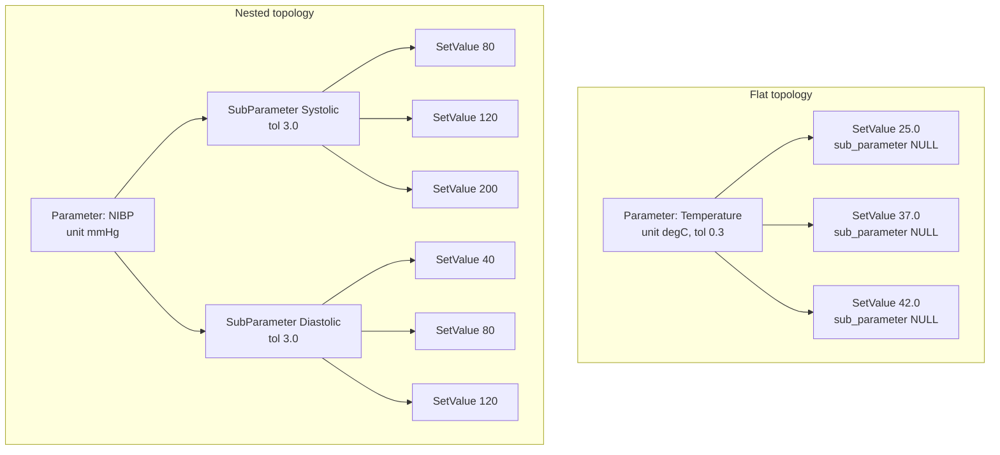

The uniqueness constraint on `CalibrationReading` is `['session', 'parameter', 'sub_parameter', 'set_value']`. This is what makes the two topologies coexist safely: in the flat case `sub_parameter` is NULL and the triple is sufficient; in the nested case the sub-parameter discriminates.

**Point selection guidance.** The system does not enforce how many points a procedure should have or where they should lie, but `CalibrationValidator.validate_procedure` emits a warning below three set values, on the grounds that linearity cannot be assessed from two points, and a further warning when the span of the set values is less than ten times the tolerance, on the grounds that a range that narrow cannot distinguish a gain error from an offset error. Both warnings are advisory and neither blocks saving.

## 2.5 Step 4: Measurement collection

The measurement screen is generated client side by `static/calibrition/calibration-perform.js` from the JSON returned by `api_procedure` and `api_set_values`.

Three input classes appear on the form.

**Environmental conditions.** Temperature, relative humidity and atmospheric pressure. All three are required by the client validator. They are compared against the procedure's nominal conditions after submission.

**Resolution, one per parameter.** The field is labelled "Resolution for {parameter}" with the help text "Enter the smallest unit the equipment can read for this parameter". It is validated client side as strictly positive. On entry, `updateReadingSteps` rewrites the HTML `step` attribute of every reading input for that parameter to the entered resolution, so the browser's numeric stepper snaps to physically achievable values. This is a small but genuinely useful piece of engineering: it makes it mechanically awkward to type a reading finer than the instrument can display.

**Readings.** The input name encodes the full addressing tuple:

```
reading_{parameter_id}_{sub_parameter_id_or_null}_{set_value_id}_{index}
```

Server side, `_process_readings` splits this on underscore and takes the first five fields. UUIDs contain hyphens rather than underscores, so the split is unambiguous.

**Divergence: the no set value fallback.** When a parameter has no set values at all, the JavaScript emits the name `reading_{param_id}_null_{i}`, which has only four underscore separated fields. The server requires `len(parts) >= 5` and therefore silently discards these readings. The server separately synthesises a placeholder set value object with `value = Decimal('0')` and `id = 'default'`, whose reading key can never match anything the client sent. The net effect is that a parameter with no set values produces no readings, and because `_process_readings` sets `overall_pass = False` whenever a point yields no readings, the session fails. A procedure must have at least one set value per parameter. `CalibrationValidator.validate_procedure` flags this as an error, but that validator is not invoked on the submission path.

### 2.5.1 Client side pre submission validation

`checkAllRequiredFields` in the JavaScript enforces, and disables the submit button until satisfied:

1. A procedure is selected.
2. Temperature, humidity and pressure are present and numeric.
3. Every resolution input is present, numeric and strictly greater than zero.
4. For every parameter, for every row, the first `required_readings` columns are all present and numeric. Partial rows are rejected outright rather than accepted with fewer readings.
5. At least one parameter section has loaded.

This is a usability control, not a security control. It runs in the browser and can be bypassed. The server side consequences of bypassing it are covered in Chapter 11.

## 2.6 Step 5: The calculation engine

The engine is invoked once per `CalibrationReading` row. Chapter 7 derives every equation; Chapter 11 documents the algorithm and its edge cases. In outline the engine performs, in this order:

1. Collect non null readings.
2. Require at least two. Compute the arithmetic mean and the sample standard deviation with Bessel's correction.
3. Compute the error against the nominal set value.
4. Retrieve the resolution recorded for this parameter in this session.
5. Compute the Type A standard uncertainty as the standard deviation of the mean.
6. Compute the Type B standard uncertainty due to resolution using the rectangular distribution.
7. Convert the reference standard's expanded uncertainty to a standard uncertainty by dividing by the coverage factor.
8. Combine the three components in quadrature.
9. Expand the combined uncertainty by the coverage factor.
10. Compare the absolute error against the applicable tolerance.
11. Round every stored result to six decimal places, half up.

## 2.7 Step 6 to Step 8: Error, tolerance and the pass or fail decision

The error of a single calibration point is computed in `CalSoft/models.py` as:

```python
self.error = (self.set_value.value - self.mean)
```

The tolerance applied is selected by a two level lookup which prefers the more specific declaration:

```python
tolerance = self.sub_parameter.tolerance if self.sub_parameter else self.parameter.tolerance
```

and the decision is:

```python
self.passes_tolerance = calculator.check_tolerance(self.error, tolerance)
# abs(Decimal(error)) <= Decimal(tolerance)
```

The session level verdict is a logical conjunction over every point. In `_process_readings`, `overall_pass` starts True and is set False by any point that fails and by any point for which no readings were supplied. One failed point fails the whole session. There is no partial credit, no weighting by parameter importance, and no automatic waiver.

**Divergence: two error sign conventions coexist.**

| Location | Formula | Sign for a reading below nominal |
|---|---|---|
| `CalSoft/models.py` `calculate_statistics` | `error = set_value - mean` | positive |
| `templates/Calibrition/calibration_page.html` client preview | `error = mean - setValue` | negative |

The conventional metrological definition of error is *indication minus reference*, which is the client side form. The backend is inverted relative to that convention. Because the pass or fail test takes an absolute value, the verdict is unaffected. Three things are affected: the sign printed in the Error column of the certificate, the sign of the drift slope computed by `DriftAnalyzer` from the stored errors, and the interpretation a reader places on the number. A reader who assumes the standard convention will conclude that an instrument reading low is reading high. This is discussed further in Chapter 6, section 6.9.

## 2.8 Step 9: Certificate generation

Certificate generation is split into number allocation, which happens exactly once at approval, and document rendering, which happens on demand and may happen many times.

Number allocation is described in Chapter 12, section 12.4. Document rendering is performed by `BtwelveHospitalCertificateGenerator`, a class composed from eight mixins, one per concern:

| Mixin | File | Contribution |
|---|---|---|
| `StylesMixin` | `styles.py` | ReportLab paragraph and table styles |
| `HeaderMixin` | `header.py` | Institutional header block |
| `SectionsMixin` | `sections.py` | Device identity, environment, due date, standards used |
| `ResultsMixin` | `results.py` | Results table and uncertainty budget table |
| `AnalysisMixin` | `analysis.py` | Linearity chart via matplotlib, failure analysis |
| `DriftMixin` | `drift.py` | Historical drift section |
| `QrMixin` | `qr.py` | Verification QR code |
| `SignatureMixin` | `signature_section.py` | Performed by, reviewed by, approved by blocks |

Two document variants exist. An approved session yields a certificate carrying a `BNH-nnnn` certificate number. A rejected session yields a document explicitly marked as declined, carrying a reference number of the form `DECLINED-{pk}` and never a certificate number. The constructor sets `self.certificate_number = None` for the declined variant. This distinction matters: a declined document is evidence that a calibration was attempted and refused, and it must not be capable of being mistaken for a certificate.

## 2.9 Step 10: Database storage

At the close of a successful submission the following rows exist:

| Table | Rows | Content |
|---|---|---|
| `CalibrationSession` | 1 | Who, when, which procedure, which device, environment, verdict, status |
| `SessionParameterResolution` | one per parameter | The resolution used for that parameter in this session |
| `CalibrationReading` | one per (parameter, sub-parameter, set value) | Up to ten raw readings plus every derived quantity |
| `HistoricalCalibration` | one per reading with a non null mean | Denormalised drift series row |
| `CalibrationAuditLog` | 1 | `complete_calibration` action |

`HistoricalCalibration` deserves comment. It duplicates data already present in `CalibrationReading`, deliberately. It is keyed on `device_serial` and `parameter_name` as plain strings, and it is indexed on `['device_serial', 'parameter_name', 'sub_parameter_name']` and on `['calibration_date']`. The purpose is to make a multi year drift query for one instrument a single indexed scan rather than a join across sessions, procedures and parameters. The cost is that a renamed parameter breaks the series continuity.

## 2.10 Step 11: Audit logging

`CalibrationAuditLog` records `user`, `action`, `description`, `timestamp`, and optional foreign keys to `schedule`, `equipment` and `session`. The actions written by the calibration path are `complete_calibration` and `complete_schedule`.

**Divergence: audit coverage is partial.** The approval and rejection paths in `pending_sessions.py` write to the Python logger but do not create `CalibrationAuditLog` rows. The evidence that a session was approved is therefore carried by the session's own `approved_by` and `approved_at` fields rather than by the audit table. Those fields are mutable in principle and are cleared by `restore_rejected_session`. An auditor asking "who approved this and when, and has that record ever been altered" cannot be answered from the audit log alone. This is a gap and is listed in Chapter 17.

## 2.11 Workflow state machines

### 2.11.1 Session status

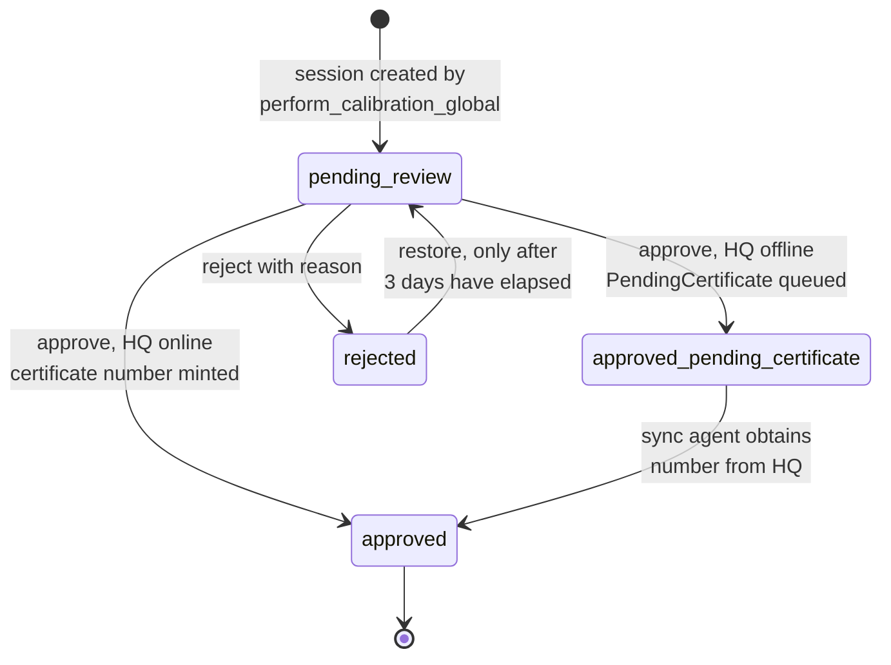

The three day delay before a rejected session may be restored is enforced in `restore_rejected_session`. Its purpose is to prevent a reviewer from rejecting and immediately un-rejecting a session as a way of clearing the queue, and to force the rejection to be visible in the declined tab for long enough to be noticed.

### 2.11.2 Schedule status

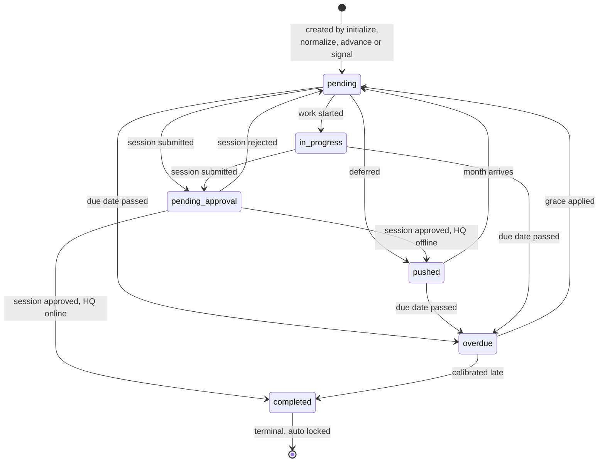

The transition guards are enforced in `calSchedules.models.CalibrationSchedule.save` and raise `ValidationError`:

1. `completed` is terminal. Any transition away from it is refused with the message that completed schedules are locked historical records.
2. `overdue` may only be entered from `pending`, `pushed` or `in_progress`.
3. `overdue` may only be left toward `pending`, `pushed`, `in_progress` or `completed`.
4. `pushed` may not be entered from `completed`.

Entering `completed` also sets `is_locked = True` automatically.

# Chapter 3. Mathematical Foundations

This chapter establishes every mathematical object the module uses, in the order in which the module uses it. Each equation is given a purpose, a full variable table with units, a physical interpretation, a derivation, a worked numerical example, and an explicit statement of what alternative was rejected and why.

## 3.0 The reference dataset

To keep the numbers comparable across eighteen chapters, two datasets are used throughout. They are defined once, here.

**Dataset A: non invasive blood pressure, systolic sub-parameter.**

| Quantity | Symbol | Value | Unit |
|---|---|---|---|
| Nominal set value | x_s | 120 | mmHg |
| Readings | x_1 to x_5 | 118, 119, 119, 118, 119 | mmHg |
| Number of readings | n | 5 | count |
| Instrument resolution | d | 1 | mmHg |
| Tolerance | T | 3 | mmHg |
| Reference expanded uncertainty | U_ref | 0.50 | mmHg |
| Coverage factor of the reference | k_ref | 2 | dimensionless |
| Coverage factor for reporting | k | 2 | dimensionless |

**Dataset B: patient temperature.**

| Quantity | Symbol | Value | Unit |
|---|---|---|---|
| Nominal set value | x_s | 37.00 | degC |
| Readings | x_1 to x_6 | 37.1, 37.2, 37.1, 37.3, 37.2, 37.1 | degC |
| Number of readings | n | 6 | count |
| Instrument resolution | d | 0.1 | degC |
| Tolerance | T | 0.3 | degC |
| Reference expanded uncertainty | U_ref | 0.06 | degC |
| Coverage factor of the reference | k_ref | 2 | dimensionless |
| Coverage factor for reporting | k | 2 | dimensionless |

## 3.1 The arithmetic mean

### 3.1.1 Equation

$$\bar{x} = \frac{1}{n}\sum_{i=1}^{n} x_i$$

### 3.1.2 Purpose

To produce a single best estimate of the quantity the instrument indicates when commanded to a given nominal value, from n repeated observations that will not agree exactly with one another.

### 3.1.3 Variables

| Symbol | Meaning | Unit | Source in code |
|---|---|---|---|
| x_i | the i-th individual reading | unit of the parameter | `CalibrationReading.reading_1` to `reading_10` |
| n | count of non null readings | dimensionless | `len(get_readings_list())` |
| x̄ | arithmetic mean of the readings | unit of the parameter | `CalibrationReading.mean` |

### 3.1.4 Physical meaning

Each reading is the sum of the true indication of the instrument at that operating point plus a random perturbation contributed by electrical noise, mechanical hysteresis, air currents, operator judgement, and the finite resolution of the display. The perturbations are assumed to have zero mean. Averaging them therefore suppresses their contribution while leaving the true indication untouched.

### 3.1.5 Derivation of why the mean is the right estimator

Model each reading as

$$x_i = \mu + \varepsilon_i$$

where μ is the fixed true indication and ε_i are independent random perturbations with expectation zero and common variance σ². Consider the general class of linear estimators

$$\hat{\mu} = \sum_{i=1}^{n} w_i x_i \quad \text{subject to} \quad \sum_{i=1}^{n} w_i = 1$$

The constraint on the weights is what makes the estimator unbiased, since

$$E[\hat{\mu}] = \sum w_i E[x_i] = \mu \sum w_i = \mu$$

The variance of the estimator is

$$\operatorname{Var}(\hat{\mu}) = \sum_{i=1}^{n} w_i^2 \sigma^2 = \sigma^2 \sum_{i=1}^{n} w_i^2$$

We minimise Σw_i² subject to Σw_i = 1. Using a Lagrange multiplier λ,

$$L = \sum w_i^2 - \lambda\left(\sum w_i - 1\right)$$

$$\frac{\partial L}{\partial w_j} = 2 w_j - \lambda = 0 \implies w_j = \frac{\lambda}{2}$$

Every weight is therefore the same constant, and the constraint Σw_i = 1 forces that constant to be 1/n. The arithmetic mean is the minimum variance unbiased linear estimator of μ. This is why the code averages rather than taking a median, a mid range, or a trimmed mean.

### 3.1.6 Worked example, Dataset A

$$\bar{x} = \frac{118 + 119 + 119 + 118 + 119}{5} = \frac{593}{5} = 118.6\ \text{mmHg}$$

### 3.1.7 Worked example, Dataset B

$$\bar{x} = \frac{37.1 + 37.2 + 37.1 + 37.3 + 37.2 + 37.1}{6} = \frac{223.0}{6} = 37.166667\ \text{degC}$$

### 3.1.8 Why not the median

The median is more robust against a single wild reading, and the module does use a median internally, but only inside the outlier detector in `QualityAssurance.validate_readings`. It is not used as the estimate of the indication, for three reasons. First, the median discards information: with five readings it uses effectively one of them, so its variance is roughly π/2 times larger than that of the mean for normally distributed data, which inflates every downstream uncertainty. Second, the Type A uncertainty formula s/√n is defined for the mean and would need replacement. Third, a median of an even number of readings requires a tie breaking convention, which would need to be documented and defended. The chosen design is to compute the mean and to flag outliers separately, so that a contaminated dataset is reported as contaminated rather than silently repaired.

## 3.2 Sample variance and sample standard deviation

### 3.2.1 Equations

$$s^2 = \frac{1}{n-1}\sum_{i=1}^{n}\left(x_i - \bar{x}\right)^2 \qquad s = \sqrt{s^2}$$

### 3.2.2 Purpose

To quantify the dispersion of the individual readings about their own mean, which is the observable manifestation of the instrument's repeatability under the conditions of the measurement.

### 3.2.3 Variables

| Symbol | Meaning | Unit | Source in code |
|---|---|---|---|
| s² | sample variance | (unit of parameter)² | local `variance` in `calculate_statistics` |
| s | sample standard deviation | unit of the parameter | `CalibrationReading.standard_deviation` |
| n − 1 | degrees of freedom | dimensionless | `Decimal(n - 1)` |

### 3.2.4 Derivation of Bessel's correction

The natural first guess for a variance estimator divides by n:

$$\tilde{s}^2 = \frac{1}{n}\sum_{i=1}^{n}(x_i - \bar{x})^2$$

We show this is biased low, and by exactly the factor (n−1)/n.

Begin by writing the deviation from the mean in terms of the deviation from the true value μ:

$$x_i - \bar{x} = (x_i - \mu) - (\bar{x} - \mu)$$

Square and sum over i:

$$\sum_{i=1}^{n}(x_i - \bar{x})^2 = \sum_{i=1}^{n}(x_i - \mu)^2 - 2(\bar{x}-\mu)\sum_{i=1}^{n}(x_i - \mu) + n(\bar{x}-\mu)^2$$

Note that

$$\sum_{i=1}^{n}(x_i - \mu) = n\bar{x} - n\mu = n(\bar{x} - \mu)$$

so the middle term equals −2n(x̄−μ)², and

$$\sum_{i=1}^{n}(x_i - \bar{x})^2 = \sum_{i=1}^{n}(x_i - \mu)^2 - n(\bar{x}-\mu)^2$$

This is an exact algebraic identity, not an approximation. It says that the sum of squares about the sample mean is always smaller than the sum of squares about the true mean, by exactly n times the squared error of the mean. The sample mean is, by construction, the point that minimises the sum of squared deviations, so it hugs the data more closely than the true mean does.

Now take expectations. By definition E[(x_i − μ)²] = σ², so the first term has expectation nσ². For the second term we need the variance of the mean:

$$\operatorname{Var}(\bar{x}) = \operatorname{Var}\left(\frac{1}{n}\sum x_i\right) = \frac{1}{n^2}\sum \operatorname{Var}(x_i) = \frac{n\sigma^2}{n^2} = \frac{\sigma^2}{n}$$

where independence was used to drop the covariance terms. Therefore E[(x̄ − μ)²] = σ²/n and

$$E\left[\sum_{i=1}^{n}(x_i - \bar{x})^2\right] = n\sigma^2 - n \cdot \frac{\sigma^2}{n} = (n-1)\sigma^2$$

Dividing by n would give an expectation of (n−1)σ²/n, which is too small. Dividing by n−1 gives exactly σ². Hence the divisor n−1.

The intuition behind the loss of one degree of freedom is that the n deviations (x_i − x̄) are not free: they must sum to zero. Knowing any n−1 of them determines the last. Only n−1 independent pieces of information about dispersion remain in the sample once the mean has been estimated from it.

The practical size of the correction is not negligible at the sample sizes this module uses. At n = 3 the uncorrected estimator understates the variance by 33 percent. At n = 5, by 20 percent. At n = 10, by 10 percent. Since the variance feeds the Type A uncertainty and hence the expanded uncertainty printed on the certificate, using the wrong divisor would systematically understate the declared uncertainty of every calibration this laboratory issues.

### 3.2.5 Worked example, Dataset A

| i | x_i | x_i − x̄ | (x_i − x̄)² |
|---|---|---|---|
| 1 | 118 | −0.6 | 0.36 |
| 2 | 119 | +0.4 | 0.16 |
| 3 | 119 | +0.4 | 0.16 |
| 4 | 118 | −0.6 | 0.36 |
| 5 | 119 | +0.4 | 0.16 |
| | | Sum 0.0 | Sum 1.20 |

The deviations sum to zero, which is the arithmetic check that the mean was computed correctly.

$$s^2 = \frac{1.20}{5-1} = \frac{1.20}{4} = 0.30\ \text{mmHg}^2$$

$$s = \sqrt{0.30} = 0.547723\ \text{mmHg}$$

Had the divisor been n, the result would have been s = 0.489898 mmHg, understating dispersion by 10.6 percent.

### 3.2.6 Worked example, Dataset B

| i | x_i | x_i − x̄ | (x_i − x̄)² |
|---|---|---|---|
| 1 | 37.1 | −0.066667 | 0.00444444 |
| 2 | 37.2 | +0.033333 | 0.00111111 |
| 3 | 37.1 | −0.066667 | 0.00444444 |
| 4 | 37.3 | +0.133333 | 0.01777778 |
| 5 | 37.2 | +0.033333 | 0.00111111 |
| 6 | 37.1 | −0.066667 | 0.00444444 |
| | | Sum 0.000000 | Sum 0.03333333 |

$$s^2 = \frac{0.03333333}{5} = 0.00666667\ \text{degC}^2 \qquad s = 0.0816497\ \text{degC}$$

### 3.2.7 Implementation detail

```python
mean = sum(readings) / Decimal(n)
variance = sum((r - mean) ** 2 for r in readings) / Decimal(n - 1)
std_dev = variance.sqrt()
```

The code uses the two pass definitional form rather than the algebraically equivalent one pass form Σx² − nx̄². The one pass form is faster but catastrophically cancels when the readings are large and closely spaced, which is precisely the regime a calibration operates in. Consider readings near 100000 differing in the sixth digit: the two sums are nearly equal and their difference loses most of its significant figures. The two pass form subtracts the mean first, so the squared quantities are small and well conditioned. Given that n is at most ten, the performance cost of the second pass is irrelevant and the numerical benefit is decisive.

`Decimal.sqrt()` is used rather than `math.sqrt()`, so the square root is taken in decimal arithmetic at the configured precision and never round trips through a binary float.

## 3.3 Standard deviation of the mean

### 3.3.1 Equation

$$s(\bar{x}) = \frac{s}{\sqrt{n}}$$

### 3.3.2 Purpose

The quantity carried forward into the uncertainty budget is not how much individual readings scatter. It is how well the average of n readings is known. These are different numbers and confusing them is the single most common error in bench level uncertainty work.

### 3.3.3 Derivation

From section 3.2.4 we already have the exact result for independent readings of common variance σ²:

$$\operatorname{Var}(\bar{x}) = \frac{\sigma^2}{n}$$

Taking the positive square root and replacing the unknown population σ by its sample estimate s:

$$s(\bar{x}) = \frac{s}{\sqrt{n}}$$

The independence assumption is essential and is not automatically satisfied at the bench. If the operator reads the same digit repeatedly because the display is not settling, or if a common drift affects all n readings, the readings are positively correlated and the true variance of the mean is larger than σ²/n. The formula then understates the uncertainty. Section 17.9 discusses how to recognise this at the bench.

### 3.3.4 Worked examples

Dataset A:

$$s(\bar{x}) = \frac{0.547723}{\sqrt{5}} = \frac{0.547723}{2.236068} = 0.244949\ \text{mmHg}$$

Dataset B:

$$s(\bar{x}) = \frac{0.0816497}{\sqrt{6}} = \frac{0.0816497}{2.449490} = 0.0333333\ \text{degC}$$

### 3.3.5 The √n law and its practical limit

The uncertainty of the mean falls as the reciprocal square root of the number of readings. To halve it, four times as many readings are required. To reduce it by a factor of ten, one hundred times as many. This is why `CalibrationParameter.num_readings` is bounded above at twenty by a `MaxValueValidator`: beyond that point the marginal reduction in Type A uncertainty does not justify the bench time, and the total uncertainty is in any case floored by the Type B components, which do not fall at all with repetition. Chapter 7, section 7.9 quantifies exactly where that floor sits for the two datasets.

The lower bound of three, enforced by `MinValueValidator(3)` on the model and by `clean_num_readings` on the form, exists because at n = 2 the sample standard deviation has one degree of freedom and is a wildly unstable estimate of σ. Its own relative uncertainty is about 76 percent at one degree of freedom, falling to 52 percent at two and 42 percent at three.

## 3.4 Error

### 3.4.1 Equation as implemented

$$e = x_s - \bar{x}$$

### 3.4.2 Purpose

To express, in a single signed number in the unit of the measurand, the degree to which the instrument misrepresents the quantity presented to it.

### 3.4.3 Variables

| Symbol | Meaning | Unit | Source in code |
|---|---|---|---|
| x_s | nominal set value applied by the reference | unit of the parameter | `SetValue.value` |
| x̄ | mean indication of the UUT | unit of the parameter | `CalibrationReading.mean` |
| e | error of indication as stored | unit of the parameter | `CalibrationReading.error` |

### 3.4.4 Interpretation and the sign convention question

Under the implemented convention a positive error means the instrument indicated **less** than the applied value, and a negative error means it indicated more. This is the reverse of the convention used by the VIM and by most calibration certificates, in which error is indication minus reference, so a positive error means the instrument reads high.

The full treatment of this divergence, including its effect on drift analysis, is given in Chapter 6, section 6.9. What matters at this point is only that a reader of a certificate produced by this system must know which convention is in force, and that Chapter 18 records the correction that should be applied to the certificate legend.

### 3.4.5 Worked examples

Dataset A: e = 120 − 118.6 = **+1.4 mmHg**. The instrument reads 1.4 mmHg low.

Dataset B: e = 37.00 − 37.166667 = **−0.166667 degC**. The instrument reads 0.166667 degC high.

## 3.5 Combination of uncertainties in quadrature

### 3.5.1 Equation

$$u_c = \sqrt{u_A^2 + u_{res}^2 + u_{ref}^2}$$

### 3.5.2 Derivation from the general law of propagation

Let a measurand y be a function of input quantities x_1 to x_N:

$$y = f(x_1, x_2, \ldots, x_N)$$

Expand f in a Taylor series about the expected values of the inputs and keep first order terms:

$$y - E[y] \approx \sum_{i=1}^{N} \frac{\partial f}{\partial x_i}\left(x_i - E[x_i]\right)$$

Square both sides and take expectations. Writing c_i for the sensitivity coefficient ∂f/∂x_i:

$$u_c^2(y) = \sum_{i=1}^{N} c_i^2 u^2(x_i) + 2\sum_{i=1}^{N-1}\sum_{j=i+1}^{N} c_i c_j u(x_i,x_j)$$

where u(x_i, x_j) is the covariance between inputs i and j. This is the general law of propagation of uncertainty.

Two simplifications are now applied, and both must be justified rather than assumed.

**Simplification 1: the inputs are uncorrelated.** The three components are the repeatability of the UUT, the finite resolution of the UUT's display, and the calibration uncertainty of an entirely separate reference instrument. There is no physical mechanism by which the reference laboratory's uncertainty could co-vary with this afternoon's electrical noise. The resolution interval is a fixed property of the display hardware. The covariance terms therefore vanish and the double sum disappears.

**Simplification 2: every sensitivity coefficient is unity.** The measurement model is a direct comparison in a single unit:

$$e = x_s - \bar{x} \quad\text{with}\quad x_s \text{ carrying } u_{ref} \text{ and } \bar{x} \text{ carrying } u_A \text{ and } u_{res}$$

so ∂e/∂x_s = +1 and ∂e/∂x̄ = −1. Since only the squares of the coefficients enter, both contribute with weight one. If the module ever acquired a parameter measured through a transducer with a scale factor, for example a pressure derived from a voltage, the sensitivity coefficients would no longer be unity and this simplification would fail. No such parameter exists in the current data model.

With both simplifications the general law collapses to

$$u_c^2 = u_A^2 + u_{res}^2 + u_{ref}^2$$

which is the implemented formula.

### 3.5.3 Why quadrature and not a linear sum

A linear sum, u_A + u_res + u_ref, would answer a different question: what is the largest error that could result if every component happened to reach its extreme in the same direction at the same instant. That is a worst case bound, and it is the correct thing to compute when the components are known to be perfectly correlated.

For independent components the linear sum is wildly pessimistic, because the probability that three independent quantities all take extreme values with matching signs is small. Quadrature is the statement that variances of independent random variables add, which is exact, not approximate. Its geometric interpretation is Pythagorean: the components are orthogonal vectors and the combined uncertainty is the length of their resultant.

For Dataset A the difference is material:

| Method | Result | Ratio to quadrature |
|---|---|---|
| Quadrature | 0.453688 mmHg | 1.000 |
| Linear sum | 0.783624 mmHg | 1.727 |

Reporting the linear sum would inflate the declared uncertainty by 73 percent, which would degrade the test uncertainty ratio and could cause instruments to be rejected that are in fact fit for use.

### 3.5.4 Worked example, Dataset A

| Component | Symbol | Value (mmHg) | Value squared (mmHg²) | Contribution to variance |
|---|---|---|---|---|
| Repeatability | u_A | 0.244949 | 0.060000 | 29.15 % |
| Resolution | u_res | 0.288675 | 0.083333 | 40.49 % |
| Reference standard | u_ref | 0.250000 | 0.062500 | 30.36 % |
| **Combined** | **u_c** | **0.453688** | **0.205833** | **100 %** |

Note that resolution is the largest single contributor. This is characteristic of coarse resolution instruments and is the quantitative justification for Chapters 4, 9 and 10 treating resolution at length.

### 3.5.5 Worked example, Dataset B

| Component | Symbol | Value (degC) | Value squared (degC²) | Contribution |
|---|---|---|---|---|
| Repeatability | u_A | 0.0333333 | 0.00111111 | 39.06 % |
| Resolution | u_res | 0.0288675 | 0.00083333 | 29.30 % |
| Reference standard | u_ref | 0.0300000 | 0.00090000 | 31.64 % |
| **Combined** | **u_c** | **0.0533333** | **0.00284444** | **100 %** |

## 3.6 Expansion by a coverage factor

$$U = k\,u_c$$

Derived and discussed fully in Chapter 7, section 7.6, and Chapter 8, section 8.4.

Dataset A: U = 2 × 0.453688 = **0.907376 mmHg**, reported as ±0.91 mmHg at k = 2.
Dataset B: U = 2 × 0.0533333 = **0.106667 degC**, reported as ±0.107 degC at k = 2.

## 3.7 Least squares straight line fit

### 3.7.1 Purpose

Two separate features use a straight line fit: linearity assessment across the set values of one parameter within one session, and drift assessment across time for one parameter across many sessions.

### 3.7.2 Equations

For data pairs (x_i, y_i), i = 1 to n, the fitted line y = ax + b has

$$a = \frac{n\sum x_i y_i - \sum x_i \sum y_i}{n\sum x_i^2 - \left(\sum x_i\right)^2} \qquad b = \frac{\sum y_i - a\sum x_i}{n}$$

### 3.7.3 Derivation

Minimise the sum of squared vertical residuals:

$$S(a,b) = \sum_{i=1}^{n}\left(y_i - a x_i - b\right)^2$$

Differentiate with respect to b and set to zero:

$$\frac{\partial S}{\partial b} = -2\sum_{i=1}^{n}\left(y_i - a x_i - b\right) = 0 \implies \sum y_i = a\sum x_i + nb$$

Differentiate with respect to a and set to zero:

$$\frac{\partial S}{\partial a} = -2\sum_{i=1}^{n} x_i\left(y_i - a x_i - b\right) = 0 \implies \sum x_i y_i = a\sum x_i^2 + b\sum x_i$$

These are the two normal equations. From the first, b = (Σy − aΣx)/n. Substituting into the second:

$$\sum x_i y_i = a\sum x_i^2 + \frac{\left(\sum y_i - a\sum x_i\right)\sum x_i}{n}$$

Multiply through by n and collect the terms in a:

$$n\sum x_i y_i = a\,n\sum x_i^2 + \sum x_i\sum y_i - a\left(\sum x_i\right)^2$$

$$a\left[n\sum x_i^2 - \left(\sum x_i\right)^2\right] = n\sum x_i y_i - \sum x_i \sum y_i$$

which gives the stated result for a, and b follows by back substitution.

The denominator n·Σx² − (Σx)² equals n²·Var(x) and vanishes only when every x_i is identical. Both call sites guard against this: `calculate_linearity` requires at least two distinct points, and `DriftAnalyzer._calculate_drift_metrics` tests `if denominator != 0` and falls back to a zero slope with the mean as intercept.

### 3.7.4 Linearity error

Having fitted the line, the linearity error at each point is the residual, and the reported figure is the largest residual by absolute value, optionally expressed as a percentage of full scale:

$$\delta_i = y_i - (a x_i + b) \qquad \delta_i^{\%} = \frac{\delta_i}{\text{FS}} \times 100$$

where full scale defaults to max(x) − min(x) when not supplied explicitly. This is the "best straight line" definition of linearity. Its distinguishing property is that both the gain and the offset of the fitted line are free parameters, so a perfectly linear instrument with a wrong gain and a wrong offset registers zero linearity error. Linearity in this sense measures curvature and irregularity only, which is exactly the intent: gain and offset errors are already captured, point by point, by the error and tolerance machinery.

### 3.7.5 Worked example of a linearity fit

Take a temperature parameter calibrated at three points, with means as shown.

| Point | x_i (set, degC) | y_i (mean, degC) | x_i y_i | x_i² |
|---|---|---|---|---|
| 1 | 25.0 | 25.10 | 627.50 | 625.00 |
| 2 | 37.0 | 37.17 | 1375.29 | 1369.00 |
| 3 | 42.0 | 42.19 | 1771.98 | 1764.00 |
| Sum | 104.0 | 104.46 | 3774.77 | 3758.00 |

$$a = \frac{3(3774.77) - (104.0)(104.46)}{3(3758.00) - (104.0)^2} = \frac{11324.31 - 10863.84}{11274.00 - 10816.00} = \frac{460.47}{458.00} = 1.005393$$

$$b = \frac{104.46 - 1.005393 \times 104.0}{3} = \frac{104.46 - 104.560872}{3} = \frac{-0.100872}{3} = -0.033624$$

Residuals:

| Point | Fitted value a·x + b | Residual δ_i |
|---|---|---|
| 1 | 1.005393(25.0) − 0.033624 = 25.101201 | −0.001201 |
| 2 | 1.005393(37.0) − 0.033624 = 37.165917 | +0.004083 |
| 3 | 1.005393(42.0) − 0.033624 = 42.192882 | −0.002882 |

Maximum linearity error is +0.004083 degC. With full scale taken as 42.0 − 25.0 = 17.0 degC, that is 0.024 percent of full scale. The residuals sum to zero to rounding, which is the arithmetic check on the fit.

Interpretation: the instrument has a gain error of +0.54 percent and an offset of −0.034 degC, but its response is essentially a straight line. The correct engineering conclusion is that the device is a candidate for adjustment rather than for replacement, because a linear device with a gain error can be trimmed.

### 3.7.6 Divergence: the linearity call site is defective

`CalibrationCalculator.calculate_linearity` is defined as an instance method with signature `(self, set_values, measured_values, full_scale=None, return_percent=True)`. In `ReportGenerator.generate_certificate` it is invoked as

```python
linearity = CalibrationCalculator.calculate_linearity(set_values, errors)
```

on the class rather than on an instance. Python binds `set_values` to the `self` parameter and `errors` to `set_values`, leaving `measured_values` unfilled, and raises `TypeError`. The call is not wrapped in a try block, so `generate_certificate` fails outright if any parameter has three or more readings.

A second defect is present in the same call even after the binding is corrected: it passes `errors` where `measured_values` is expected, which would fit a line of error against set value rather than indication against set value. That is a legitimate analysis in its own right, but it is not linearity, and the returned quantity would be mislabelled.

`ReportGenerator.generate_certificate` is not reachable from the PDF certificate path, which uses `BtwelveHospitalCertificateGenerator` instead, so the defect does not currently affect issued certificates. It would affect any future HTML certificate feature.

A third call site, `_calculate_linearity_analysis` in `view_modules/sessions.py`, calls `TrendAnalysis.calculate_linear_regression`, a method that does not exist on `TrendAnalysis`. That call is wrapped in a bare `except Exception`, so the session detail page silently displays "Unable to calculate linearity" for every parameter rather than raising.

## 3.8 Modified Z score for outlier detection

### 3.8.1 Equation

$$M_i = \frac{0.6745\left(x_i - \tilde{x}\right)}{\text{MAD}} \qquad \text{MAD} = \operatorname{median}\left(\left|x_j - \tilde{x}\right|\right)$$

with x̃ the median of the readings. A reading is flagged when |M_i| > 3.5.

### 3.8.2 Derivation of the constant 0.6745

For a normally distributed variable with standard deviation σ, the median absolute deviation about the median satisfies

$$P\left(\left|X - \mu\right| \le \text{MAD}\right) = 0.5$$

Standardising, this requires

$$\Phi\left(\frac{\text{MAD}}{\sigma}\right) - \Phi\left(-\frac{\text{MAD}}{\sigma}\right) = 0.5 \implies 2\Phi\left(\frac{\text{MAD}}{\sigma}\right) - 1 = 0.5 \implies \Phi\left(\frac{\text{MAD}}{\sigma}\right) = 0.75$$

The 75th percentile of the standard normal distribution is z = 0.674490. Hence MAD = 0.6745 σ for normal data, and therefore

$$\hat{\sigma} = \frac{\text{MAD}}{0.6745}$$

Substituting this robust estimate of σ into the ordinary Z score (x_i − centre)/σ yields exactly the modified Z score formula. The constant is not arbitrary: it is the reciprocal of the normal consistency factor that makes the MAD an unbiased scale estimator for Gaussian data.

The threshold 3.5 follows Iglewicz and Hoaglin. For strictly normal data, |M| > 3.5 has a probability of roughly 0.05 percent per observation, so false alarms are rare.

### 3.8.3 Why a robust estimator rather than the ordinary Z score

The ordinary Z score divides by the sample standard deviation, which is itself inflated by the very outlier it is meant to detect. This is the masking problem. With five readings, a single gross outlier can inflate s enough that its own Z score stays below 3, so it hides itself. The median and the MAD both have a breakdown point of 50 percent, meaning up to half the data must be corrupted before the estimate is destroyed. With five readings, two wild values can be tolerated.

### 3.8.4 Implementation note

```python
median = sorted(readings)[len(readings)//2]
mad = sorted([abs(x - median) for x in readings])[len(readings)//2]
```

For odd n this is the exact median. For even n it takes the upper of the two central order statistics rather than their average. The resulting quasi median is a legitimate location estimator and the detector remains usable, but it is not the textbook median and results will differ marginally from a reference implementation for even n. The `if mad > 0` guard is essential and present: when more than half the readings are identical, which happens routinely on a coarse resolution display, the MAD is exactly zero and every Z score would be infinite. The guard suppresses outlier detection entirely in that case, which is the safe behaviour.

## 3.9 Summary of the mathematical pipeline

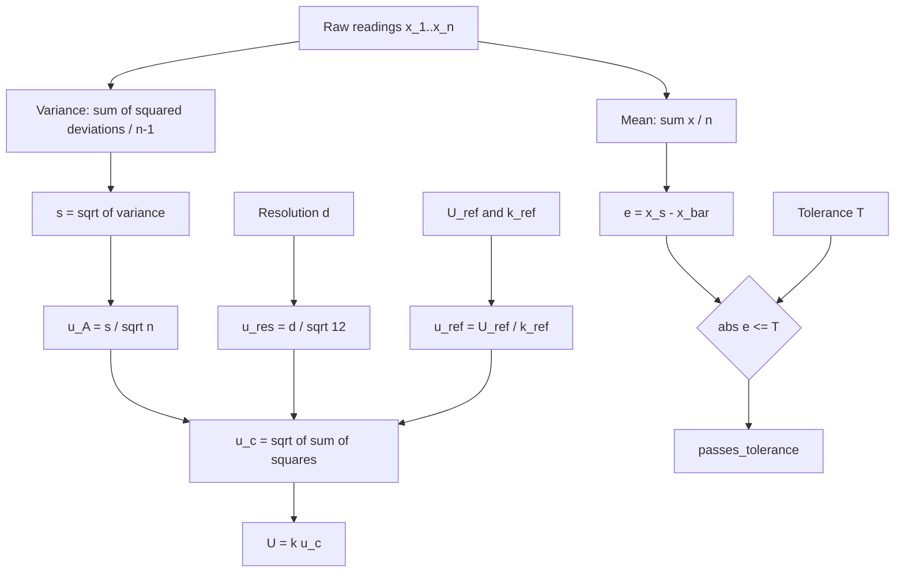

# Chapter 4. Resolution: Theory, Derivation and Consequences

## 4.1 What resolution is

Resolution is the smallest change in the measurand that produces a perceptible change in the instrument's indication. It is a property of the indicating device, not of the quantity being measured and not of the operator.

The module captures it per parameter per session, in `SessionParameterResolution`, with the field help text "Resolution for this parameter in this session" and the user facing help text "Enter the smallest unit the equipment can read for this parameter".

The decision to attach resolution to the session rather than to the procedure is correct and deserves explicit defence, because it is the opposite of the decision taken for tolerance. Tolerance is a requirement: it is what this class of device must achieve, and it is identical for every unit of that class. Resolution is a hardware fact: two infusion pumps of the same model may have different display firmware, and the same model calibrated on a different range setting will display a different number of digits. A procedure that hard coded resolution would be wrong for some of the instruments it governs. Recording it per session also means the certificate can state the resolution that actually applied on the day.

## 4.2 Why resolution matters

Resolution matters for three separate reasons, and conflating them causes confusion at the bench.

**It sets a floor on measurement uncertainty.** No amount of repetition can extract information the display never presented. This is derived in section 4.8 and quantified in section 4.9.

**It quantises the readings.** Every value in the dataset is an integer multiple of d. This makes the sample standard deviation itself quantised, and at coarse resolution it makes s equal to zero with high probability, which has consequences examined in section 4.10.

**It limits the meaningful precision of every derived quantity.** A mean of 118.6 computed from five readings of a display that shows whole millimetres of mercury is a meaningful number, because averaging genuinely does recover sub-division information when dither is present. A mean of 118.600000 is not: the trailing zeros are an artefact of the storage format, not a claim about the instrument.

## 4.3 Digital resolution

For a digital display the resolution is the value of one count of the least significant digit on the range in use.

$$d = \text{value of one least significant digit}$$

For an instrument whose display carries D digits after the decimal point, d = 10^(−D).

| Display | Digits after point | d |
|---|---|---|
| 118 mmHg | 0 | 1 mmHg |
| 37.2 degC | 1 | 0.1 degC |
| 4.9985 V | 4 | 0.0001 V |
| 000.00 kPa | 2 | 0.01 kPa |

For an instrument built on an analogue to digital converter of N bits spanning a full scale range FSR, the intrinsic quantisation step is

$$q = \frac{\text{FSR}}{2^N}$$

Note carefully that q is the converter's step and d is the display's step. These are frequently different, and it is d that the technologist must enter, because d is what limits the information the operator can actually read. A 16 bit converter spanning 0 to 5 volts has q = 76.3 microvolts, but if the front panel shows three decimal places then d = 1 millivolt and the extra converter resolution is invisible and unusable.

**Worked example.** A 12 bit converter spanning 0 to 10 volts:

$$q = \frac{10}{2^{12}} = \frac{10}{4096} = 0.00244\ \text{V} = 2.44\ \text{mV}$$

If the display shows two decimal places, d = 0.01 V, and 0.01 V is the value to enter, not 0.00244 V.

## 4.4 Analogue resolution and least count

An analogue instrument has no digits. Its resolution is set by the smallest scale division that a competent observer can reliably distinguish, which is called the least count.

$$\text{Least count} = \frac{\text{value of one major scale division}}{\text{number of subdivisions}}$$

**Worked example.** A mercury sphygmomanometer with major divisions every 10 mmHg and two subdivisions per major division:

$$\text{Least count} = \frac{10}{2} = 5\ \text{mmHg}$$

A trained observer can interpolate to a fraction of a division. Conventional practice permits interpolation to one half of the least count for a clear scale with a fine pointer, which would give an effective resolution of 2.5 mmHg for the instrument above. This interpolation must be a documented laboratory decision, not an individual operator's private judgement, because two operators using different interpolation conventions on the same instrument will produce uncertainty budgets that differ by a factor of two.

For a vernier instrument the least count is

$$\text{Least count} = \frac{\text{one main scale division}}{\text{number of vernier divisions}}$$

**Worked example.** Vernier callipers with a 1 mm main scale and a 50 division vernier:

$$\text{Least count} = \frac{1}{50} = 0.02\ \text{mm}$$

For a micrometer the least count is the thimble pitch divided by the number of thimble graduations. A 0.5 mm pitch with 50 graduations gives 0.01 mm.

## 4.5 Measurement increment and sensitivity

Three terms are often used loosely and are distinguished here.

**Measurement increment** is the spacing between adjacent indicatable values. For a digital instrument this is d. Some instruments have a non unit increment: a display showing 118, 120, 122 has one decimal digit of display but an increment of 2.

**Sensitivity** is the ratio of the change in indication to the change in the measurand:

$$S = \frac{\Delta(\text{indication})}{\Delta(\text{measurand})}$$

For a correctly scaled instrument reading in the same unit as the measurand, S = 1 and is dimensionless. For a transducer it carries units, for example 10 mV per degC. Sensitivity and resolution are related but not identical: an instrument may be highly sensitive yet have poor resolution if its display truncates.

**Discrimination or threshold** is the smallest change in the measurand that produces a detectable change in indication. For an ideal quantiser this equals the increment. For a real instrument with friction, stiction or hysteresis it can be considerably larger, and this is a genuine trap: a dial gauge with a 0.001 mm least count and 0.003 mm of stiction has a discrimination three times worse than its resolution suggests.

## 4.6 Quantisation

Quantisation is the mapping of a continuous quantity onto a discrete set of representable values. Let x be the true value presented to the instrument and let x̂ be what the display shows. For a rounding quantiser with step d:

$$\hat{x} = d \cdot \operatorname{round}\!\left(\frac{x}{d}\right)$$

The quantisation error is

$$\varepsilon = x - \hat{x}$$

and by construction of the rounding operation:

$$-\frac{d}{2} \le \varepsilon \le +\frac{d}{2}$$

The staircase transfer characteristic is central to everything in Chapters 9 and 10:

```
displayed
value
   |
122 +                        ┌────────
   |                         │
121 +                ┌───────┘
   |                 │
120 +        ┌───────┘
   |         │
119 +┌───────┘
   |
   +─┬───┬───┬───┬───┬───┬───┬───┬──> true value
    118.5 119.5 120.5 121.5

    Every true value in the half open interval
    [119.5, 120.5) displays as exactly 120.
    The displayed value carries no information
    about position within that interval.
```

A truncating quantiser instead maps x to d·floor(x/d), giving an error range of [0, d) with a mean of d/2 rather than zero. A truncating instrument therefore has a systematic bias of half a count in addition to its random quantisation error. The module assumes rounding behaviour. If an instrument is known to truncate, the correct treatment is to apply a correction of +d/2 to the indication and then treat the residual as rectangular over ±d/2 as usual. The module has no field to record truncation behaviour, so this correction must be handled outside the software.

## 4.7 Precision, and its distinction from resolution

Precision is the closeness of agreement between repeated measurements. Resolution is the fineness of the display. They are independent axes and every combination occurs in practice.

| | Fine resolution | Coarse resolution |
|---|---|---|
| **High precision** | Ideal. Small s, small u_res. | s often reads as exactly zero. u_res dominates. Common in older clinical devices. |
| **Low precision** | Large s despite fine display. Instrument is noisy. u_A dominates. | Worst case. Both components large and s is quantised, making its estimate unreliable. |

A five digit display on an instrument that scatters over three counts is not a precise instrument, it is a noisy instrument with a generous display. Conversely, an instrument that returns the identical reading every time on a two digit display is not necessarily precise: it may simply lack the resolution to reveal its own scatter. This second case is the more dangerous of the two because it presents as perfect repeatability. Section 4.10 gives the quantitative treatment.

## 4.8 Derivation of the resolution contribution to uncertainty

Full derivation appears in Chapters 9 and 10. The result, stated here for continuity of this chapter, is:

$$u_{res} = \frac{d}{\sqrt{12}} = \frac{d}{2\sqrt{3}} \approx 0.288675\,d$$

The code implements the left hand form directly:

```python
def calculate_type_b_uncertainty(self, resolution):
    """u_res = resolution / sqrt(12)"""
    return Decimal(str(resolution)) / Decimal(str(math.sqrt(12)))
```

## 4.9 Numerical table of resolution contributions

| d | u_res = d/√12 | Contribution to u_c² when u_A = 0.1 and u_ref = 0.1 | u_c | Resolution share |
|---|---|---|---|---|
| 0.001 | 0.000289 | 8.3e-8 | 0.141421 | 0.00 % |
| 0.01 | 0.002887 | 8.3e-6 | 0.141450 | 0.04 % |
| 0.1 | 0.028868 | 8.3e-4 | 0.144338 | 4.00 % |
| 0.2 | 0.057735 | 3.3e-3 | 0.152753 | 14.29 % |
| 0.5 | 0.144338 | 2.1e-2 | 0.202759 | 50.68 % |
| 1.0 | 0.288675 | 8.3e-2 | 0.331662 | 75.76 % |
| 2.0 | 0.577350 | 3.3e-1 | 0.602771 | 91.74 % |
| 5.0 | 1.443376 | 2.08 | 1.450287 | 99.05 % |

The rule of thumb this table supports is that resolution becomes the dominant term once d exceeds roughly three times the other components combined, and becomes negligible once d falls below roughly one third of them. A laboratory selecting equipment should aim for the top two rows of this table relative to its required tolerances.

## 4.10 The zero standard deviation problem

Consider a display with d = 1 mmHg and a genuine underlying scatter of σ = 0.2 mmHg. The probability that all five readings land in the same bin is high, because 0.2 mmHg of scatter around a value near a bin centre almost never crosses a bin boundary. The recorded readings are then, say, 119, 119, 119, 119, 119.

The engine computes:

- Mean = 119.0, exactly.
- Sum of squared deviations = 0, exactly.
- s = 0, exactly.
- u_A = 0, exactly.

The instrument now appears to have perfect repeatability. It does not. The true repeatability is 0.2 mmHg; it is simply invisible below the quantisation step.

The uncertainty budget is nevertheless not wrong, and this is the elegant part. Because u_res = d/√12 = 0.2887 mmHg is included, the budget already carries a term larger than the invisible true scatter. The rectangular resolution term acts as a floor that absorbs the repeatability the display cannot show. The combined uncertainty is

$$u_c = \sqrt{0 + 0.2887^2 + u_{ref}^2}$$

which is a defensible number.

This is precisely why the resolution term must never be omitted when readings agree exactly. An engineer who reasons "all five readings were identical, so there is no uncertainty" would report u_c = u_ref alone and would understate the uncertainty by a large factor. The system prevents this by computing u_res unconditionally.

**When the argument breaks down.** If the true scatter is comparable to or larger than d, the readings will straddle bins, s will be non zero, and both u_A and u_res will be counted. There is then a mild double counting, since the quantisation noise is already embedded in the observed scatter. The GUM permits this conservatism and the resulting overstatement is bounded: at worst the budget is √2 times too large in the resolution term alone, and much less than that in u_c. The convention adopted here, which is to always include both, is the standard conservative treatment.

## 4.11 Resolution and the reporting of results

The results table on the certificate formats mean, standard deviation and error to four decimal places (`f"{reading.mean:.4f}"` in `pdf_generators/results.py`), and the database stores six. Neither figure is a claim about instrument capability. For an instrument with d = 1 mmHg, quoting a mean as 118.6000 invites a reader to believe the instrument resolves to 0.0001 mmHg.

The metrologically correct practice is to round the reported error to the same or one more decimal place than the expanded uncertainty, and to round the uncertainty to at most two significant figures. For Dataset A the correct presentation is:

$$e = +1.4\ \text{mmHg}, \qquad U = 0.91\ \text{mmHg}\ (k = 2)$$

and not

$$e = +1.400000\ \text{mmHg}, \qquad U = 0.907376\ \text{mmHg}$$

**Implementation note.** The system does not implement significant figure reduction. Storage at six decimal places is correct, since intermediate values should not be prematurely rounded, but the presentation layer inherits the storage precision. This is a presentational defect rather than a computational one, and correcting it is a matter of formatting in `pdf_generators/results.py`. Chapter 17 lists it among the recommended improvements.

## 4.12 Resolution entry: validation and failure modes

| Layer | Check | Consequence of failure |
|---|---|---|
| Browser, `validateResolutionInput` | non empty, numeric, strictly positive | submit button stays disabled |
| Browser, `checkAllRequiredFields` | every resolution input satisfies the above | submit button stays disabled |
| Server, `_process_readings` | `Decimal(resolution_value)` parses | silently substitutes `Decimal('0.001')` |
| Model, `SessionParameterResolution` | `DecimalField(max_digits=10, decimal_places=6)` | database error above the field limits |

**Divergence: the server side silent default.** The server code is:

```python
try:
    resolution = Decimal(resolution_value)
except (InvalidOperation, ValueError):
    resolution = Decimal('0.001')
```

If the resolution field is missing or unparseable, the system substitutes one thousandth of a unit without warning the user, without logging, and without marking the session. For a parameter measured in millimetres of mercury this substitution understates u_res by a factor of one thousand, since 0.001/√12 = 0.000289 against a true 1/√12 = 0.288675. The resulting expanded uncertainty would be understated and the certificate would carry a materially false figure.

The client side validation makes this hard to reach through the user interface. It does not make it impossible: a direct POST, a JavaScript error that prevents the validator from loading, or a browser with scripting disabled all bypass it. The correct behaviour would be to reject the submission. This is recorded as a defect in Chapter 17, item 17.14.4.

## 4.13 Illustration: how resolution propagates

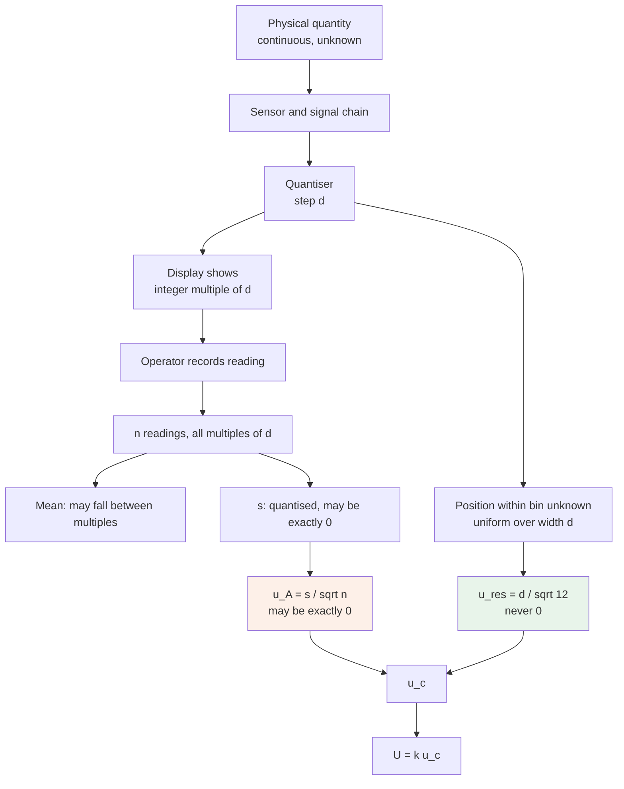

# Chapter 5. Tolerance Calculations

## 5.1 What tolerance is in this system

Tolerance is the maximum magnitude of error that will be accepted at a calibration point. It is a requirement imposed by the intended use of the equipment, not a measured property of the equipment.

In this module tolerance is always **absolute, symmetric and two sided**. It is stored as a single positive decimal number in the same unit as the parameter, and the acceptance region it defines is

$$\left|e\right| \le T \iff -T \le e \le +T$$

The field carries the help text `±tolerance`, which encodes this symmetry.

| Where declared | Field | Applies to |
|---|---|---|
| `CalibrationParameter.tolerance` | `DecimalField(max_digits=10, decimal_places=6, null=True)` | every set value of the parameter that has no sub-parameter |
| `SubParameter.tolerance` | `DecimalField(max_digits=10, decimal_places=6, default=1.0)` | every set value belonging to that sub-parameter |

The resolution of the two is a strict override, implemented as one line:

```python
tolerance = self.sub_parameter.tolerance if self.sub_parameter else self.parameter.tolerance
```

The sub-parameter value wins completely when present. The parameter value is not consulted as a fallback, is not averaged in, and is not used as a bound. This is deliberate: a systolic pressure and a diastolic pressure have genuinely different clinical requirements and a single parameter level number cannot express both.

## 5.2 Tolerance is fixed at the point of judgement

The tolerance used in a pass or fail decision is read live from the procedure at the moment `calculate_statistics` runs. It is not copied onto the `CalibrationReading` row. Two consequences follow, one benign and one significant.

The benign consequence is that a typographical error in a tolerance can be corrected and the affected sessions recomputed.

The significant consequence is that **editing a tolerance changes the meaning of every historical record that references it**. A session certified as passing in January against a tolerance of 3 mmHg will, if the tolerance is later tightened to 2 mmHg, display as failing when its detail page is next rendered, even though the certificate issued in January says PASS. The certificate PDF is a snapshot and does not change; the live view does. The two will disagree.

There is no version history on `CalibrationProcedure` or its children. `clone_procedure` exists and produces an independent copy with a new UUID, and using it is the correct way to change acceptance criteria: clone, edit the clone, remap the equipment, and leave the original untouched so historical sessions continue to reference criteria that match their certificates. This is a procedural control, not an enforced one. It is recorded in Chapter 12, section 12.14 as a business rule that depends on discipline rather than on software.

## 5.3 Absolute tolerance

$$\left|e\right| \le T_{abs}$$

T_abs has the same unit as the measurand and does not vary across the range.

**Worked example, Dataset A.** T = 3 mmHg, e = +1.4 mmHg.

$$\left|+1.4\right| = 1.4 \le 3 \implies \textbf{PASS}$$

Margin remaining: 3 − 1.4 = 1.6 mmHg, which is 53.3 percent of the tolerance band unused.

**Worked example, Dataset B.** T = 0.3 degC, e = −0.166667 degC.

$$\left|-0.166667\right| = 0.166667 \le 0.3 \implies \textbf{PASS}$$

Margin remaining: 0.133333 degC, which is 44.4 percent of the band unused.

Absolute tolerance is the appropriate form when the physical consequence of an error is the same regardless of where in the range it occurs. A blood pressure error of 3 mmHg is equally consequential at 80 mmHg and at 200 mmHg, so absolute tolerance is correct for that parameter.

## 5.4 Relative and percentage tolerance

A relative tolerance is proportional to the value being measured:

$$\left|e\right| \le p \cdot x_s \qquad\text{or equivalently}\qquad \frac{\left|e\right|}{x_s} \times 100 \le P\%$$

where p is a fraction and P = 100p is the same quantity as a percentage.

**The module does not implement relative tolerance directly.** There is no percentage flag on `CalibrationParameter` and no code path that scales tolerance by set value. Relative requirements are expressed by converting them to absolute values at each set value and declaring a separate set value with its own sub-parameter, or by accepting the absolute figure computed at the most demanding point.

**Worked conversion.** A manufacturer specifies ±2 percent of reading for a flow meter across set values 100, 500 and 1000 mL/h.

| Set value (mL/h) | 2 % of reading (mL/h) |
|---|---|
| 100 | 2.0 |
| 500 | 10.0 |
| 1000 | 20.0 |

To express this in the current data model the options are:

1. Declare the parameter tolerance as 2.0 mL/h, the value at the lowest set point. This is conservative everywhere and rejects instruments at high flow that the manufacturer considers acceptable. It is metrologically safe but commercially harsh.
2. Declare three sub-parameters, "100 mL/h", "500 mL/h" and "1000 mL/h", each with one set value and its own absolute tolerance of 2.0, 10.0 and 20.0. This reproduces the intended requirement exactly, at the cost of a slightly unnatural use of the sub-parameter concept.

Option 2 is the recommended workaround and is what the data model supports today. A first class percentage tolerance would require a new field and a change to the single line of tolerance resolution logic, and is listed in Chapter 17 among suggested enhancements.

## 5.5 Combined specifications: percent of reading plus percent of range

Instrument manufacturers commonly specify accuracy in a two term form:

$$T = a \cdot x_s + b \cdot \text{FS}$$

read aloud as "a percent of reading plus b percent of full scale". A common variant is "percent of reading plus n counts", where the second term is n·d.

**Worked example.** A digital multimeter specified as ±(0.05 % of reading + 3 counts) on a 10 V range with d = 0.001 V, measuring at 5.000 V:

$$T = 0.0005 \times 5.000 + 3 \times 0.001 = 0.0025 + 0.003 = 0.0055\ \text{V}$$

The second term dominates at 5 V and would dominate even more at 1 V, where the first term contributes only 0.0005 V. This is the general shape of such specifications: proportional error dominates at the top of the range, fixed error at the bottom. The correct place to test such an instrument is therefore near the bottom of the range, where the specification is hardest to meet in relative terms.

To express this in the module, evaluate T at each set value and enter the resulting absolute figures, using the sub-parameter mechanism of section 5.4 if the values differ.

## 5.6 Maximum permissible error

Maximum permissible error, abbreviated MPE, is the term used by legal metrology and by most medical device standards for the extreme value of error permitted by specification, regulation or contract. In the vocabulary of this module, MPE is exactly what `tolerance` holds.

The hierarchy of sources from which an MPE should be taken, in descending order of authority:

1. A statutory or regulatory limit that applies to the device in its jurisdiction and use.
2. A published standard specific to the device class, for example the accuracy requirements in IEC 80601-2-30 for automated sphygmomanometers.
3. The manufacturer's published specification for the model.
4. The clinical or operational requirement stated by the department that uses the device.
5. A laboratory default.

An MPE taken from source 3 is a statement about what the device can do. An MPE taken from source 4 is a statement about what the department needs. When they disagree, and the manufacturer's figure is looser than the clinical need, the correct action is to record the clinical figure as the tolerance and to accept that some devices meeting their own specification will nevertheless fail this laboratory's calibration. That outcome is informative rather than erroneous: it says the device is not suitable for that clinical use.

The module stores a single number and does not record which of the five sources it came from. Recording the provenance in `CalibrationProcedure.description` is the available mechanism and is strongly recommended, because an auditor will ask.

## 5.7 The acceptance region, illustrated

For a single calibration point, the acceptance region is a band of width 2T centred on the set value in error space, equivalently centred on x_s in indication space.

```
                    ACCEPTANCE REGION FOR ONE POINT
                    Dataset A: x_s = 120, T = 3 mmHg

  error e (mmHg)
       |
   +4  |                                          . FAIL
   +3  +━━━━━━━━━━━━━━━━━━━━━━━━━━━━━━━━━━━━━━━  upper limit +T
       |
   +2  |
       |            ● e = +1.4  measured, PASS
   +1  |            │
       |            │ margin to limit 1.6
    0  +────────────┼─────────────────────────── perfect agreement
       |            │
   -1  |
       |
   -2  |
       |
   -3  +━━━━━━━━━━━━━━━━━━━━━━━━━━━━━━━━━━━━━━━  lower limit -T
   -4  |                                          . FAIL
       |
       └───────────────────────────────────────>
                     calibration point


  Equivalent view in indication space:

       117        118        119        120        121        122   123
        │          │          │          │          │          │     │
        ├──────────┼──────────┼──────────┼──────────┼──────────┤
        └── x_s-T = 117 ──── x_s = 120 ──── x_s+T = 123 ──┘
                    ▲
                    │
              x̄ = 118.6 lies inside the band, so PASS
```

## 5.8 The acceptance region across the whole parameter

When a parameter has several set values, the acceptance region becomes a corridor.

```
  indication
     |
 210 +                                            ╱
     |                                       ╱  ╱
 200 +                                  ╱  ╱  ╱ ← upper limit x_s + T
     |                             ╱  ╱  ╱
     |                        ╱  ╱  ╱  ← ideal line, indication = x_s
 160 +                   ╱  ╱  ╱
     |              ╱  ╱  ╱      ← lower limit x_s - T
 120 +         ╱ ●╱  ╱               ● measured mean at 120
     |    ╱  ╱  ╱
  80 +  ●╱  ╱                        ● measured mean at 80
     | ╱  ╱
     +─┴────┴─────┴──────┴──────┴──────┴─────> set value
      80   120   160    200

  The corridor has constant vertical width 2T for an absolute
  tolerance. For a relative tolerance it would fan outward,
  widening in proportion to the set value.
```

## 5.9 The relationship between tolerance and uncertainty

This is the most important idea in the chapter and the one most often mishandled.

Tolerance is a **requirement**. Uncertainty is a **property of the measurement that tested the requirement**. They have the same units and appear side by side on the certificate, which is exactly why they get confused.

The system's decision rule compares the error against the tolerance and completely ignores the uncertainty:

```python
def check_tolerance(self, error, tolerance):
    return abs(Decimal(str(error))) <= Decimal(str(tolerance))
```

This is called **simple acceptance** or **shared risk** in ISO/IEC 17025 clause 7.1.3 and in ILAC-G8. It is a legitimate documented decision rule. Its property is that when the measured error lies close to the tolerance limit, the probability of a wrong decision approaches 50 percent, because the true error is equally likely to be on either side of the measured one.

### 5.9.1 Test uncertainty ratio

The customary way to control that risk without formal guard banding is to require the measurement to be much better than the thing it measures. The test uncertainty ratio is

$$\text{TUR} = \frac{T}{U}$$

where U is the expanded uncertainty at k = 2. The traditional requirement is TUR ≥ 4. At that ratio, simple acceptance produces a probability of false accept of roughly 0.8 percent at the worst case point, which most laboratories consider tolerable.

The module implements this ratio in `MetrologyUtils.calculate_measurement_capability`:

```python
return float(tolerance) / float(uncertainty)
```

with the docstring noting the 4:1 target. **It is not called from the calibration path.** No warning is raised and no session is blocked when the ratio is inadequate.

### 5.9.2 Worked TUR evaluation

Dataset A:

$$\text{TUR} = \frac{3}{0.907376} = 3.31$$

Dataset B:

$$\text{TUR} = \frac{0.3}{0.106667} = 2.81$$

Both fall below 4:1. Both sessions nevertheless pass with a PASS verdict and no annotation. An assessor reading the certificate can compute this ratio themselves from the printed tolerance and uncertainty, and will. The recommendation in Chapter 17 is to compute and print it.

### 5.9.3 The related quantity, TAR

The test accuracy ratio compares the tolerance of the UUT with the tolerance of the reference standard rather than with the measurement uncertainty:

$$\text{TAR} = \frac{T_{UUT}}{T_{reference}}$$

TAR is the older concept and is inferior, because it ignores repeatability, resolution and every other contribution to the measurement's uncertainty. A laboratory with an excellent reference standard and a badly behaved bench can have an excellent TAR and a poor TUR. TUR is the quantity to use, and it is the quantity the module's helper actually computes despite the docstring mentioning both.

## 5.10 Guard banding

Guard banding narrows the acceptance limit by an amount related to the measurement uncertainty, so that a device accepted at the narrowed limit is very likely to be inside the true limit.

$$T_{eff} = T - g$$

The module supplies

```python
def calculate_guard_banding(measurement_uncertainty, tolerance):
    guard_band = 2 * float(measurement_uncertainty)
    effective_tolerance = float(tolerance) - guard_band
    return {
        'guard_band': guard_band,
        'effective_tolerance': max(0, effective_tolerance),
        'risk_reduction': (guard_band / float(tolerance)) * 100 if tolerance > 0 else 0
    }
```

The guard band is set at twice the passed uncertainty, and the function is documented as conservative. Note carefully that the interpretation depends on what the caller passes as `measurement_uncertainty`. If the caller passes u_c, then g = 2u_c = U and the guard band is one expanded uncertainty, which corresponds to the common ILAC-G8 approach at approximately 95 percent confidence. If the caller passes U, then g = 2U and the guard band is doubled again, which is far more conservative than usual practice. **The function has no call site in the calibration workflow**, so the ambiguity is currently academic. Any future caller must resolve it explicitly.

### 5.10.1 Worked guard band evaluation

Dataset A, passing u_c = 0.453688:

$$g = 2 \times 0.453688 = 0.907376 \qquad T_{eff} = 3 - 0.907376 = 2.092624\ \text{mmHg}$$

The measured error of 1.4 mmHg is inside 2.092624, so the point would still pass under guard banding. Risk reduction as the function defines it is 0.907376/3 × 100 = 30.2 percent.

Dataset A, passing U = 0.907376:

$$g = 2 \times 0.907376 = 1.814752 \qquad T_{eff} = 3 - 1.814752 = 1.185248\ \text{mmHg}$$

The measured error of 1.4 mmHg now **exceeds** the guarded limit and the point would fail. This single example shows how much the interpretation matters, and why the function must not be wired in without a decision being taken and documented.

### 5.10.2 Guard banding illustrated

```
        T = 3.0                                 acceptance under
   ─────────────────────────────────────────    simple acceptance
   0                                    3.0

        guard band g = 0.907
   ┌───────────────────────────┬─────────┐
   │  accept                   │ guarded │      acceptance under
   └───────────────────────────┴─────────┘      guard banding with g = U
   0                       2.093       3.0

        guard band g = 1.815
   ┌─────────────────┬───────────────────┐
   │  accept         │     guarded       │      acceptance under
   └─────────────────┴───────────────────┘      guard banding with g = 2U
   0             1.185                 3.0

        measured |e| = 1.4  ────────────▲
                     passes the first two, fails the third
```

## 5.11 Decision rule summary as implemented

| Feature | Implemented | Reference |
|---|---|---|
| Absolute symmetric tolerance | Yes | `check_tolerance` |
| Sub-parameter override of parameter tolerance | Yes | `calculate_statistics` |
| Asymmetric tolerance | No | would need two fields |
| Relative or percentage tolerance | No | workaround in 5.4 |
| Combined percent plus counts | No | workaround in 5.5 |
| Guard banding applied to decisions | No | helper exists, unused |
| TUR computed and shown | No | helper exists, unused |
| Uncertainty considered in the verdict | No | simple acceptance |
| Tolerance versioned with the session | No | live lookup, see 5.2 |

## 5.12 Validation of tolerance values

| Layer | Rule | Enforcement |
|---|---|---|
| `CalibrationParameterForm.clean_tolerance` | must be strictly positive if supplied | raises `ValidationError` |
| `CalibrationParameter.tolerance` | `null=True, blank=True` | a parameter may be saved with no tolerance at all |
| `SubParameter.tolerance` | `default=1.0`, not nullable | always present |
| `CalibrationReading.calculate_statistics` | raises `ValueError` if the applicable tolerance is None | caught by the surrounding handler, which nulls every derived field and sets `passes_tolerance = False` |
| `CalibrationValidator.validate_procedure` | flags non positive tolerance as an error | validator is not invoked on the submission path |

The gap is that a parameter with no sub-parameters and a null tolerance is a valid database row. Any reading against it will fail with a logged error and a null uncertainty budget. The failure is safe, in that it produces a fail rather than a spurious pass, but it is opaque to the technologist, who sees a session that failed without an explanation. The remedy is to make `tolerance` non nullable on `CalibrationParameter`, which requires a data migration for any existing null rows.

# Chapter 6. Measurement Error

## 6.1 True value

The true value of a quantity is the value that a perfect measurement would yield. It is not knowable. This is not a practical limitation to be engineered away; it is the definitional situation in which all of metrology operates, and every other concept in this chapter is built on the acknowledgement of it.

In a calibration the true value is not attempted. What is used instead is a **conventional true value**, being the value produced by the reference standard, accepted as true for the purpose of this comparison because the reference standard's own uncertainty is small compared with the error being sought.

In this system the conventional true value is `SetValue.value`, and its associated uncertainty is `CalibrationParameter.reference_uncertainty`. The acceptance of x_s as true is exactly the assumption that the calibration chain, running from this laboratory's reference standard up through the accredited calibration agency named in `Standard.calibration_agency` to a national metrology institute, is intact.

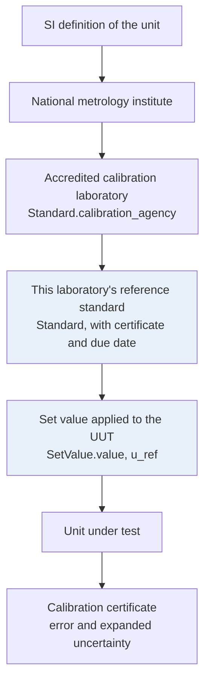

The chain is only as strong as its weakest link, and the module's weakest link is the absence of any check that `Standard.calibration_due_date` has not passed. That single missing check can silently break traceability for every certificate issued after the reference standard expires. See Chapter 12, section 12.3.

## 6.2 Measured value

The measured value is what the instrument indicated, and in this system it is the mean of n readings, stored as `CalibrationReading.mean`. The individual readings are retained so that the reduction from n numbers to one is auditable rather than assumed.

## 6.3 Absolute error

$$e = x_s - \bar{x} \qquad \text{[implemented]}$$

$$e_{conventional} = \bar{x} - x_s \qquad \text{[VIM convention]}$$

Unit: the unit of the parameter. Interpretation under the implemented form: positive means the instrument under reads.

Dataset A: e = +1.4 mmHg.
Dataset B: e = −0.166667 degC.

## 6.4 Relative error

$$e_{rel} = \frac{e}{x_s}$$

Dimensionless. Undefined at x_s = 0, which is why a set value of zero must never be used to compute a relative figure. The module stores no relative error field; the quantity is computed here for interpretation only.

Dataset A: e_rel = 1.4/120 = 0.011667.
Dataset B: e_rel = −0.166667/37.00 = −0.004505.

## 6.5 Percentage error

$$e_{\%} = \frac{e}{x_s}\times 100$$

Dataset A: +1.17 percent.
Dataset B: −0.45 percent.

Percentage error is the natural currency of conversation with clinical staff, who will ask "how far off was it" and expect a percentage. It is a poor currency for acceptance decisions on parameters where the physical consequence is absolute, for the reason given in section 5.3.

## 6.6 Systematic error and bias

A systematic error is a component of error that remains constant, or varies predictably, over repeated measurements under the same conditions. Its expectation is not zero.

$$\text{bias} = E[\bar{x}] - x_{true}$$

Systematic error is what a calibration exists to find. It is exactly the quantity reported as `error`. Averaging does not reduce it: taking a thousand readings of an instrument that reads 1.4 mmHg low will produce a mean that is 1.4 mmHg low with great precision.

Typical physical sources in this laboratory's work:

| Source | Mechanism | Typical remedy |
|---|---|---|
| Zero offset | sensor or amplifier offset voltage | zero adjustment |
| Gain error | reference voltage or scaling resistor tolerance | span adjustment |
| Non linearity | sensor characteristic curvature | multi point correction or replacement |
| Temperature coefficient | drift of components away from the calibration temperature | control the environment, or correct |
| Hysteresis | mechanical friction, magnetic history | approach every point from the same direction |
| Loading | the measuring instrument perturbs the circuit or flow it measures | higher impedance or lower flow restriction |

## 6.7 Random error

A random error is a component that varies unpredictably in repeated measurements. Its expectation is zero and its dispersion is characterised by σ, estimated by s.

Random error is what averaging attacks. Its contribution to the uncertainty of the mean falls as 1/√n.

Typical sources: thermal and shot noise in electronics, air currents and thermal gradients around a probe, mains interference, mechanical vibration, operator variation in reading an analogue scale, and quantisation when the underlying signal dithers across a bin boundary.

### 6.7.1 The decomposition

Every reading decomposes exactly as

$$x_i = x_{true} + \underbrace{b}_{\text{systematic}} + \underbrace{\varepsilon_i}_{\text{random}}$$

with E[ε_i] = 0 and Var(ε_i) = σ². Then

$$E[\bar{x}] = x_{true} + b \qquad \operatorname{Var}(\bar{x}) = \frac{\sigma^2}{n}$$

The calibration measures b, to within an uncertainty governed by σ/√n and by the uncertainty of the reference. This equation is the whole of calibration in one line, and it explains why both a mean and a standard deviation must be reported: the mean estimates the thing being corrected, the standard deviation bounds how well it was estimated.

### 6.7.2 Illustration of the two error types

```
        RANDOM ERROR ONLY              SYSTEMATIC ERROR ONLY
        (imprecise, unbiased)          (precise, biased)

           ○   ○                              ○○○
         ○   ●   ○                            ○●○      ● = true value
           ○   ○                              ○○○      ○ = readings
        scattered about truth          tight cluster, displaced

        mean converges to truth        mean converges to truth + b
        as n grows                     for any n

        BOTH                           NEITHER

           ○   ○                            ○●○
         ○       ○                          ○○○
             ●                              readings on truth
        scattered and displaced        the goal, never exactly reached
```

## 6.8 Accuracy, precision, repeatability, reproducibility

These four terms are used interchangeably in ordinary speech and must not be in a calibration document.

**Accuracy** is closeness to the true value. It is a qualitative concept and, strictly, is not expressed as a number. What is expressed as a number is error, or uncertainty.

**Precision** is closeness of agreement among repeated measurements. It says nothing about closeness to truth. It is quantified by a standard deviation.

**Repeatability** is precision under repeatability conditions: the same operator, the same instrument, the same procedure, the same location, the same reference standard, over a short period, with no intervening adjustment. This is exactly the condition under which the n readings of one calibration point are taken. `CalibrationReading.standard_deviation` is therefore a repeatability standard deviation, and it is the narrowest and most optimistic dispersion measure available.

**Reproducibility** is precision under changed conditions: different operator, different day, different instrument, different site. It is always at least as large as repeatability and usually larger.

```
  dispersion
      ^
      |                                        ┌──────────────┐
      |                                        │ Reproducibility│
      |                          ┌─────────────┴──────────────┘
      |                          │  Intermediate precision
      |          ┌───────────────┴─────┐  (same lab, different day
      |          │  Repeatability      │   or operator)
      |          └─────────────────────┘
      +──────────────────────────────────────────────> conditions varied
        none      operator/day      laboratory
```

### 6.8.1 What the module measures and what it does not

The module measures repeatability, directly, on every point.

It does not measure reproducibility. There is no operator comparison feature, no round robin capability, and no field recording which operator variation was explored. `QualityAssurance.assess_measurement_capability` mentions operator technique in a recommendation string but computes nothing about it.

The module offers a partial, indirect window on reproducibility through `HistoricalCalibration` and `DriftAnalyzer`. A series of calibrations of the same instrument, performed on different days by different technologists, contains reproducibility information mixed with genuine instrument drift. The drift analyser fits a straight line to that series and reports the slope. What it reports as drift therefore includes any between operator and between day variation. This is a genuine limitation of the analysis, not of the data: separating the two requires a designed experiment, not a fit to routine data.

## 6.9 Divergence: the two sign conventions

This section consolidates the issue raised in Chapters 2 and 3, because an auditor will need it in one place.

| Location | File and construct | Formula | Sign when instrument reads low |
|---|---|---|---|
| Backend of record | `CalSoft/models.py`, `CalibrationReading.calculate_statistics` | `error = set_value - mean` | positive |
| Client preview | `templates/Calibrition/calibration_page.html`, `updateRowCalculations` | `error = mean - setValue` | negative |
| VIM and common practice | | `error = indication - reference` | negative |

**Effect on the pass or fail verdict: none.** `check_tolerance` applies `abs()`, and the acceptance region is symmetric about zero, so a sign flip cannot change a verdict.

**Effect on the certificate: material.** The Error column of the results table prints the stored value with its sign. A reader applying the standard convention will interpret a positive error as reading high when in fact the instrument reads low. For an infusion pump or a ventilator this is not a cosmetic matter, because it inverts the direction of any correction a clinical engineer might apply.

**Effect on drift analysis: material.** `HistoricalCalibration.error` stores the backend value. `DriftAnalyzer._calculate_drift_metrics` fits error against elapsed days and reports `drift_rate_per_day` and the human readable string `drift_equation`. The slope carries the same inverted sign, so an instrument progressively reading higher over time will show a negative drift rate.

**Effect on the operator's live preview versus the stored record: confusing.** The technologist sees one sign on screen while entering data and a different sign on the certificate. Nobody has reported this because, in the current implementation, the stored error is never computed at all on the web submission path. See section 6.10.

**Recommended remedy.** Change the backend to `error = mean - set_value`, add a migration that negates the sign of all existing `CalibrationReading.error` and `HistoricalCalibration.error` values, and add an explicit legend to the certificate stating the convention. Until that is done, the certificate legend should state the current convention in words.

## 6.10 Divergence: the web submission path does not compute error at all

This is the most consequential finding in the audit and is stated in full here.

`CalibrationReading.calculate_statistics()` in `CalSoft/models.py` is the complete and correct implementation. It computes the mean, the standard deviation, the error, all four uncertainty components with the reference uncertainty properly divided by the coverage factor, and the tolerance verdict. It is a well written method.

**It has no caller.** A search of the entire repository for `calculate_statistics` finds the definition in `models.py` line 607, the definition of the different method of the same name on `CalibrationCalculator` in `utils.py` line 121, and three call sites which all invoke the `CalibrationCalculator` method rather than the model method. There is no `post_save` signal, no `pre_save` hook, and no `ready()` wiring in `CalSoft/apps.py`. The model method is dead code.

What actually runs on submission is `_calculate_stats` in `CalSoft/view_modules/calibration.py`:

```python
def _calculate_stats(reading, resolution, parameter):
    try:
        calculator = CalibrationCalculator()
        readings_list = [getattr(reading, f'reading_{i}', None)
            for i in range(1, 11) if getattr(reading, f'reading_{i}', None) is not None]
        if readings_list:
            stats = calculator.calculate_statistics([float(r) for r in readings_list])
            if stats:
                reading.type_a_uncertainty = calculator.calculate_type_a_uncertainty(float(stats['std_dev']), stats['count'])
                reading.type_b_uncertainty = calculator.calculate_type_b_uncertainty(resolution)
                reading.reference_uncertainty_component = parameter.reference_uncertainty or Decimal('0')
                reading.combined_uncertainty = calculator.calculate_combined_uncertainty(
                    float(reading.type_a_uncertainty), float(reading.type_b_uncertainty),
                    float(parameter.reference_uncertainty or Decimal('0')))
                reading.expanded_uncertainty = calculator.calculate_expanded_uncertainty(
                    float(reading.combined_uncertainty), parameter.coverage_factor or 2)
                reading.save()
    except Exception as e:
        logger.error(f"Error in statistics: {str(e)}")
```

Compare the two, field by field:

| Field | Model method | View function | Consequence of the view's behaviour |
|---|---|---|---|
| `mean` | computed and stored | **never assigned** | stays NULL |
| `standard_deviation` | computed and stored | **never assigned** | stays NULL |
| `error` | computed and stored | **never assigned** | stays NULL |
| `type_a_uncertainty` | s/√n | s/√n | same |
| `type_b_uncertainty` | d/√12 using the session resolution row | d/√12 using the POST value | same value, different source |
| `reference_uncertainty_component` | `ref / coverage_factor` | **`ref` undivided** | stores the expanded value where a standard value belongs |
| `combined_uncertainty` | uses ref/k | **uses ref undivided** | overstated |
| `expanded_uncertainty` | k·u_c | k·u_c on the overstated u_c | overstated |
| `passes_tolerance` | computed | **never assigned** | remains at the model default `False` |

### 6.10.1 The chain of consequences

1. `passes_tolerance` remains `False` for every reading, because the field default is `False` and nothing sets it.
2. In `_process_readings` the loop reads `if not reading.passes_tolerance: overall_pass = False`. Since no reading ever passes, `overall_pass` is `False` for **every session**, regardless of the data.
3. The user is shown "Calibration session completed. Result: FAILED" on every submission.
4. `_store_historical_data` iterates readings and writes a `HistoricalCalibration` row only `if reading.mean is not None`. Since `mean` is never set, **no historical rows are written at all**, and the drift series is permanently empty.
5. The certificate results table formats mean, standard deviation and error with `if reading.mean else 'N/A'`, so all three columns print N/A.
6. `calculate_failure_statistics` in `pdf_generators/results.py` reads `passes_tolerance` via `hasattr`, which is always true for a model field, so it takes the stored `False` and reports a 100 percent failure rate. Since the threshold for a failure report is 40 percent, **every certificate is rendered as a failure report**.
7. The pending approval queue counts every session as high priority, since `high_priority_count` filters on `overall_pass=False`.
8. `MetrologyUtils` and `QualityAssurance` capability assessments, if they were called, would see a zero pass rate.

### 6.10.2 The reference uncertainty double counting, quantified

Even setting aside the missing fields, the view path mishandles the reference uncertainty. Applying it to Dataset A:

| Quantity | Correct, model method | As computed by the view |
|---|---|---|
| u_A | 0.244949 | 0.244949 |
| u_res | 0.288675 | 0.288675 |
| reference component | 0.50/2 = 0.250000 | **0.500000** |
| u_c | √(0.06 + 0.083333 + 0.0625) = 0.453688 | √(0.06 + 0.083333 + 0.25) = 0.627160 |
| U at k = 2 | 0.907376 | 1.254320 |

The expanded uncertainty printed on the certificate is 38 percent larger than it should be. In the direction of conservatism, which is the safer direction to be wrong, but wrong nonetheless, and it degrades the TUR from an already marginal 3.31 to 2.39.

### 6.10.3 Why this was not caught

The failure is silent in exactly the way that makes it survive. Nothing raises. The uncertainty columns of the certificate are populated with plausible numbers, so the document looks complete. The mean, standard deviation and error columns show N/A, which reads as "not applicable" rather than "not computed". And the universal FAILED verdict is easy to attribute to the equipment rather than to the software.

### 6.10.4 The remedy

The minimal correct change is to replace the body of `_calculate_stats` with a call to the model method:

```python
def _calculate_stats(reading, resolution, parameter):
    reading.calculate_statistics()
```

The model method reads its resolution from `SessionParameterResolution`, which `_process_readings` has already created before the call, so the `resolution` argument becomes unnecessary. This single change restores mean, standard deviation, error, the correct reference component, the correct combined and expanded uncertainties, the tolerance verdict, the session verdict, and the historical drift series simultaneously.

The change is not made by this document, which is a description of the system as it stands. It is recorded in Chapter 17, section 17.14.1 as the highest priority remediation.

# Chapter 7. Uncertainty Analysis

## 7.1 What uncertainty is

Uncertainty is a parameter, associated with the result of a measurement, that characterises the dispersion of the values that could reasonably be attributed to the measurand.

The phrase "could reasonably be attributed" is the operative one. An uncertainty statement is not a bound on error and it is not a guess about how wrong the answer might be. It is a quantitative description of a state of knowledge, expressed as if it were the standard deviation of a probability distribution over the possible true values.

Error and uncertainty answer different questions:

| | Question answered | Sign | Correctable |
|---|---|---|---|
| Error | how far is this instrument from truth | signed | yes, by adjustment or by applying a correction |
| Uncertainty | how well do we know that answer | unsigned, always positive | no, only reducible |

## 7.2 The uncertainty budget

The module recognises exactly three contributions. They are declared, in order, in `CalibrationReading`:

| Field | Symbol | Type | Distribution assumed | Divisor |
|---|---|---|---|---|
| `type_a_uncertainty` | u_A | A | Normal, from the data | √n |
| `type_b_uncertainty` | u_res | B | Rectangular | √12 |
| `reference_uncertainty_component` | u_ref | B | Normal, from a certificate | k_ref |
| `combined_uncertainty` | u_c | derived | Approximately normal | — |
| `expanded_uncertainty` | U | derived | — | multiply by k |

### 7.2.1 Type A and Type B

The classification is by **method of evaluation**, not by the nature of the effect.

**Type A** is evaluation by statistical analysis of a series of observations. Its distinguishing property is that the data itself supplies the estimate. Its degrees of freedom are finite and known: n − 1.

**Type B** is evaluation by any other means. Sources include a manufacturer's specification, a calibration certificate, a handbook value, the known resolution of a display, or reasoned engineering judgement. Its degrees of freedom are conventionally taken as infinite unless the source states otherwise.

A common and persistent misconception is that Type A means random and Type B means systematic. It does not. A systematic effect can be evaluated by Type A methods, for example by measuring the same artefact on many days and computing a standard deviation of the day to day variation. And a random effect can be evaluated by Type B methods, as resolution is here.

### 7.2.2 The standard uncertainty budget table, Dataset A

| Source | Symbol | Value | Distribution | Divisor | u_i | u_i² | Percent of variance | ν_i |
|---|---|---|---|---|---|---|---|---|
| Repeatability of the UUT | s | 0.547723 | Normal | √5 = 2.236068 | 0.244949 | 0.060000 | 29.15 % | 4 |
| Resolution of the UUT | d | 1.000000 | Rectangular | √12 = 3.464102 | 0.288675 | 0.083333 | 40.49 % | ∞ |
| Reference standard | U_ref | 0.500000 | Normal | k_ref = 2 | 0.250000 | 0.062500 | 30.36 % | ∞ |
| **Combined** | **u_c** | | | | **0.453688** | **0.205833** | **100 %** | 47 |
| **Expanded, k = 2** | **U** | | | | **0.907376** | | | |

### 7.2.3 The standard uncertainty budget table, Dataset B

| Source | Symbol | Value | Distribution | Divisor | u_i | u_i² | Percent of variance | ν_i |
|---|---|---|---|---|---|---|---|---|
| Repeatability of the UUT | s | 0.0816497 | Normal | √6 = 2.449490 | 0.0333333 | 0.00111111 | 39.06 % | 5 |
| Resolution of the UUT | d | 0.1000000 | Rectangular | √12 | 0.0288675 | 0.00083333 | 29.30 % | ∞ |
| Reference standard | U_ref | 0.0600000 | Normal | k_ref = 2 | 0.0300000 | 0.00090000 | 31.64 % | ∞ |
| **Combined** | **u_c** | | | | **0.0533333** | **0.00284444** | **100 %** | 32 |
| **Expanded, k = 2** | **U** | | | | **0.1066667** | | | |

## 7.3 Type A: full derivation

The Type A standard uncertainty is the experimental standard deviation of the mean, derived in section 3.3:

$$u_A = s(\bar{x}) = \frac{s}{\sqrt{n}} = \sqrt{\frac{1}{n(n-1)}\sum_{i=1}^{n}\left(x_i - \bar{x}\right)^2}$$

The second form is worth writing out because it shows the two divisors, n and n−1, doing different jobs in the same expression: n−1 corrects the variance estimate for the loss of a degree of freedom, and the additional n converts a variance of individuals into a variance of a mean.

Implementation:

```python
def calculate_type_a_uncertainty(self, std_dev, count):
    if count <= 0:
        return Decimal('0')
    return Decimal(str(std_dev)) / Decimal(str(math.sqrt(count)))
```

The `count <= 0` guard is defensive; `calculate_statistics` already returns None for n < 2, so the guard cannot fire on the normal path.

**Worked, Dataset A.** u_A = 0.547723/2.236068 = **0.244949 mmHg**.
**Worked, Dataset B.** u_A = 0.0816497/2.449490 = **0.0333333 degC**.

## 7.4 Type B from resolution: full derivation

Derived from first principles in Chapters 9 and 10. The result:

$$u_{res} = \frac{d}{\sqrt{12}}$$

**Worked, Dataset A.** u_res = 1/3.464102 = **0.288675 mmHg**.
**Worked, Dataset B.** u_res = 0.1/3.464102 = **0.0288675 degC**.

## 7.5 Type B from the reference certificate

A calibration certificate for a reference standard states an expanded uncertainty U_ref together with the coverage factor k_ref at which it was expanded. To use it in a new budget the expansion must be undone:

$$u_{ref} = \frac{U_{ref}}{k_{ref}}$$

This is not an approximation. Expansion is defined as multiplication by k, so division by the same k recovers the standard uncertainty exactly, provided k_ref is known. When a certificate states a confidence level rather than a coverage factor, k must be inferred, and `MetrologyUtils.convert_confidence_level_to_k_factor` provides the mapping:

| Confidence level | k |
|---|---|
| 68.27 % | 1.000 |
| 90.00 % | 1.645 |
| 95.00 % | 1.960 |
| 95.45 % | 2.000 |
| 99.00 % | 2.576 |
| 99.73 % | 3.000 |

The function snaps to the nearest tabulated confidence level, which is a reasonable behaviour for the small set of values that appear on real certificates. It assumes normality, which is appropriate for the output of an accredited laboratory whose own budget was itself a combination of many components.

Implementation:

```python
def calculate_reference_uncertainty(self, reference_uncertainty, coverage_factor):
    ref_unc = Decimal(str(reference_uncertainty))
    cov_factor = Decimal(str(coverage_factor))
    if self.reference_is_expanded:
        return ref_unc / cov_factor
    return ref_unc
```

`reference_is_expanded` defaults to `True` in the constructor, which matches the help text `k=2` on `CalibrationParameter.reference_uncertainty`. Note that the same `coverage_factor` field is used both to interpret the reference certificate and to expand this laboratory's own result. If a reference certificate were issued at k = 2.576 while this laboratory reports at k = 2, the single field cannot represent both. In practice both are 2 and the conflation is harmless, but it is a latent limitation.

**Worked, Dataset A.** u_ref = 0.50/2 = **0.250000 mmHg**.
**Worked, Dataset B.** u_ref = 0.06/2 = **0.0300000 degC**.

## 7.6 Combined standard uncertainty

$$u_c = \sqrt{u_A^2 + u_{res}^2 + u_{ref}^2}$$

Derived in section 3.5 from the general law of propagation.

```python
def calculate_combined_uncertainty(self, type_a_uncertainty, type_b_uncertainty, reference_uncertainty_component):
    u_A = Decimal(str(type_a_uncertainty))
    u_res = Decimal(str(type_b_uncertainty))
    u_ref = Decimal(str(reference_uncertainty_component))
    return Decimal(str(math.sqrt(u_A**2 + u_res**2 + u_ref**2)))
```

**Implementation note on precision.** The squares and the sum are computed in `Decimal`, then handed to `math.sqrt`, which coerces to a binary float, takes the root in double precision, and the result is converted back to `Decimal` through its string representation. The decimal chain is therefore broken at exactly one point. Double precision carries about sixteen significant decimal digits, and results are stored to six decimal places, so no error can reach the stored value. The inconsistency is stylistic rather than numerical. `Decimal.sqrt()` is available and is used elsewhere in the same file, in `calculate_statistics`, so the two could be made consistent at no cost.

**Worked, Dataset A.**

$$u_c = \sqrt{0.244949^2 + 0.288675^2 + 0.250000^2} = \sqrt{0.060000 + 0.083333 + 0.062500} = \sqrt{0.205833} = 0.453688$$

**Worked, Dataset B.**

$$u_c = \sqrt{0.001111 + 0.000833 + 0.000900} = \sqrt{0.002844} = 0.053333$$

## 7.7 Expanded uncertainty and the coverage factor

$$U = k \cdot u_c$$

The combined standard uncertainty defines an interval x̄ ± u_c which, for an approximately normal distribution, contains the true value with probability about 68 percent. That is too weak a statement for a certificate. Multiplying by a coverage factor widens the interval to a stated level of confidence.

```python
def calculate_expanded_uncertainty(self, combined_uncertainty, coverage_factor):
    return Decimal(str(combined_uncertainty)) * Decimal(str(coverage_factor))
```

The default k is 2, set on `CalibrationParameter.coverage_factor` with `default=2.0`. For a normal distribution with sufficient degrees of freedom, k = 2 corresponds to 95.45 percent. Certificates conventionally describe it as "approximately 95 percent", which is honest: the exact level depends on the effective degrees of freedom, computed in section 7.8.

**Worked, Dataset A.** U = 2 × 0.453688 = **0.907376 mmHg**, reported ±0.91 mmHg at k = 2.
**Worked, Dataset B.** U = 2 × 0.053333 = **0.106667 degC**, reported ±0.107 degC at k = 2.

## 7.8 Effective degrees of freedom: the Welch–Satterthwaite equation

Using k = 2 and claiming 95 percent presumes the combined distribution is normal. It is not exactly normal, because the Type A component is a scaled Student t variable with only n − 1 degrees of freedom, and the resolution component is rectangular. The Welch–Satterthwaite equation gives the effective degrees of freedom of the combination:

$$\nu_{eff} = \frac{u_c^4}{\displaystyle\sum_{i=1}^{N} \frac{u_i^4}{\nu_i}}$$

Type B components evaluated from a certificate or from a known interval carry ν_i = ∞, so their terms vanish from the denominator.

### 7.8.1 Worked, Dataset A

Only u_A has finite degrees of freedom, ν_A = n − 1 = 4.

$$u_c^4 = \left(0.205833\right)^2 = 0.0423672$$

$$\frac{u_A^4}{\nu_A} = \frac{\left(0.060000\right)^2}{4} = \frac{0.0036}{4} = 0.0009$$

$$\nu_{eff} = \frac{0.0423672}{0.0009} = 47.07 \implies \nu_{eff} = 47 \text{ (truncated down, as convention requires)}$$

The two sided 95 percent Student t value at 47 degrees of freedom is t = 2.012. The exact coverage factor for 95 percent is therefore 2.012 rather than 2.000, and using k = 2 delivers about 95.2 percent rather than 95.0 percent. The difference is negligible and k = 2 is fully defensible.

### 7.8.2 Worked, Dataset B

ν_A = 5.

$$u_c^4 = \left(0.00284444\right)^2 = 8.0909\times 10^{-6}$$

$$\frac{u_A^4}{\nu_A} = \frac{\left(0.00111111\right)^2}{5} = \frac{1.23457\times 10^{-6}}{5} = 2.4691\times 10^{-7}$$

$$\nu_{eff} = \frac{8.0909\times 10^{-6}}{2.4691\times 10^{-7}} = 32.77 \implies \nu_{eff} = 32$$

t at 32 degrees of freedom for 95 percent is 2.037. Again k = 2 is adequate.

### 7.8.3 When k = 2 would not be adequate

The Type B components are what rescue the effective degrees of freedom in both datasets. When Type A dominates the budget and n is small, ν_eff collapses toward n − 1 and the required k rises sharply.

| ν_eff | t for 95 % | Error if k = 2 is used instead |
|---|---|---|
| 2 | 4.303 | interval 53 % too narrow |
| 3 | 3.182 | 37 % too narrow |
| 4 | 2.776 | 28 % too narrow |
| 5 | 2.571 | 22 % too narrow |
| 10 | 2.228 | 10 % too narrow |
| 20 | 2.086 | 4 % too narrow |
| 30 | 2.042 | 2 % too narrow |
| 50 | 2.009 | 0.4 % too narrow |
| ∞ | 1.960 | k = 2 is slightly conservative |

The dangerous region is ν_eff below about 10, which arises when the instrument is noisy, the resolution is fine, and the reference is excellent, so that the repeatability term dominates a budget built on three or four readings. That is precisely the case the minimum of three readings was chosen to avoid, but it is not impossible.

### 7.8.4 Divergence: the implementation is a stub

```python
@staticmethod
def calculate_degrees_of_freedom(type_a_uncertainty, type_b_components):
    if type_a_uncertainty <= 0:
        return float('inf')
    return max(2, 10)  # Conservative estimate
```

The function returns the constant 10 for any finite Type A uncertainty, regardless of n, regardless of the relative sizes of the components, and regardless of the `type_b_components` argument, which is never read. The docstring acknowledges this. It has no call site in the calibration workflow, so nothing depends on the wrong answer, but the function must not be wired in as it stands.

The correct implementation is short and is given here for the benefit of whoever picks this up:

```python
@staticmethod
def calculate_degrees_of_freedom(u_a, n, type_b_components=()):
    """Welch-Satterthwaite effective degrees of freedom.

    u_a: Type A standard uncertainty
    n:   number of readings behind u_a
    type_b_components: iterable of (u_i, nu_i); nu_i may be float('inf')
    """
    u_a = float(u_a)
    terms = [(u_a, n - 1)] + [(float(u), v) for u, v in type_b_components]
    u_c_squared = sum(u * u for u, _ in terms)
    denom = sum((u ** 4) / v for u, v in terms if v not in (0, float('inf')))
    if denom == 0:
        return float('inf')
    return (u_c_squared ** 2) / denom
```

## 7.9 Sensitivity of the budget to more readings

Since only u_A responds to n, there is a hard floor on what repetition can achieve. Let u_B denote the quadrature sum of the two Type B components, which is fixed:

$$u_B = \sqrt{u_{res}^2 + u_{ref}^2}$$

$$u_c(n) = \sqrt{\frac{s^2}{n} + u_B^2} \xrightarrow{n\to\infty} u_B$$

For Dataset A, u_B = √(0.083333 + 0.0625) = 0.381881 mmHg.

| n | u_A | u_c | U at k = 2 | Percent above the floor |
|---|---|---|---|---|
| 3 | 0.316228 | 0.495815 | 0.991631 | 29.8 % |
| 5 | 0.244949 | 0.453688 | 0.907376 | 18.8 % |
| 10 | 0.173205 | 0.419325 | 0.838650 | 9.8 % |
| 20 | 0.122474 | 0.401046 | 0.802092 | 5.0 % |
| 100 | 0.054772 | 0.385787 | 0.771574 | 1.0 % |
| ∞ | 0 | 0.381881 | 0.763763 | 0 % |

Going from five readings to twenty, a fourfold increase in bench time, buys a 12 percent reduction in the expanded uncertainty. Going from five to one hundred buys 15 percent. This is the quantitative justification for the twenty reading cap, and it is the answer to the technologist who asks whether taking more readings would help. It would help a little, and it would help far less than replacing a 1 mmHg display with a 0.1 mmHg display, which would drop u_res from 0.288675 to 0.028868 and pull u_B down to 0.251663.

```
   U (mmHg)
   1.0 +●
       | ╲
   0.95+  ●
       |    ╲
   0.90+      ●
       |        ╲___
   0.85+            ●______
       |                   ‾‾‾●______________
   0.80+                                     ●________
       |
   0.76+ ─ ─ ─ ─ ─ ─ ─ ─ ─ ─ ─ ─ ─ ─ ─ ─ ─ ─ ─ ─ ─ ─ ─  floor set by u_B
       |
       +──┬────┬─────┬──────┬──────────┬──────────────> n
          3    5     10     20         100
```

## 7.10 The reporting statement

A complete uncertainty statement for Dataset A reads:

> The error of indication at a nominal 120 mmHg is +1.4 mmHg with an expanded measurement uncertainty of ±0.91 mmHg. The reported expanded uncertainty is based on a standard uncertainty multiplied by a coverage factor k = 2, providing a level of confidence of approximately 95 percent. The uncertainty evaluation was carried out in accordance with the GUM. The stated error is calculated as set value minus mean indication.

The final sentence is required only for as long as the sign convention of section 6.9 remains as implemented. Once corrected, it should be replaced by the conventional statement.

## 7.11 Uncertainty propagation diagram

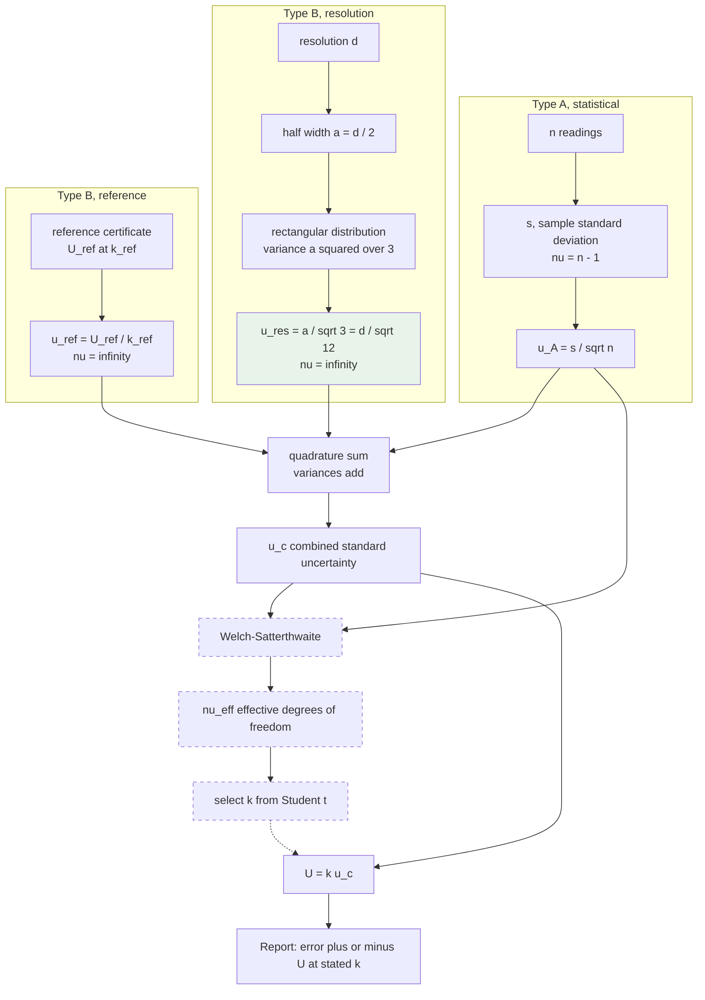

The dashed path is the Welch–Satterthwaite branch, drawn dashed because it is not implemented: the system uses the declared `coverage_factor` directly without computing ν_eff.

# Chapter 8. Probability Theory Used in Calibration

## 8.1 Why probability is unavoidable in calibration

A calibration produces a number. That number is not the truth; it is an estimate. The question every user of a certificate must be able to answer is "how much should I trust this estimate", and the only coherent language for answering that question is the language of probability.

More precisely, three things force probability into the discipline.

**Repeated measurements disagree.** Five readings of a stable quantity through a stable instrument produce five different numbers. Any description of what the instrument indicates must therefore be a description of a distribution, not of a point.

**Some contributions are known only as intervals.** The true value behind a displayed reading of 120 lies somewhere in an interval of width d. No amount of staring at the display narrows it. The only honest description is a distribution over that interval.

**Decisions are made near limits.** When a measured error of 2.9 is compared against a tolerance of 3.0 with an uncertainty of 0.9, the question of whether the instrument really conforms is a question about the probability that the true error exceeds 3.0. It has no deterministic answer.

## 8.2 Random variables, densities, expectation and variance

A continuous random variable X is described by a probability density function p(x) satisfying

$$p(x) \ge 0 \quad \forall x \qquad \int_{-\infty}^{\infty} p(x)\,dx = 1$$

The probability that X falls in an interval is the area under the density over that interval:

$$P(a \le X \le b) = \int_a^b p(x)\,dx$$

The density itself is not a probability. Its units are reciprocal to those of x, and its value at a point may exceed one. Only areas are probabilities. This point is laboured because the rectangular density of Chapter 9 takes the value 1/d, which for d = 0.001 equals 1000, and a reader who believes densities are probabilities will conclude something has gone wrong.

The expectation, or mean, is the first moment:

$$\mu = E[X] = \int_{-\infty}^{\infty} x\,p(x)\,dx$$

The variance is the second central moment:

$$\sigma^2 = \operatorname{Var}(X) = E\left[(X-\mu)^2\right] = \int_{-\infty}^{\infty}(x-\mu)^2 p(x)\,dx$$

and the standard deviation is its positive square root. The identity

$$\operatorname{Var}(X) = E[X^2] - \left(E[X]\right)^2$$

follows by expanding the square inside the integral and is used in Chapter 9.

**In calibration, a standard uncertainty is by definition a standard deviation.** Every divisor in every uncertainty budget in this document exists for one reason: to convert some other description of a distribution, whether a half width, an expanded interval, or a confidence statement, into the standard deviation of that distribution. Once every component is a standard deviation, they can be combined by the addition of variances. This is the single unifying idea of the GUM, and it is worth stating in one sentence: **all divisors are conversions to standard deviation.**

## 8.3 The normal distribution

### 8.3.1 Density

$$p(x) = \frac{1}{\sigma\sqrt{2\pi}}\exp\left(-\frac{(x-\mu)^2}{2\sigma^2}\right)$$

### 8.3.2 Why it appears

The normal distribution is not assumed because measurement errors are known to be normal. It arises for a structural reason given by the central limit theorem: if a quantity is the sum of many independent contributions, none dominant, its distribution tends to normality regardless of the distributions of the individual contributions.

Measurement error is exactly such a sum. Thermal noise, mechanical vibration, air currents, mains pickup, operator judgement, and dozens of smaller effects add together. None dominates. The sum is approximately normal even though several of the contributions individually are not.

This is also why the combined standard uncertainty u_c may be treated as approximately normal even though one of its three components is rectangular. The convolution of a normal with a rectangular of comparable width is markedly closer to normal than the rectangular alone. The GUM makes this argument explicitly, and it is the justification for applying a normal based coverage factor to a budget that contains a rectangular term.

### 8.3.3 Coverage of the normal distribution

| Interval | Probability contained | Complementary probability |
|---|---|---|
| μ ± 1.000σ | 68.27 % | 1 in 3.15 |
| μ ± 1.645σ | 90.00 % | 1 in 10 |
| μ ± 1.960σ | 95.00 % | 1 in 20 |
| μ ± 2.000σ | 95.45 % | 1 in 22 |
| μ ± 2.576σ | 99.00 % | 1 in 100 |
| μ ± 3.000σ | 99.73 % | 1 in 370 |

These are the values hard coded in `MetrologyUtils.convert_confidence_level_to_k_factor`.

### 8.3.4 The normal density illustrated

```
   p(x)
     |                    ▁▄█▄▁
     |                  ▄███████▄
     |                ▄███████████▄
     |              ▄███████████████▄
     |            ▄███████████████████▄
     |         ▄▄███████████████████████▄▄
     |     ▄▄███████████████████████████████▄▄
     |▄▄███████████████████████████████████████▄▄
     +──┬─────┬─────┬─────┬─────┬─────┬─────┬──── x
      -3σ   -2σ   -1σ     μ    +1σ   +2σ   +3σ

     |<------------- 68.27 % ------------->|      is  μ ± 1σ
     |<------------------ 95.45 % ---------------->|  is  μ ± 2σ
     |<------------------------ 99.73 % ---------------->|  is μ ± 3σ

     Inflection points sit at exactly μ ± σ, which is
     the geometric definition of the standard deviation
     for this density.
```

### 8.3.5 Worked probability calculation

Dataset A gives a measured error of +1.4 mmHg with u_c = 0.453688 mmHg. Treating the state of knowledge about the true error as normal with that mean and standard deviation, what is the probability that the true error exceeds the tolerance of 3 mmHg?

$$z = \frac{3.0 - 1.4}{0.453688} = \frac{1.6}{0.453688} = 3.527$$

$$P(e_{true} > 3.0) = 1 - \Phi(3.527) \approx 2.1\times 10^{-4}$$

and by symmetry the probability of exceeding −3.0 on the other side is negligible. The total probability of false accept for this point is therefore about 0.02 percent. The instrument comfortably conforms and the simple acceptance decision carries very little risk here, because the measured error sits well inside the band.

Now repeat for a measured error of 2.9 mmHg with the same uncertainty:

$$z = \frac{3.0 - 2.9}{0.453688} = 0.220 \qquad P(e_{true} > 3.0) = 1 - \Phi(0.220) = 0.413$$

There is a 41 percent chance the instrument does not actually conform, and simple acceptance passes it anyway. This calculation is the entire argument for guard banding, expressed in one number, and it is the reason section 5.10 exists.

## 8.4 Confidence intervals and coverage intervals

Two related but distinct ideas are in play, and a calibration document should be clear about which it means.

A **confidence interval** in classical frequentist statistics is a random interval constructed so that, in repeated application of the procedure, a stated proportion of such intervals would contain the fixed unknown parameter.

A **coverage interval** in the GUM sense is an interval about the measurement result within which the value of the measurand is believed to lie with a stated probability, based on the available state of knowledge.

The GUM adopts the second reading, and so does this document. When a certificate states "±0.91 mmHg at k = 2, approximately 95 percent", the intended meaning is that, given everything known about this measurement, the true error is believed to lie within 0.91 mmHg of the reported value with about 95 percent probability.

```
                 measured error
                       │
                       ▼
        ───────────────●───────────────
                 ┌─────┴─────┐
                 │  ± u_c    │            68 % coverage
             ┌───┴───────────┴───┐
             │      ± 2u_c       │        95 % coverage, this is U
         ┌───┴───────────────────┴───┐
         │         ± 3u_c            │    99.7 % coverage
         └───────────────────────────┘

        +0.49    +0.95    +1.4    +1.85   +2.31   mmHg
```

## 8.5 Distributions used for Type B evaluation

Beyond the two the module uses, the metrologist should recognise the standard family, because a Type B component from a new source will have to be assigned to one of them.

| Distribution | When to use | Divisor to obtain u | Density shape |
|---|---|---|---|
| Normal | a certificate quoting U and k, or a specification stated as a standard deviation | k | bell |
| Rectangular | an interval within which the value lies, with no reason to prefer any part of it | √3 on the half width | flat |
| Triangular | an interval where the centre is more likely than the edges, for example the sum of two independent rectangulars of equal width | √6 on the half width | tent |
| U shaped | a value oscillating sinusoidally through an interval, for example a temperature cycled by a thermostat | √2 on the half width | two peaks at the edges |
| Student t | a Type A component with few degrees of freedom | t(ν) rather than k | bell with heavy tails |

The rectangular is the default choice when nothing is known beyond the bounds. This is not laziness. It is the maximum entropy distribution on a bounded interval, meaning it is the distribution that assumes the least beyond the information actually available. Assuming a triangular distribution when only the bounds are known would be claiming knowledge about the centre that nobody possesses.

## 8.6 Repeatability as a probability statement

The n readings of one calibration point are a sample from a distribution whose standard deviation σ characterises the instrument's repeatability. The sample standard deviation s estimates σ, and it is itself a random variable.

For normally distributed data, the sampling distribution of s² is chi squared scaled:

$$\frac{(n-1)s^2}{\sigma^2} \sim \chi^2_{n-1}$$

from which the relative standard uncertainty of s itself is approximately

$$\frac{u(s)}{s} \approx \frac{1}{\sqrt{2(n-1)}}$$

| n | ν = n − 1 | relative uncertainty of s |
|---|---|---|
| 2 | 1 | 71 % |
| 3 | 2 | 50 % |
| 5 | 4 | 35 % |
| 10 | 9 | 24 % |
| 20 | 19 | 16 % |
| 30 | 29 | 13 % |

This table is the deeper reason for the minimum of three readings and for the Welch–Satterthwaite machinery of section 7.8. At n = 3 the estimate of the repeatability is itself uncertain by half its own value. The uncertainty budget is not wrong, but it is soft, and the effective degrees of freedom calculation is the formal way of accounting for that softness.

## 8.7 Reproducibility as a probability statement

Under reproducibility conditions the total variance decomposes:

$$\sigma_R^2 = \sigma_r^2 + \sigma_{between}^2$$

where σ_r is the repeatability standard deviation and σ_between captures variation between operators, days, laboratories, or whatever factor was changed. Since σ_between ≥ 0, reproducibility is always at least as large as repeatability.

The module has no facility to estimate σ_between. Chapter 17, section 17.10 describes the manual study that would be needed.

## 8.8 Error distributions in the aggregate

Across a population of calibrations of one equipment class, the distribution of errors is informative in a different way from any single certificate.

A **centred, narrow** error distribution indicates a well controlled population and a well specified tolerance.

A **centred, wide** distribution that spills past the tolerance indicates either that the tolerance is too tight for this equipment class or that the calibration method is inadequate. The remedy is different in each case, and the two are distinguished by looking at the uncertainty: if U is a large fraction of T, the method is the problem.

An **off centre** distribution indicates a systematic effect common to the whole population. Candidates include a mis-set reference standard, a shared environmental deviation, a consistent operator habit, or a genuine manufacturing bias in that model of device. This is the most valuable pattern the aggregate data can reveal, and it is invisible from any single certificate.

```
        POPULATION OF ERRORS, three diagnostic shapes

   centred and narrow        centred and wide       off centre
        │  ▁▄█▄▁                 │ ▁▂▄▆█▆▄▂▁            │    ▁▄█▄▁
        │ ▄█████▄                │▂▄███████▄▂           │   ▄█████▄
   ─────┼─────────────      ─────┼──────────────   ─────┼──────────────
       -T    0   +T             -T    0    +T          -T    0    +T
                                 ↑spill    ↑spill                 ↑spill
   healthy                  tolerance or method     systematic effect
                            inadequate              in the population
```

The module supports this analysis in principle: `TrendAnalysis.analyze_procedure_trends` aggregates pass rate and average uncertainty by month for one procedure. It does not currently produce an error histogram. Given that `HistoricalCalibration` holds exactly the right data, indexed by parameter name and set value, an error distribution report is one of the more valuable features the module could gain, and it is listed in Chapter 17.

## 8.9 Statistical confidence and the meaning of a pass

A PASS on a certificate issued by this system means precisely this and nothing more:

> The absolute value of the measured error, computed as the difference between the nominal set value and the mean of n readings, did not exceed the tolerance declared in the procedure at the time the calculation ran.

It does **not** mean that the true error is within tolerance with any stated probability, because the decision rule does not consult the uncertainty. Section 8.3.5 showed that a point passing with a measured error of 2.9 against a tolerance of 3.0 carries a 41 percent probability of actual non conformity.

This is a legitimate and common decision rule, but it must be declared. ISO/IEC 17025 clause 7.8.6.1 requires that when a statement of conformity is given, the decision rule employed shall be documented and, where not inherent in the requirement, communicated to and agreed with the customer. Chapter 17, section 17.14.6 records this as an outstanding compliance item.

# Chapter 9. The Rectangular Distribution

This chapter is the mathematical centre of the document. The single line of code

```python
return Decimal(str(resolution)) / Decimal(str(math.sqrt(12)))
```

encodes a chain of reasoning that runs from an epistemic statement about what an operator can know, through a choice of probability distribution, through an integration, to a number. Every link of that chain is derived here from first principles. Nothing is quoted.

## 9.1 Where the rectangular distribution is used in this module

| Use | Location | Half width a |
|---|---|---|
| Resolution of the UUT display | `CalibrationCalculator.calculate_type_b_uncertainty`, called from `models.py` and `view_modules/calibration.py` | d/2 |
| Resolution, client side preview | `calibration_page.html`, `updateRowCalculations` | d/2 |
| Resolution, uncertainty API | `view_modules/api.py`, `api_calculate_uncertainty` | d/2 |
| Resolution, standalone helper | `utils.py`, `calculate_uncertainties` | d/2 |

It is used nowhere else. In particular, the reference standard's uncertainty is treated as normal, not rectangular, because a calibration certificate states a coverage factor and thereby asserts normality.

## 9.2 Why the rectangular distribution is the correct choice here

The state of knowledge after reading a digital display is precisely this: the true value lies somewhere in an interval of width d centred on the displayed value, and nothing whatsoever distinguishes one part of that interval from another.

Three properties of the situation force the choice.

**Bounded support.** The true value cannot lie outside the interval, because if it did, the display would have shown a different number. Any distribution with unbounded tails, such as a normal, would assign non zero probability to values the physics excludes.

**No preference within the interval.** There is no mechanism by which the display, having shown 120, makes 120.01 more likely than 120.49. A triangular or normal shape would encode exactly such a preference, and there is no evidence for it.

**Maximum entropy.** Among all distributions supported on a bounded interval, the uniform distribution maximises the differential entropy

$$H = -\int p(x)\ln p(x)\,dx$$

This is provable by the calculus of variations and means, in plain terms, that the uniform distribution is the one that assumes the least beyond the stated bounds. Choosing anything else would be smuggling in unjustified knowledge.

## 9.3 The probability density function

Define the rectangular distribution on the symmetric interval [−a, +a], where a is the half width:

$$p(x) = \begin{cases} \dfrac{1}{2a} & -a \le x \le +a \\[2ex] 0 & \text{otherwise}\end{cases}$$

### 9.3.1 Derivation of the constant 1/(2a)

The density must be constant on the support, by the assumption of uniformity. Call that constant c. Normalisation requires the total area to be one:

$$\int_{-\infty}^{\infty} p(x)\,dx = \int_{-a}^{a} c\,dx = c\left[x\right]_{-a}^{a} = c\left(a - (-a)\right) = 2ac = 1$$

Hence c = 1/(2a). Equivalently, writing the full width as w = 2a, the density is 1/w, which is the more familiar form: the density of a uniform distribution is the reciprocal of the width of its support.

### 9.3.2 The density illustrated

```
   p(x)
     |
 1/2a+     ┌─────────────────────────────┐
     |     │                             │
     |     │      area = 1 exactly       │
     |     │                             │
     |     │                             │
    0+─────┴─────────────┬───────────────┴──────────> x
           -a            0              +a

           |<─────── width 2a ─────────>|

   Every point in [-a, +a] is equally likely.
   The density is zero everywhere outside.
   The two vertical edges are discontinuities;
   the distribution has no tails at all.
```

## 9.4 The mean

$$\mu = E[X] = \int_{-a}^{a} x \cdot \frac{1}{2a}\,dx = \frac{1}{2a}\left[\frac{x^2}{2}\right]_{-a}^{a} = \frac{1}{2a}\left(\frac{a^2}{2} - \frac{a^2}{2}\right) = 0$$

The mean is zero. This is not a coincidence of the algebra: it is a consequence of choosing a symmetric interval, and it encodes the physical assumption that the quantiser rounds rather than truncates. A truncating quantiser has support [0, d] rather than [−d/2, +d/2] and a mean of d/2, which is a bias requiring correction rather than an uncertainty. Section 10.7 treats that case.

## 9.5 The variance, derived twice

### 9.5.1 First derivation, direct integration of the second central moment

Since μ = 0, the second central moment is simply the second raw moment:

$$\sigma^2 = \int_{-a}^{a}(x - 0)^2 \cdot \frac{1}{2a}\,dx = \frac{1}{2a}\int_{-a}^{a} x^2\,dx$$

Evaluate the integral:

$$\int_{-a}^{a} x^2\,dx = \left[\frac{x^3}{3}\right]_{-a}^{a} = \frac{a^3}{3} - \frac{(-a)^3}{3} = \frac{a^3}{3} + \frac{a^3}{3} = \frac{2a^3}{3}$$

Therefore:

$$\sigma^2 = \frac{1}{2a}\cdot\frac{2a^3}{3} = \frac{a^2}{3}$$

### 9.5.2 Second derivation, via the general interval

To confirm the result independently and to obtain the form that matches the code, derive the variance for a general interval [α, β] and then specialise.

The mean of a uniform distribution on [α, β] with density 1/(β−α):

$$\mu = \int_{\alpha}^{\beta} \frac{x}{\beta-\alpha}\,dx = \frac{1}{\beta-\alpha}\left[\frac{x^2}{2}\right]_{\alpha}^{\beta} = \frac{\beta^2-\alpha^2}{2(\beta-\alpha)} = \frac{(\beta-\alpha)(\beta+\alpha)}{2(\beta-\alpha)} = \frac{\alpha+\beta}{2}$$

which is the midpoint, as expected. The second raw moment:

$$E[X^2] = \int_{\alpha}^{\beta}\frac{x^2}{\beta-\alpha}\,dx = \frac{1}{\beta-\alpha}\left[\frac{x^3}{3}\right]_{\alpha}^{\beta} = \frac{\beta^3-\alpha^3}{3(\beta-\alpha)}$$

Factor the difference of cubes, β³ − α³ = (β−α)(β² + αβ + α²):

$$E[X^2] = \frac{\beta^2 + \alpha\beta + \alpha^2}{3}$$

Now apply Var(X) = E[X²] − μ²:

$$\sigma^2 = \frac{\beta^2+\alpha\beta+\alpha^2}{3} - \frac{(\alpha+\beta)^2}{4}$$

Place over a common denominator of 12:

$$\sigma^2 = \frac{4\left(\beta^2+\alpha\beta+\alpha^2\right) - 3\left(\alpha^2 + 2\alpha\beta + \beta^2\right)}{12}$$

$$= \frac{4\beta^2 + 4\alpha\beta + 4\alpha^2 - 3\alpha^2 - 6\alpha\beta - 3\beta^2}{12}$$

$$= \frac{\beta^2 - 2\alpha\beta + \alpha^2}{12} = \frac{(\beta-\alpha)^2}{12}$$

**This is the origin of the twelve.** The variance of a uniform distribution equals the square of the width of its support divided by twelve. The twelve is not a convention or a fudge factor; it falls out of the integration, and specifically out of the 3 in the integral of x² combining with the 4 in the square of the midpoint over the common denominator.

Specialising to the symmetric interval, α = −a and β = +a, so β − α = 2a:

$$\sigma^2 = \frac{(2a)^2}{12} = \frac{4a^2}{12} = \frac{a^2}{3}$$

The two derivations agree.

## 9.6 The standard uncertainty and the origin of √3

The standard uncertainty is by definition the standard deviation of the distribution:

$$u = \sigma = \sqrt{\frac{a^2}{3}} = \frac{a}{\sqrt{3}}$$

**This is where √3 comes from, and it comes from nowhere else.** It is the square root of the 3 that appeared in section 9.5.1 as the exponent divisor when integrating x², combined with the cancellation of the factor 2a between the density and the limits of integration. Written out with every step visible:

$$u^2 = \underbrace{\frac{1}{2a}}_{\text{density}} \times \underbrace{\frac{2a^3}{3}}_{\int_{-a}^{a} x^2 dx} = \frac{a^2}{3} \implies u = \frac{a}{\sqrt{3}} \approx 0.5774\,a$$

The number 0.5774 has a concrete meaning worth internalising: **the standard deviation of a uniform distribution is 57.74 percent of its half width.** An interval of ±1 unit within which a value lies uniformly has a standard uncertainty of 0.577 units, not 1 unit and not 0.5 units.

### 9.6.1 Why the divisor exists at all

The reason a divisor is needed is that a half width and a standard deviation are different descriptions of a distribution and are not interchangeable.

The half width a is a **bound**. It says the value is certainly within ±a. It carries a probability of 100 percent.

The standard deviation u is a **dispersion measure**. It says the value is typically within about ±u. It carries a probability of 57.7 percent for this particular distribution.

Uncertainty budgets combine variances, and variances are the squares of standard deviations. A half width cannot be squared and added to a variance, because it is a different kind of quantity. The divisor √3 is the exchange rate between the two descriptions for this distribution, exactly as k = 2 is the exchange rate for a normal distribution reported at 95 percent.

Every Type B divisor in metrology is such an exchange rate:

| Description available | Distribution implied | Divisor to reach u |
|---|---|---|
| half width a, uniform within | rectangular | √3 |
| half width a, centre favoured | triangular | √6 |
| half width a, edges favoured | U shaped | √2 |
| expanded U at coverage factor k | normal | k |
| stated 95 % interval, half width h | normal | 1.96 |
| stated 99 % interval, half width h | normal | 2.576 |

## 9.7 From √3 to √12

The module's inputs are expressed as a full resolution d, not as a half width a. The technologist enters "the smallest unit the equipment can read", which is d. Since the true value lies within half a count either side of the displayed value:

$$a = \frac{d}{2}$$

Substituting:

$$u_{res} = \frac{a}{\sqrt{3}} = \frac{d/2}{\sqrt{3}} = \frac{d}{2\sqrt{3}}$$

and since 2√3 = √4·√3 = √12:

$$u_{res} = \frac{d}{\sqrt{12}} \approx 0.288675\,d$$

The two forms are algebraically identical. The code uses the √12 form because its input is d.

```
    THE TWO EQUIVALENT FORMS

    input is the HALF WIDTH a          input is the FULL WIDTH d
              │                                   │
              ▼                                   ▼
        u = a / sqrt(3)                     u = d / sqrt(12)
              │                                   │
              │  a = d/2                          │  d = 2a
              └──────────────┬────────────────────┘
                             ▼
                   identical numerical result

    sqrt(3)  = 1.7320508...      1/sqrt(3)  = 0.5773503...
    sqrt(12) = 3.4641016...      1/sqrt(12) = 0.2886751...

    Note 1/sqrt(12) is exactly half of 1/sqrt(3),
    which is the factor of two between a and d.
```

**The most common error in bench level uncertainty work is to divide the full resolution by √3 rather than by √12.** That mistake doubles the resolution contribution to the standard uncertainty and, for a resolution dominated budget, nearly doubles the reported expanded uncertainty. For Dataset A it would give u_res = 0.577350 instead of 0.288675, u_c = 0.669162 instead of 0.453688, and U = 1.338 instead of 0.907, an overstatement of 47 percent.

## 9.8 Coverage properties of the rectangular distribution

The rectangular distribution's coverage behaviour is markedly different from the normal, and using normal coverage factors on a purely rectangular component is wrong.

For X uniform on [−a, a], the probability of lying within ±t is

$$P(|X| \le t) = \frac{2t}{2a} = \frac{t}{a} \quad \text{for } 0 \le t \le a$$

Expressing t as a multiple of the standard uncertainty, t = ku with u = a/√3:

$$P(|X| \le ku) = \frac{ku}{a} = \frac{k \cdot a/\sqrt{3}}{a} = \frac{k}{\sqrt{3}} \quad \text{for } 0 \le k \le \sqrt{3}$$

| k | Coverage, rectangular | Coverage, normal |
|---|---|---|
| 1.000 | 57.74 % | 68.27 % |
| 1.500 | 86.60 % | 86.64 % |
| 1.645 | 94.97 % | 90.00 % |
| 1.732 = √3 | **100 %** | 91.67 % |
| 1.960 | 100 % | 95.00 % |
| 2.000 | 100 % | 95.45 % |
| 3.000 | 100 % | 99.73 % |

Three observations follow.

At k = 1 the rectangular distribution covers less than the normal, because it has no central concentration.

At k = √3 the rectangular distribution covers everything, because √3·u = √3·a/√3 = a, which is the edge of the support. No value can lie beyond it.

Above k = √3 the rectangular distribution is over covered and applying k = 2 to a lone rectangular component produces an interval wider than the physically possible range. This is not an error in the budget, but it is a reason not to reason about a rectangular component in isolation using normal coverage factors.

```
    COVERAGE COMPARISON

    Rectangular                        Normal
    ┌───────────────────┐                    ▁▄█▄▁
    │███████████████████│                  ▄███████▄
    │███████████████████│              ▄▄███████████▄▄
    └───────────────────┘         ▄▄███████████████████▄▄
   -a       0        +a          -3σ    -σ   0   +σ    +3σ

    ±1u  → 57.7 %                  ±1σ → 68.3 %
    ±√3u → 100 %                   ±2σ → 95.5 %
    beyond √3u: impossible         ±3σ → 99.7 %, tails never end
```

## 9.9 Why the whole budget is not treated as rectangular

The certificate reports U = k·u_c with k = 2 and describes it as approximately 95 percent, which is a normal coverage factor. Section 9.8 shows this is wrong for a rectangular component alone. It is nevertheless correct for the combination, and the reason is the central limit theorem operating on a sum of only three terms.

Convolving a normal with a rectangular of comparable standard deviation produces a distribution that is visually and numerically close to normal. Adding a second normal component brings it closer still. The GUM addresses this explicitly and concludes that when the combined uncertainty is dominated by no single rectangular component, or when at least one substantial component is normal, the combined distribution may be treated as normal.

For Dataset A the resolution component contributes 40.5 percent of the variance and the other 59.5 percent comes from two approximately normal sources. The normal approximation for the combination is sound.

The case that would break the approximation is a budget in which a single rectangular component contributes almost all of the variance, for example an instrument with very coarse resolution, excellent repeatability and an excellent reference. In that limit the combined distribution is essentially the rectangular itself, the true coverage at k = 2 is 100 percent rather than 95 percent, and the interval is conservative by roughly 15 percent. Conservative is the safe direction, so the error is tolerable, but a metrologist reporting such a budget should note it.

## 9.10 Worked calculations across common resolutions

$$u_{res} = 0.288675\,d$$

| Instrument | d | a = d/2 | u_res = a/√3 | u_res = d/√12 | Check |
|---|---|---|---|---|---|
| Sphygmomanometer | 1 mmHg | 0.5 | 0.5/1.732051 = 0.288675 | 1/3.464102 = 0.288675 | agree |
| Clinical thermometer | 0.1 degC | 0.05 | 0.05/1.732051 = 0.028868 | 0.1/3.464102 = 0.028868 | agree |
| Digital multimeter | 0.001 V | 0.0005 | 0.000289 | 0.000289 | agree |
| Infusion pump display | 0.1 mL/h | 0.05 | 0.028868 | 0.028868 | agree |
| Analogue manometer, LC 5 mmHg | 5 mmHg | 2.5 | 1.443376 | 1.443376 | agree |
| Weighing scale | 0.01 kg | 0.005 | 0.002887 | 0.002887 | agree |
| ECG amplitude, 0.5 mm grid | 0.5 mm | 0.25 | 0.144338 | 0.144338 | agree |

## 9.11 Complete symbolic derivation on one page

For reference and for teaching, the whole argument compressed:

$$\textbf{1. State of knowledge: } x_{true} \in \left[x_{disp} - \tfrac{d}{2},\; x_{disp} + \tfrac{d}{2}\right], \text{ nothing more}$$

$$\textbf{2. Maximum entropy on a bounded interval } \implies \text{uniform density}$$

$$\textbf{3. Normalisation: } \int_{-a}^{a} c\,dx = 2ac = 1 \implies p(x) = \frac{1}{2a},\quad a = \frac{d}{2}$$

$$\textbf{4. Mean: } \mu = \frac{1}{2a}\int_{-a}^{a} x\,dx = \frac{1}{2a}\left[\frac{x^2}{2}\right]_{-a}^{a} = 0$$

$$\textbf{5. Variance: } \sigma^2 = \frac{1}{2a}\int_{-a}^{a} x^2\,dx = \frac{1}{2a}\left[\frac{x^3}{3}\right]_{-a}^{a} = \frac{1}{2a}\cdot\frac{2a^3}{3} = \frac{a^2}{3}$$

$$\textbf{6. Standard uncertainty: } u = \sqrt{\sigma^2} = \frac{a}{\sqrt{3}}$$

$$\textbf{7. Substitute } a = \frac{d}{2}: \quad u = \frac{d}{2\sqrt{3}} = \frac{d}{\sqrt{12}} = 0.288675\,d$$

$$\textbf{8. Code: } \texttt{Decimal(str(resolution)) / Decimal(str(math.sqrt(12)))}$$

# Chapter 10. Resolution Modelled as a Rectangular Distribution

Chapter 9 derived the mathematics of the rectangular distribution. This chapter proves that resolution genuinely is such a distribution, rather than merely being modelled as one by convention.

## 10.1 The measurement rounding model

Let x be the true value presented to the instrument and x̂ the value it displays. A rounding quantiser of step d implements

$$\hat{x} = d \cdot \operatorname{round}\!\left(\frac{x}{d}\right)$$

By the definition of the rounding operation, x̂ is the multiple of d nearest to x, so

$$\left|x - \hat{x}\right| \le \frac{d}{2}$$

Define the quantisation error

$$\varepsilon = x - \hat{x} \in \left[-\tfrac{d}{2},\; +\tfrac{d}{2}\right]$$

The observer has access to x̂ and to d. The observer does not have access to ε. That is the entire epistemic situation, and everything that follows is a consequence of it.

## 10.2 The inverse view: what the observer knows

Turn the relation around. Given a displayed value x̂, the set of true values consistent with that display is

$$\mathcal{S}(\hat{x}) = \left\{x : \operatorname{round}(x/d) = \hat{x}/d\right\} = \left[\hat{x} - \tfrac{d}{2},\; \hat{x} + \tfrac{d}{2}\right)$$

a half open interval of width exactly d. Every element of this set produced the observed display. No element outside it could have. The observation therefore localises the true value to an interval of width d and provides no information at all about position within that interval.

```
   TRUE VALUE AXIS

    119.0    119.5    120.0    120.5    121.0
      │        │        │        │        │
      ├────────┼────────┼────────┼────────┤
               ├─────────────────┤
               │  all these true │
               │  values display │
               │   as exactly    │
               │      120        │
               └─────────────────┘
                   width = d = 1

   The display reads 120. Every point in the shaded
   interval is consistent with that observation.
   Nothing in the observation prefers any of them.
```

## 10.3 Proof that the distribution over the interval is uniform

Three independent arguments converge on uniformity. Any one of them is sufficient; together they make the choice compelling rather than conventional.

### 10.3.1 Argument from maximum entropy

The observer's knowledge is exactly: ε lies in [−d/2, d/2]. The distribution that encodes that knowledge and nothing further is the one maximising differential entropy subject to the support constraint.

Maximise

$$H[p] = -\int_{-d/2}^{d/2} p(\varepsilon)\ln p(\varepsilon)\,d\varepsilon$$

subject to

$$\int_{-d/2}^{d/2} p(\varepsilon)\,d\varepsilon = 1$$

Form the functional with a Lagrange multiplier λ:

$$J[p] = -\int p\ln p\,d\varepsilon - \lambda\left(\int p\,d\varepsilon - 1\right)$$

The Euler–Lagrange condition for a stationary point requires the derivative of the integrand with respect to p to vanish pointwise:

$$\frac{\partial}{\partial p}\left(-p\ln p - \lambda p\right) = -\ln p - 1 - \lambda = 0$$

$$\implies \ln p = -1 - \lambda \implies p = e^{-1-\lambda}$$

The right hand side contains no ε, so p is constant on the support. Normalisation then fixes the constant at 1/d. The second variation is negative, confirming a maximum rather than a minimum.

Interpretation: any non uniform choice would assert knowledge the observer does not have. A triangular density would claim the true value is more likely near the display's face value, and nothing in the physics of a rounding quantiser supports that claim.

### 10.3.2 Argument from the smoothness of the underlying distribution

Suppose the true value x is drawn from some smooth density f(x) that varies slowly on the scale of d. Condition on the display reading x̂. The conditional density of ε is

$$p(\varepsilon \mid \hat{x}) = \frac{f(\hat{x} + \varepsilon)}{\displaystyle\int_{-d/2}^{d/2} f(\hat{x}+t)\,dt} \quad \text{for } \varepsilon\in\left[-\tfrac{d}{2},\tfrac{d}{2}\right]$$

Expand f about x̂:

$$f(\hat{x}+\varepsilon) = f(\hat{x}) + \varepsilon f'(\hat{x}) + \tfrac{1}{2}\varepsilon^2 f''(\hat{x}) + \ldots$$

If f varies slowly over an interval of width d, meaning |f'(x̂)|·d ≪ f(x̂), the first term dominates and

$$p(\varepsilon\mid\hat{x}) \approx \frac{f(\hat{x})}{d\,f(\hat{x})} = \frac{1}{d}$$

which is uniform. The correction term is of relative order (d/2)·f'/f, which for any physically reasonable prior over a measurand and a resolution fine enough to be useful is small.

This is the standard argument behind quantisation noise theory in signal processing, where it appears as the condition that the input must exercise several quantisation levels for the quantisation error to be well modelled as uniform white noise.

### 10.3.3 Argument from symmetry

A rounding quantiser has no preferred direction. The mapping is symmetric about each bin centre: a true value at x̂ + δ and one at x̂ − δ are treated identically by the rounding rule. Any density asserting that positive ε is more likely than negative ε of the same magnitude would require a physical mechanism, and there is none in a symmetric rounding rule. Symmetry therefore forces p(ε) = p(−ε). Symmetry alone does not force uniformity, but combined with either of the two arguments above it fixes the distribution completely.

## 10.4 Expected value of the quantisation error

$$E[\varepsilon] = \int_{-d/2}^{d/2}\varepsilon \cdot \frac{1}{d}\,d\varepsilon = \frac{1}{d}\left[\frac{\varepsilon^2}{2}\right]_{-d/2}^{d/2} = \frac{1}{d}\left(\frac{d^2}{8} - \frac{d^2}{8}\right) = 0$$

The quantisation error of a rounding quantiser is unbiased. This is the formal statement that resolution contributes uncertainty but not error, and it is why `u_res` appears in the uncertainty budget and nowhere in the error calculation.

## 10.5 Variance of the quantisation error

$$\operatorname{Var}(\varepsilon) = E[\varepsilon^2] - \left(E[\varepsilon]\right)^2 = E[\varepsilon^2] - 0$$

$$= \int_{-d/2}^{d/2}\varepsilon^2\cdot\frac{1}{d}\,d\varepsilon = \frac{1}{d}\left[\frac{\varepsilon^3}{3}\right]_{-d/2}^{d/2}$$

$$= \frac{1}{d}\left(\frac{(d/2)^3}{3} - \frac{(-d/2)^3}{3}\right) = \frac{1}{d}\cdot\frac{2}{3}\cdot\frac{d^3}{8} = \frac{d^2}{12}$$

## 10.6 Standard uncertainty due to resolution

$$u_{res} = \sqrt{\operatorname{Var}(\varepsilon)} = \sqrt{\frac{d^2}{12}} = \frac{d}{\sqrt{12}} = \frac{d}{2\sqrt{3}} \approx 0.288675\,d$$

The derivation is complete and independent of Chapter 9's general treatment, which it reproduces exactly. Note that in this formulation the twelve appears directly, without passing through a half width, because the integration was performed over the full width d from the outset. This is the cleanest route to the code's constant.

## 10.7 The truncating quantiser

Some instruments truncate rather than round. For such an instrument

$$\hat{x} = d\cdot\left\lfloor\frac{x}{d}\right\rfloor \implies \varepsilon = x - \hat{x} \in [0, d)$$

Repeating the derivation on the shifted support:

$$E[\varepsilon] = \int_0^d \varepsilon\cdot\frac{1}{d}\,d\varepsilon = \frac{1}{d}\cdot\frac{d^2}{2} = \frac{d}{2}$$

$$E[\varepsilon^2] = \int_0^d \varepsilon^2\cdot\frac{1}{d}\,d\varepsilon = \frac{1}{d}\cdot\frac{d^3}{3} = \frac{d^2}{3}$$

$$\operatorname{Var}(\varepsilon) = \frac{d^2}{3} - \left(\frac{d}{2}\right)^2 = \frac{d^2}{3} - \frac{d^2}{4} = \frac{4d^2 - 3d^2}{12} = \frac{d^2}{12}$$

The variance is unchanged, since shifting a distribution does not alter its dispersion. The mean is not: it is d/2 rather than zero.

**Consequence.** A truncating instrument carries a systematic bias of half a count on top of the quantisation uncertainty. The correct treatment is to add +d/2 as a correction to every indication and then to apply the usual u_res = d/√12. Failing to do so introduces a systematic error of half a count into every reading, which for a 1 mmHg display is 0.5 mmHg, one sixth of a typical 3 mmHg tolerance.

**Implementation note.** The module has no field in which to record whether an instrument rounds or truncates, and applies no correction. It assumes rounding universally. For instruments known to truncate, the correction must be applied by the technologist before entering the reading, and the fact recorded in `CalibrationSession.notes`. This is recorded in Chapter 17.

## 10.8 The resolution bin illustration, complete

```
  RESOLUTION BINS AND THE UNIFORM ASSUMPTION
  d = 1 mmHg. Five readings all displayed 119.

  Display value:      118        119        120        121
                       │          │          │          │
  Bin boundaries: ─────┼────┬─────┼─────┬────┼─────┬────┼─────
                    117.5  118.5     119.5     120.5   121.5

  Bin for "119":            ├───────────────┤
                          118.5           119.5

  Density of the true value, given a reading of 119:

     p(x)
      |
   1/d+          ┌───────────────────┐
      |          │███████████████████│  area = 1
      |          │███████████████████│
     0+──────────┴─────────┬─────────┴──────────────> x
              118.5      119.0     119.5

  Any of these true values would have produced
  the observed display:

      118.51 ──┐
      118.72 ──┤
      119.00 ──┼── all display as 119
      119.33 ──┤
      119.49 ──┘

  Standard uncertainty of this state of knowledge:
      u_res = 1 / sqrt(12) = 0.2887 mmHg

  Note that the interval half width is 0.5 mmHg but
  the standard uncertainty is 0.2887 mmHg. The two
  differ by the factor sqrt(3) = 1.732.
```

## 10.9 Confidence interpretation

For a state of knowledge described by the rectangular distribution over one bin:

| Interval about the displayed value | Probability the true value lies within |
|---|---|
| ±0.1 u_res = ±0.029 d | 5.8 % |
| ±0.5 u_res = ±0.144 d | 28.9 % |
| ±1.0 u_res = ±0.289 d | 57.7 % |
| ±1.5 u_res = ±0.433 d | 86.6 % |
| ±√3 u_res = ±0.500 d | 100 % |
| ±2.0 u_res = ±0.577 d | 100 %, beyond the support |

The row at 57.7 percent is worth remembering. It says that the standard uncertainty due to resolution corresponds to a confidence of only about 58 percent, considerably weaker than the 68 percent a normal standard deviation would give. That is the price of a distribution with no central concentration, and it is automatically accounted for once the component is combined in quadrature with the others.

## 10.10 The double counting question, resolved

A recurring and legitimate objection: if the readings scatter across several bins, the observed sample standard deviation s already contains the quantisation noise. Adding u_res separately counts it twice.

The objection is correct in the regime where σ ≫ d. In that regime the observed variance is approximately

$$s^2 \approx \sigma_{true}^2 + \frac{d^2}{12}$$

which is Sheppard's correction, and adding u_res² again gives

$$u_c^2 \approx \sigma_{true}^2 + \frac{d^2}{12} + \frac{d^2}{12}$$

which overstates the resolution contribution by a factor of two in variance, or √2 in uncertainty.

Three responses, in order of importance.

**The regime where this matters is the regime where resolution does not matter.** If σ ≫ d then d²/12 is a small fraction of the total variance and doubling a small fraction changes little. For Dataset A, σ ≈ 0.55 and d = 1, so the two are comparable and the regime does not apply cleanly. For an instrument with 0.1 mmHg resolution and 0.5 mmHg scatter, the resolution term is 0.029 against a Type A of 0.245, and doubling its variance changes u_c by 0.3 percent.

**The opposite regime is dangerous and the convention protects against it.** When σ ≪ d, all readings land in one bin, s = 0 exactly, and the entire uncertainty comes from u_res. Omitting u_res in that case would produce a budget consisting only of the reference uncertainty, which would be a serious understatement. The convention of always including u_res is what makes the coarse resolution case safe, and section 4.10 gives the full argument.

**The GUM sanctions the conservative treatment.** Uncertainty budgets are permitted to be conservative. An overstatement of at most √2 in one component, in a regime where that component is minor, is an acceptable price for a rule that is simple, universally applicable, and safe at both extremes.

The chosen convention is therefore correct and is deliberately conservative. It is not an oversight.

## 10.11 Sheppard's correction, for completeness

For a metrologist who wishes to remove the double counting explicitly, Sheppard's correction subtracts the quantisation variance from the observed sample variance before computing the Type A term:

$$\sigma_{corrected}^2 = s^2 - \frac{d^2}{12} \qquad \text{(valid only when } s^2 > d^2/12\text{)}$$

Applying it to Dataset A: s² = 0.30, d²/12 = 0.083333, corrected σ² = 0.216667, corrected s = 0.465475, corrected u_A = 0.208164. Then

$$u_c = \sqrt{0.208164^2 + 0.288675^2 + 0.25^2} = \sqrt{0.043333 + 0.083333 + 0.0625} = \sqrt{0.189167} = 0.434933$$

against the uncorrected 0.453688, a difference of 4.1 percent. The correction is small, and it fails entirely when s² < d²/12, which is exactly the coarse resolution case where it is most tempting to apply it. The module does not implement it, and should not.

## 10.12 Summary diagram of the resolution argument

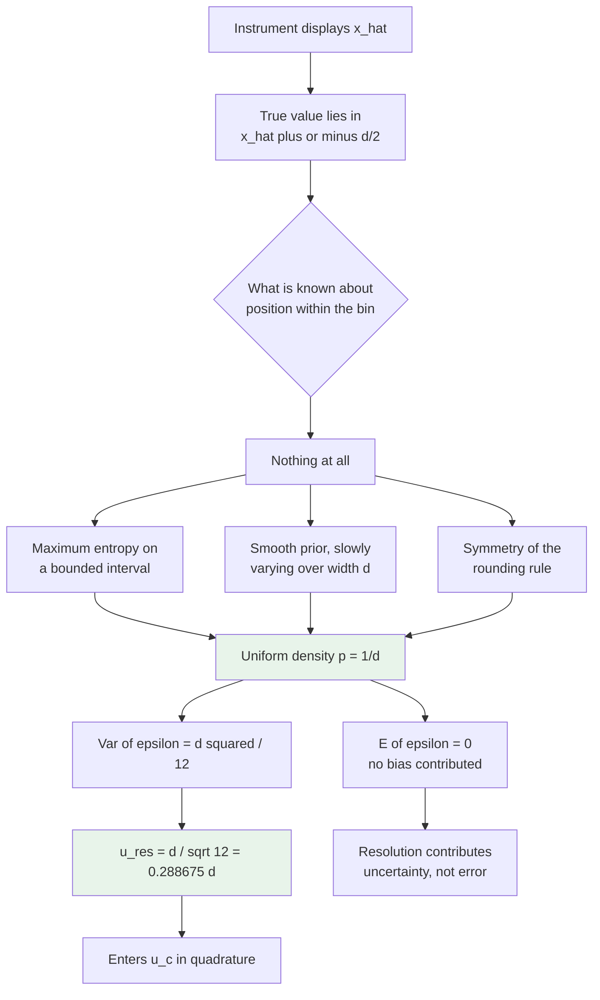

# Chapter 11. Calibration Algorithms

Each algorithm is documented with its inputs, outputs, validation, decision logic, mathematics, edge cases, failure handling, pseudocode, flow diagram and computational complexity.

## 11.1 ALG-01: Statistics from readings

**Location:** `CalSoft/utils.py`, `CalibrationCalculator.calculate_statistics`

### 11.1.1 Inputs and outputs

| | Name | Type | Constraint |
|---|---|---|---|
| In | `readings` | list of numbers or Decimals | may contain None |
| Out | dict | `{'mean': Decimal, 'std_dev': Decimal, 'count': int}` | or `None` |

### 11.1.2 Validation

None values are filtered before counting. If fewer than two values survive, the function returns `None` rather than raising. The caller is responsible for interpreting `None` correctly.

### 11.1.3 Pseudocode

```
function calculate_statistics(readings):
    values <- [Decimal(r) for r in readings if r is not None]
    n <- length(values)
    if n < 2:
        return None
    mean <- sum(values) / Decimal(n)
    ss <- sum((r - mean)^2 for r in values)
    variance <- ss / Decimal(n - 1)
    std_dev <- variance.sqrt()
    return {mean, std_dev, count: n}
```

### 11.1.4 Edge cases

| Case | Behaviour | Assessment |
|---|---|---|
| empty list | returns None | correct |
| one value | returns None | correct, s undefined at one degree of freedom |
| two identical values | mean = value, s = 0 | correct, see 4.10 |
| all values identical, n > 2 | s = 0 exactly | correct |
| values contain None | filtered out | correct |
| values are strings | `Decimal(str(r))` parses numeric strings | tolerant |
| values are unparseable strings | `InvalidOperation` propagates | caller must handle |
| n = 10, values span 15 significant digits | full precision preserved | Decimal, not float |

### 11.1.5 Complexity

Two passes over n values with n ≤ 10. Time O(n), space O(n). Negligible.

### 11.1.6 Flow

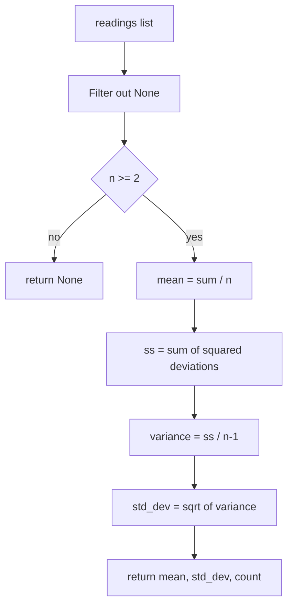

## 11.2 ALG-02: Full reading calculation

**Location:** `CalSoft/models.py`, `CalibrationReading.calculate_statistics`

This is the correct and complete implementation. Recall from section 6.10 that it currently has no caller.

### 11.2.1 Inputs

Implicit, from `self`: the ten reading columns, the parent session, the parameter, the optional sub-parameter, and the set value.

### 11.2.2 Outputs

Eight fields written to the database plus a boolean return value.

### 11.2.3 Pseudocode

```
method calculate_statistics(self):
    readings <- self.get_readings_list()          # drops nulls
    if length(readings) < 2:
        null out all derived fields
        passes_tolerance <- False
        save; return False

    try:
        stats <- CalibrationCalculator().calculate_statistics(readings)
        if stats is None:
            null out all derived fields; passes_tolerance <- False
            save; return False

        mean       <- quantize(stats.mean, 6dp, HALF_UP)
        std_dev    <- quantize(stats.std_dev, 6dp, HALF_UP)
        error      <- quantize(set_value.value - mean, 6dp, HALF_UP)

        resolution <- session.parameter_resolutions.get(parameter=self.parameter).resolution
        # raises SessionParameterResolution.DoesNotExist -> ValueError

        u_A   <- quantize(std_dev / sqrt(count), 6dp)
        u_res <- quantize(resolution / sqrt(12), 6dp)
        u_ref <- quantize(parameter.reference_uncertainty / parameter.coverage_factor, 6dp)
        u_c   <- quantize(sqrt(u_A^2 + u_res^2 + u_ref^2), 6dp)
        U     <- quantize(u_c * coverage_factor, 6dp)

        tolerance <- sub_parameter.tolerance if sub_parameter else parameter.tolerance
        if tolerance is None: raise ValueError

        passes_tolerance <- (abs(error) <= tolerance)
        save; return True

    except any Exception:
        log with traceback
        null out all derived fields; passes_tolerance <- False
        save; return False
```

### 11.2.4 Validation ordering and why it matters

The order is deliberate and correct:

1. Reading count is checked before any arithmetic, so a division by zero is impossible.
2. Statistics are computed before the resolution lookup, so a reading with no resolution row still records what it can before failing.
3. The tolerance lookup happens last, after every uncertainty has been computed, so a missing tolerance does not destroy the uncertainty budget in the successful branch.

### 11.2.5 Failure handling

Every failure path converges on the same terminal state: all derived fields NULL, `passes_tolerance = False`, row saved, `False` returned. This is a **fail closed** design and it is the correct choice for a safety relevant system. A reading that could not be evaluated must never present as passing.

The broad `except Exception` is justified here for the same reason: any unanticipated failure must land in the safe state rather than propagating and leaving a half computed row in the database. The handler logs with `exc_info=True`, so diagnosis is not sacrificed.

### 11.2.6 Rounding policy

Every stored value is quantised to six decimal places with `ROUND_HALF_UP`.

`ROUND_HALF_UP` rather than Python's default `ROUND_HALF_EVEN` is chosen because half up is what a technologist doing the arithmetic by hand would apply, and matching hand calculation is worth more here than the marginal statistical advantage of banker's rounding. The difference arises only on exact halves at the seventh decimal place, which is far below any meaningful measurement precision.

Rounding is applied **after** each computation and the rounded value feeds the next step. Rounding u_A, u_res and u_ref before squaring them introduces a relative error of order 10⁻⁶ divided by the component, which for a component of order 0.3 is about 3 parts per million. This is entirely negligible against measurement uncertainties of order 10⁻¹, and the benefit is that every intermediate value stored in the database is exactly the value that was used in the next step, so an auditor recomputing by hand from the stored numbers reproduces the stored result exactly. That reproducibility is worth more than the discarded precision.

### 11.2.7 Complexity

O(n) with n ≤ 10, plus one indexed database query for the resolution and one row update. Dominated entirely by database round trips.

## 11.3 ALG-03: Reading collection from the HTTP POST

**Location:** `CalSoft/view_modules/calibration.py`, `_process_readings`

### 11.3.1 Algorithm

```
function process_readings(request, session, procedure, equipment, schedule):
    parameters <- CalibrationParameter for procedure, ordered by order
    readings_data <- empty map

    # Phase 1: parse the flat POST dictionary into an addressed structure
    for each (key, value) in request.POST:
        if key starts with "reading_" and value is non blank:
            parts <- key.split("_")
            if length(parts) >= 5:
                (_, param_id, sub_id, setval_id, _) <- parts[0:5]
                addr <- param_id + "_" + sub_id + "_" + setval_id
                readings_data[addr].append(Decimal(value))
            # on parse failure: message an error and redirect out

    # Phase 2: iterate the procedure structure and create rows
    overall_pass <- True
    for each parameter:
        resolution <- Decimal(POST["resolution_" + parameter.id]) or 0.001 on failure
        create SessionParameterResolution(session, parameter, resolution)

        sub_parameters <- SubParameter for parameter, or [None] if none exist
        for each sub_param:
            set_values <- SetValue for parameter filtered by sub_param
            if none: set_values <- [synthetic object with id 'default', value 0]

            for each sv:
                addr <- parameter.id + "_" + (sub_param.id or 'null') + "_" + sv.id
                readings <- readings_data[addr] or empty
                if readings is empty:
                    overall_pass <- False
                    continue
                reading_row <- create CalibrationReading(...)
                for i, val in enumerate(readings[0 : parameter.num_readings]):
                    reading_row.set_reading(i+1, val)     # one SAVE per reading
                _calculate_stats(reading_row, resolution, parameter)
                if not reading_row.passes_tolerance:
                    overall_pass <- False

    session.overall_pass <- overall_pass; save
    if schedule: schedule.status <- 'pending_approval'; save
    store historical data
    write audit log
    redirect with result in the query string
```

### 11.3.2 Ordering dependency

`SessionParameterResolution` rows are created before `_calculate_stats` is called. This ordering is what would make the corrected implementation of section 6.10.4 work: the model method looks up its own resolution and the row is guaranteed to exist by then. The ordering must be preserved.

### 11.3.3 Edge cases and failure handling

| Case | Behaviour | Assessment |
|---|---|---|
| A reading key with fewer than five underscore fields | silently ignored | see 2.5, affects the no set value path |
| A reading value that will not parse as Decimal | error message, redirect to the pending list, **session already created** | orphan session left in `pending_review` with partial readings |
| Resolution missing or unparseable | silent substitution of 0.001 | serious, see 4.12 |
| More readings submitted than `num_readings` | truncated by the slice `readings[:parameter.num_readings]` | correct |
| Fewer readings submitted than `num_readings` | accepted, no server side check | client validator is the only guard |
| Parameter with sub-parameters but set values attached to none of them | empty queryset, `overall_pass = False` | fails safe |
| Parameter with no set values | synthetic default with an unmatchable address, no readings, `overall_pass = False` | fails safe but confusing |
| Duplicate reading addresses across parameters | impossible, UUIDs are unique | |
| `set_reading` raises | logged and the loop continues, leaving that column NULL | partial row silently accepted |

### 11.3.4 The orphan session problem

The session row is created before readings are parsed. If parsing fails midway the view redirects, leaving a `CalibrationSession` in `pending_review` with an incomplete set of readings and no indication that it is incomplete. It will appear in the reviewer's queue looking like a legitimate session.

The correct structure is to wrap the whole of `_handle_calibration_post` in `transaction.atomic()` so that a parse failure rolls back the session, its resolutions and its readings together. `django.db.transaction` is already imported in the module but is not used on this path. This is recorded in Chapter 17, section 17.14.5.

### 11.3.5 Complexity

Let P be the number of parameters, B the number of sub-parameters per parameter, V the number of set values per sub-parameter, and n the number of readings per point.

Time is O(P·B·V·n) for the arithmetic, which is trivially small. The dominant cost is database round trips:

| Operation | Count |
|---|---|
| Resolution rows created | P |
| Sub-parameter queries | P |
| Set value queries | P·B |
| Reading rows created | P·B·V |
| `set_reading` saves | P·B·V·n |
| `_calculate_stats` saves | P·B·V |
| Historical rows | up to P·B·V |

For a typical procedure with 3 parameters, 2 sub-parameters each, 3 set values each and 5 readings, that is 3 + 3 + 6 + 18 + 90 + 18 + 18 = **156 database round trips** for one submission.

The dominant term by a wide margin is the 90 saves from `set_reading`, which writes the entire row to the database once per individual reading. `CalibrationReading.set_reading` is:

```python
def set_reading(self, index, value):
    decimal_value = Decimal(str(value))
    setattr(self, f'reading_{index}', decimal_value)
    self.save()  # Important: Save after each update!
```

The comment asserts that the save is important. It is not: the caller in `_process_readings` proceeds directly to `_calculate_stats`, which saves again. Setting all n attributes and saving once at the end would reduce 90 queries to 18 with no change in the stored result. On a local SQLite deployment the cost is a few hundred milliseconds; on a networked PostgreSQL deployment with a one millisecond round trip it is closer to a second of pure latency. This is recorded as a performance improvement in Chapter 17.

## 11.4 ALG-04: Certificate number allocation, local path

**Location:** `CalSoft/models.py`, `CalibrationSession.generate_certificate_number`, and `calSchedules/grouping.py`, `next_certificate_number`

### 11.4.1 Split of responsibilities

The database read, which must be serialised, stays in the model. The parse and increment, which is pure, lives in `grouping` so that it can be unit tested with `SimpleTestCase` and no database. This separation is good design and the docstring explains it.

### 11.4.2 Algorithm

```
classmethod generate_certificate_number(cls):
    prefix <- "BNH-"
    with transaction.atomic():
        last <- (cls.objects
                    .select_for_update()
                    .filter(certificate_number__startswith=prefix)
                    .exclude(certificate_number__exact="")
                    .order_by("-certificate_number")
                    .values_list("certificate_number", flat=True)
                    .first())
        return next_certificate_number(last, prefix=prefix)

function next_certificate_number(last_cert, prefix="BNH-"):
    if last_cert:
        try:    last_seq <- int(last_cert.split("-")[-1])
        except: last_seq <- 0
    else:
        last_seq <- 0
    return prefix + format(last_seq + 1, "04d")
```

### 11.4.3 Concurrency analysis

`select_for_update()` takes a row level write lock inside an explicit transaction. A second worker attempting the same query blocks until the first transaction commits, at which point it reads the newly inserted row and computes the next value. The lock is therefore sufficient **provided** the caller writes and commits the new certificate number within the same transaction.

Examine the actual caller in `approve_calibration_session_ajax`:

```python
with transaction.atomic():
    locked_session = CalibrationSession.objects.select_for_update().get(pk=pk)
    ...
    certificate_number = CalibrationSession.generate_certificate_number()
    locked_session.certificate_number = certificate_number
    ...
    locked_session.save()
```

The outer `transaction.atomic()` encloses both the allocation and the save, and `generate_certificate_number`'s own `atomic()` becomes a savepoint rather than an independent transaction. The lock is held until the outer block commits. The allocation is therefore correctly serialised on this path.

### 11.4.4 Edge cases

| Case | Behaviour | Risk |
|---|---|---|
| No certificates exist | `last_cert` is None, returns BNH-0001 | none |
| Highest is BNH-0042 | returns BNH-0043 | none |
| A row has certificate_number NULL | excluded by the prefix filter | none |
| A row has certificate_number "" | excluded by the explicit exclude | none |
| A row is "BNH-ABC" | `int()` raises, caught, `last_seq = 0`, returns **BNH-0001** | **collision if BNH-0001 exists** |
| Sequence reaches 9999 | `format(10000, "04d")` gives "10000", a five digit number | see below |
| Certificates from HQ and local coexist | HQ reuses gaps, local does not | divergent sequences |

### 11.4.5 The lexicographic ordering defect

`order_by("-certificate_number")` sorts strings, not integers. For zero padded four digit sequences this coincides with numeric order, which is exactly why the padding exists. It stops coinciding the moment a five digit suffix appears:

```
String descending order after 9999 is exceeded:

    BNH-9999      ← selected as "highest"
    BNH-10000     ← actually higher, but sorts below
    BNH-0001

Because "9" > "1" at the fifth character position.
```

Once BNH-10000 exists, the query returns BNH-9999 and the allocator produces BNH-10000 again. The `unique=True` constraint on `certificate_number` then raises `IntegrityError`, the transaction rolls back, and approval fails with a 500 response. The system stops issuing certificates entirely.

The failure is loud rather than silent, which is the better failure mode, but it is a hard stop at exactly 9999 certificates. At a plausible rate of a few thousand calibrations per year this is a two to four year time bomb.

The remedy is to sort by the parsed integer rather than the string. The pattern already exists elsewhere in the codebase: `certificates.py` uses `Cast(Substr("certificate_number", 5), output_field=IntegerField())` for exactly this purpose in its list ordering. The same expression should be used in the allocator.

### 11.4.6 The unparseable suffix defect

If any row's certificate number has a non numeric suffix, and that row happens to sort highest, the allocator silently resets to sequence 1. If BNH-0001 already exists the unique constraint raises. If it does not, for instance after a gap creating deletion, a duplicate logical number is issued in a different format. The `except ValueError: last_seq = 0` clause converts a data integrity problem into a silent sequence reset. Raising would be safer.

## 11.5 ALG-05: Certificate number allocation, HQ path

**Location:** `hq_server/certificate_normalizer.py`, `CertificateNumberNormalizer.get_next_number`

### 11.5.1 Algorithm

```
method get_next_number(reuse_gaps=True):
    cur <- cursor
    acquire pg_advisory_xact_lock(...)          # blocks all other allocators
    existing, max_seq <- fetch all allocated sequence numbers and the maximum
    if reuse_gaps:
        for i in 1 .. max_seq:
            if i not in existing:
                return (i, prefix + format(i, "04d"), True)      # gap reuse
    return (max_seq + 1, prefix + format(max_seq+1, "04d"), False)
```

### 11.5.2 Why an advisory lock rather than `SELECT ... FOR UPDATE`

A row lock can only be taken on a row that exists. The quantity being protected here is the *absence* of a row: two workers must not both conclude that BNH-0043 is free. `SELECT ... FOR UPDATE` on the current maximum protects that row but not the gap. A transaction scoped advisory lock, `pg_advisory_xact_lock`, is a lock on an abstract identifier rather than on data, and it is released automatically when the transaction ends, including on rollback. It is the correct primitive for serialising an allocation decision.

### 11.5.3 Gap reuse and its consequences

The HQ allocator scans for gaps and fills them before extending the sequence. Its purpose is to keep the certificate register dense, which auditors prefer because a gap invites the question "what happened to BNH-0037".

Gaps arise when a session is deleted after approval, when a number is allocated and the transaction later rolls back for an unrelated reason, or when records are migrated.

The consequence to understand is that **certificate numbers are not monotonic in time under gap reuse**. A certificate issued today may carry a lower number than one issued last week. Any code or report that infers chronology from a certificate number is wrong. `certificates.py` sorts by `cert_numeric` descending as its primary ordering, which under gap reuse is not a chronological ordering. It falls back to `-timestamp`, so the display is reasonable, but the primary key of the sort is not time.

### 11.5.4 Divergence between the two allocators

| | Local `next_certificate_number` | HQ `get_next_number` |
|---|---|---|
| Serialisation | `select_for_update` on the max row | `pg_advisory_xact_lock` |
| Gap reuse | no | yes, by default |
| Reads | one row, the string maximum | all allocated numbers |
| Ordering defect above 9999 | yes | no, works on parsed integers |
| Unparseable suffix | resets to 1 | not applicable, parses the set |

The two produce different numbers from the same database state whenever a gap exists. The system's design intent is that HQ is the authority and the local allocator is used only when HQ is reachable, in which case, examining `approve_calibration_session_ajax`, the local allocator is what actually runs. The HQ allocator serves the offline queue. Two different allocators are therefore in use against what is intended to be one sequence. This is a real inconsistency and is recorded in Chapter 17.

## 11.6 ALG-06: Approval with online and offline branches

**Location:** `CalSoft/view_modules/pending_sessions.py`, `approve_calibration_session_ajax`

### 11.6.1 Algorithm

```
POST approve(pk):
    session <- get_object_or_404(CalibrationSession, pk=pk, status='pending_review')

    with transaction.atomic():
        locked <- CalibrationSession.select_for_update().get(pk=pk)
        if locked.status != 'pending_review':
            return 400 with the current status        # double click guard

        now <- timezone.now()

        if is_hq_online():                            # GET /api/sync/health, 5s timeout
            cert <- CalibrationSession.generate_certificate_number()
            if not cert: raise
            locked.certificate_number <- cert
            locked.status <- 'approved'
            locked.approved_by <- request.user
            locked.approved_at <- now
            locked.save()
            mark_schedule(locked.schedule, 'completed', now)
            PendingCertificate.filter(session=locked, sync_status='pending')
                              .update(sync_status='completed', processed_at=now)
            return 200 {mode: 'online', certificate_number: cert}
        else:
            locked.status <- 'approved_pending_certificate'
            locked.approved_by <- request.user
            locked.approved_at <- now
            locked.certificate_number <- None
            locked.save()
            machine_id <- "mac-" + sha1(mac_address).hexdigest()[:12]
            PendingCertificate.create(session=locked, machine_id=machine_id,
                                      sync_status='pending')
            mark_schedule(locked.schedule, 'pushed', now)
            return 200 {mode: 'offline', certificate_number: None}
```

### 11.6.2 The double approval guard

Two guards operate in series. The `get_object_or_404(..., status="pending_review")` filter rejects an already approved session with a 404. Inside the transaction, `select_for_update()` re-reads the row under a write lock and the status is checked a second time. The second check is the one that matters: it closes the window between the unlocked read and the locked read in which a concurrent request could have approved the session. This is a correctly implemented check then act pattern.

### 11.6.3 The health probe

```python
response = requests.get(f"{sync_url}/api/sync/health", timeout=5)
return response.status_code == 200
```

Three observations.

The probe is synchronous and blocks the request thread for up to five seconds. Approving twenty sessions with HQ unreachable costs the reviewer one hundred seconds of waiting, and each of those probes holds a database row lock while it waits.

The bare `except:` catches everything including `KeyboardInterrupt` and `SystemExit`. A narrower `except requests.RequestException` would be correct.

The probe result is not cached. Each approval pays the full cost.

The design intent is nevertheless sound: an unreachable HQ means the local allocator cannot be trusted to produce a globally unique number, so the system declines to invent one. That is exactly the right instinct.

### 11.6.4 Machine identification

```python
mac_int = uuid.getnode()
mac_hex = ":".join(f"{(mac_int >> ele) & 0xff:02x}" for ele in range(40, -1, -8))
mac_hash = hashlib.sha1(mac_hex.encode()).hexdigest()[:12]
return f"mac-{mac_hash}"
```

`uuid.getnode()` returns the hardware MAC address when it can be determined and a random 48 bit value with the multicast bit set when it cannot. The random fallback is stable only for the lifetime of the process, so a machine with no readable MAC produces a different identifier on each restart, and its queued certificates appear to come from different machines. The identifier is used for diagnostics and for conflict attribution rather than for authorisation, so the consequence is confusion rather than a security issue.

The SHA-1 hash provides no security benefit here, since a MAC address is not a secret and the input space is small enough to be exhaustively searched. It does provide a fixed length identifier and it avoids putting a raw MAC address in the database, which is a mild privacy improvement.

## 11.7 ALG-07: Drift analysis

**Location:** `CalSoft/utils.py`, `DriftAnalyzer`

### 11.7.1 Algorithm

```
static analyze_drift(device_serial, current_date=None):
    rows <- HistoricalCalibration.filter(device_serial=..., calibration_date <= current_date)
                                 .order_by(parameter_name, set_value, calibration_date)
    if none: return None
    for each distinct parameter_name:
        for each distinct set_value within that parameter:
            series <- rows for (parameter, set_value) ordered by date
            if count(series) > 1:
                results[parameter][float(set_value)] <- _calculate_drift_metrics(series)
    return results

static _calculate_drift_metrics(readings):
    dates, errors, uncertainties <- extracted from readings
    days <- [(d - dates[0]).days for d in dates]
    slope, intercept <- least squares fit of errors against days   # ALG in 3.7
    total_drift <- errors[-1] - errors[0]
    average_drift_rate <- total_drift / max(days[-1], 1)
    yearly <- abs(slope * 365)
    stability <- 'Excellent' if yearly < 0.1
              else 'Good'    if yearly < 0.5
              else 'Fair'    if yearly < 1.0
              else 'Poor'
    compare mean uncertainty of the first half against the second half:
        'increasing' if second > 1.2 * first
        'decreasing' if second < 0.8 * first
        else 'stable'
    return the metrics dictionary
```

### 11.7.2 The two drift estimates

The function reports both a regression slope and a simple endpoint difference divided by elapsed time. They answer different questions and can disagree substantially.

The regression slope uses every point and is robust to noise in any single calibration. It is the better estimate.

The endpoint rate uses only the first and last points. It is exact if the drift is perfectly linear and is badly misled by a single anomalous endpoint. It is retained because it is easy to explain to a non specialist.

**Worked comparison.** Four calibrations of one instrument at one set value:

| Date | Days elapsed | Error (mmHg) |
|---|---|---|
| 2023-01-15 | 0 | +0.5 |
| 2024-01-20 | 370 | +0.9 |
| 2025-01-18 | 734 | +1.2 |
| 2026-01-22 | 1103 | +1.8 |

Sums: Σx = 2207, Σy = 4.4, Σxy = 0.5(0) + 0.9(370) + 1.2(734) + 1.8(1103) = 0 + 333 + 880.8 + 1985.4 = 3199.2, Σx² = 0 + 136900 + 538756 + 1216609 = 1892265.

$$a = \frac{4(3199.2) - (2207)(4.4)}{4(1892265) - (2207)^2} = \frac{12796.8 - 9710.8}{7569060 - 4870849} = \frac{3086.0}{2698211} = 0.0011437\ \text{mmHg/day}$$

$$b = \frac{4.4 - 0.0011437(2207)}{4} = \frac{4.4 - 2.52411}{4} = 0.46897\ \text{mmHg}$$

Yearly drift rate: 0.0011437 × 365 = **0.417 mmHg per year**, classified **Good** since 0.1 ≤ 0.417 < 0.5.

Endpoint rate: (1.8 − 0.5)/1103 = 0.0011786 mmHg/day, or 0.430 per year. The two agree closely here because the drift is nearly linear.

Drift equation as the code formats it: `Error = 0.001144 × Days + 0.468970`.

### 11.7.3 Projecting time to tolerance

The most useful thing the drift model supports, and which the module does not currently expose, is the projection of when the instrument will exceed tolerance.

$$t_{limit} = \frac{T - e_{current}}{|a|}$$

For the example, with T = 3 mmHg and a current error of 1.8:

$$t_{limit} = \frac{3 - 1.8}{0.0011437} = 1049\ \text{days} \approx 2.9\ \text{years}$$

A twelve month interval therefore carries substantial margin, and this instrument is a candidate for interval extension. Chapter 12, section 12.5 discusses why the system does not act on this.

### 11.7.4 Edge cases

| Case | Behaviour |
|---|---|
| No history at all | returns None |
| One calibration only | that set value is skipped, since `count() > 1` is required |
| All calibrations on the same day | `days_elapsed` all zero, denominator zero, slope forced to 0 with intercept as the mean |
| `total_time_days` zero | replaced by 1 to avoid division by zero |
| Fewer than two uncertainties | trend reported as 'stable' |
| Parameter renamed between calibrations | series splits into two, drift is lost |
| Set value changed between procedure revisions | series splits, drift is lost |

### 11.7.5 The stability thresholds are dimensional

```python
if yearly_drift < 0.1:   stability = 'Excellent'
elif yearly_drift < 0.5: stability = 'Good'
elif yearly_drift < 1.0: stability = 'Fair'
else:                    stability = 'Poor'
```

The thresholds 0.1, 0.5 and 1.0 are compared against a drift rate carrying the unit of the parameter per year. A drift of 0.4 mmHg per year on a blood pressure monitor with a 3 mmHg tolerance is genuinely good. A drift of 0.4 volts per year on a multimeter with a 0.001 volt tolerance is catastrophic. Both are classified 'Good'.

The classification should be dimensionless, that is, relative to the tolerance:

$$\text{relative yearly drift} = \frac{|a| \times 365}{T}$$

with thresholds expressed as fractions of tolerance consumed per year. For the worked example this gives 0.417/3 = 0.139, meaning the instrument consumes about 14 percent of its tolerance band per year, which is a directly actionable number. This is recorded in Chapter 17.

### 11.7.6 Complexity

Two nested `.distinct()` queries over the history plus one filtered query per (parameter, set value) pair. For a device with P parameters and V set values this is O(P·V) queries, an N plus one query pattern. With ten parameters and five set values that is fifty queries per drift analysis. Acceptable for an on demand certificate, poor for a dashboard listing many devices.

### 11.7.7 Divergence: the caller expects a different shape

`analyze_drift` returns a nested dictionary keyed by parameter name and then by set value. `view_modules/sessions.py` consumes it as:

```python
drift_data.get('trend', 'No significant drift detected')
drift_data.get('recommendation', 'No action required')
drift_data.get('parameter_drifts', [])
```

None of those keys exists in the returned structure. Every `get` falls back to its default, so the session detail page always displays "No significant drift detected" and an empty parameter list, regardless of the actual drift. The failure is silent because `.get` with a default never raises.

## 11.8 ALG-08: Reading quality validation

**Location:** `CalSoft/utils.py`, `QualityAssurance.validate_readings`

### 11.8.1 Checks performed

| Check | Rule | Rationale |
|---|---|---|
| Sufficiency | `len(readings) >= parameter.num_readings` | the declared number must be present |
| Outliers | modified Z score, threshold 3.5 | see 3.8 |
| Excessive variation | `std_dev > tolerance * 0.1` | s should be well under the tolerance |
| Monotonic trend | all increasing or all decreasing over 5 or more readings | detects warm up drift |

### 11.8.2 The variation check

The rule that s should not exceed one tenth of the tolerance is a rule of thumb with a defensible basis. If s = T/10, then for n = 5 the Type A component alone is T/(10√5) = 0.045T, and the expanded uncertainty from that component alone is 0.089T, giving a TUR contribution of about 11:1 from repeatability. Once s exceeds T/10 the repeatability begins to erode the 4:1 target once the other components are included.

For Dataset A: s = 0.547723, T/10 = 0.3. The check **fires** and reports "High variation in readings, check measurement conditions". This is a correct and useful warning: 0.55 mmHg of scatter against a 3 mmHg tolerance is enough to be worth investigating, even though the point passes.

### 11.8.3 The monotonic trend check

A strictly increasing or strictly decreasing sequence of five or more readings is unlikely under pure random scatter. The probability that five independent identically distributed continuous readings arrive in sorted order is 2/5! = 2/120 = 1.67 percent for either direction combined. A sequence that does so almost certainly indicates a systematic effect: an instrument still warming up, a pressure source still settling, a thermal transient in the reference, or an operator unconsciously adjusting.

The physical remedy is to allow the system to stabilise before recording, and to record readings in a non systematic order where the procedure permits.

Note that the check uses `<=` and `>=`, so a sequence of identical readings satisfies both conditions and triggers the warning. For a coarse resolution instrument this produces a false alarm on every point where all readings are identical, which section 4.10 shows is common. A stricter test using `<` and `>` would avoid this.

### 11.8.4 Divergence: the sub-parameter is passed where a parameter is expected

`api_validate_readings` calls

```python
issues = QualityAssurance.validate_readings(readings, sub_parameter if sub_parameter else parameter)
```

`validate_readings` accesses `parameter.num_readings` and `parameter.tolerance`. `SubParameter` has `tolerance` but not `num_readings`, so passing a sub-parameter raises `AttributeError` at the first check. The exception is caught by the endpoint's own `except Exception` and returned as a 400 with the error string. The validation endpoint is therefore non functional for any parameter that has sub-parameters.

## 11.9 ALG-09: Group aware schedule advance

**Location:** `calSchedules/tasks/advance.py`, `auto_advance_completed_calibrations`

### 11.9.1 The problem it solves

Equipment is calibrated in groups, either all equipment in one department or all equipment of one description. The value of the grouping is logistical: the technologist visits a ward once and calibrates everything there, or sets up one reference rig and runs every device of one type through it.

If each item advanced independently by twelve months from its own completion date, the group would disperse. An item calibrated on 3 March advances to March; one calibrated on 28 April advances to April. Within two or three cycles the group is smeared across the calendar and the logistical benefit is gone.

### 11.9.2 Algorithm

```
for each completed schedule, grouped so each group is processed once:
    group_key <- (canonical planning logic, group id, scheduled month)
    if group_key already processed: continue

    status <- check_group_completion_status(equipment, month, logic)
        # falls back to _basic_group_completion_check on any exception
    if not status.all_completed:
        record as waiting; continue

    next_month <- get_next_group_month(equipment, month, period, logic)
        # falls back to month + relativedelta(months=period)

    with transaction.atomic():
        for each member of the group:
            if a schedule already exists for (member.equipment, next_month):
                skip
            else:
                create CalibrationSchedule(
                    equipment=member.equipment, scheduled_month=next_month,
                    status='pending', calibration_period=period,
                    planning_logic=member.planning_logic or logic,
                    generation_source='auto_advance', workshop=member.workshop)
                if member is not locked: lock it
```

### 11.9.3 The completion criterion

```python
def completion_stats(total, completed):
    return {
        "total": total,
        "completed": completed,
        "all_completed": total > 0 and total == completed,
    }
```

The `total > 0` term is essential: without it an empty group would report `all_completed = True` and the advance would fire on nothing, or worse, on a group whose members were all filtered out by an active status flag.

### 11.9.4 The far future clamp

```python
def clamp_far_future_month(next_month, today, period, slack_months=6):
    max_future = today + relativedelta(months=period + slack_months)
    if next_month > max_future:
        return today.replace(day=1) + relativedelta(months=period)
    return next_month
```

The guard exists because the next month is computed from a base month that may be stale. If a schedule sat at status completed for two years without being advanced, adding a twelve month period to its own scheduled month produces a date still in the past or absurdly misaligned. The clamp detects a target more than period plus six months ahead of today and rebases on today instead.

**Worked example.** Today is 2026-08-01, period is 12 months, slack is 6.

$$\text{max future} = \text{2026-08-01} + 18\text{ months} = \text{2028-02-01}$$

A stale schedule from 2023-03-01 advanced by 12 months gives 2024-03-01, which is not greater than the maximum, so it is **not** clamped and the group is scheduled into the past. The clamp only catches dates too far in the future, not dates in the past. A separate past date guard would be needed for the stale case, and none exists. This asymmetry is worth noting: the clamp protects against one failure mode and not its mirror image.

### 11.9.5 Idempotence

The algorithm is idempotent by virtue of the existence check before each create. Running it twice produces the same set of schedules. This matters because it is a Celery task and Celery delivers at least once, not exactly once, so redelivery must be harmless.

### 11.9.6 Complexity

O(G) group completion queries where G is the number of distinct groups with completed schedules, plus O(M) existence checks and creates where M is the total membership of the advancing groups. Each is an indexed query. The `processed_groups` set prevents the same group being evaluated once per completed member, which would otherwise make this O(M²) in the worst case.

## 11.10 ALG-10: Failure statistics for the certificate

**Location:** `CalSoft/pdf_generators/results.py`, `calculate_failure_statistics`

### 11.10.1 Algorithm

```
for each reading in the session:
    if the reading has a passes_tolerance attribute: use it
    elif error and parameter are present: recompute abs(error) <= tolerance
    else: assume it passes
    accumulate per parameter totals and failures

overall_failure_rate <- failed / total
failed_parameters <- [p for p in parameters if p.failure_rate >= 0.40]
is_failed_report   <- overall_failure_rate >= 0.40
```

### 11.10.2 The 40 percent threshold

A session in which two fifths or more of the measured points fail is rendered as a failure report rather than as a certificate with some failures. The threshold is a judgement about what a document means: an instrument failing one point in ten has a specific defect worth documenting on an otherwise normal certificate, while one failing four points in ten is broadly out of specification and the document should say so prominently.

Per parameter, the same threshold identifies which parameters to name in the failure analysis table, and recommendations escalate at 60 and 80 percent:

| Parameter failure rate | Recommendation printed |
|---|---|
| 0.40 to 0.60 | Minor issue, monitor closely |
| 0.60 to 0.80 | Major issue, service needed |
| 0.80 and above | Critical, immediate repair required |

### 11.10.3 The hasattr defect

```python
if hasattr(reading, 'passes_tolerance'):
    passes_tolerance = reading.passes_tolerance
elif reading.error and reading.parameter:
    ... recompute ...
```

`passes_tolerance` is a Django model field, so `hasattr` returns `True` unconditionally for every `CalibrationReading` instance. The recomputation branch is unreachable. The intent was evidently to handle a reading whose verdict had not been computed, and the correct test is `if reading.passes_tolerance is not None`, which requires the field to be nullable rather than defaulting to `False`.

Combined with the finding of section 6.10, the effect is that every reading reports `passes_tolerance = False`, the failure rate is 100 percent for every session, and every certificate is rendered as a failure report.

### 11.10.4 The falsy error trap

The recomputation branch, were it reachable, contains a second defect: `elif reading.error and reading.parameter` treats an error of exactly zero as absent, because `Decimal('0')` is falsy in Python. A perfect measurement would take the `else` branch and default to passing, which happens to be the right answer for the wrong reason. The correct test is `is not None`.

## 11.11 Algorithm inventory

| ID | Algorithm | Location | Complexity | Status |
|---|---|---|---|---|
| ALG-01 | Statistics from readings | `utils.py` | O(n) | correct |
| ALG-02 | Full reading calculation | `models.py` | O(n) plus 2 queries | correct but uncalled |
| ALG-03 | POST reading collection | `view_modules/calibration.py` | O(P·B·V·n) queries | works, defects noted |
| ALG-04 | Certificate number, local | `models.py` and `grouping.py` | O(1) locked query | defective above 9999 |
| ALG-05 | Certificate number, HQ | `hq_server/certificate_normalizer.py` | O(N) under advisory lock | correct |
| ALG-06 | Approval with online and offline branches | `pending_sessions.py` | O(1) plus a 5 s probe | correct |
| ALG-07 | Drift analysis | `utils.py` | O(P·V) queries | correct, caller mismatched |
| ALG-08 | Reading quality validation | `utils.py` | O(n log n) | correct, one caller defective |
| ALG-09 | Group aware advance | `tasks/advance.py` | O(G + M) | correct |
| ALG-10 | Failure statistics | `pdf_generators/results.py` | O(R) | defective, see 11.10.3 |
| ALG-11 | Least squares fit | `utils.py` | O(n) | correct, call sites defective |
| ALG-12 | Environmental validation | `utils.py` | O(1) | correct |

# Chapter 12. Business Logic

Every rule in this chapter is stated, located in the code, and justified. Where a rule is intended but not enforced, that is stated explicitly.

## 12.1 Equipment eligibility

**Rule.** Equipment may be calibrated when it is active and a calibration procedure can be determined for it.

**Procedure resolution order** in `_handle_calibration_post`:

1. An explicit `procedure` in the POST, filtered on `active_status=True`.
2. The procedure attached to the selected `CalibrationSchedule`.
3. The `EquipmentCalibrationProcedure` mapping flagged `is_default=True` for that equipment.
4. Failure: "No calibration procedure found for this equipment", redirect.

**Why the order.** An explicit choice by the technologist wins because there are legitimate reasons to deviate, for example calibrating a device against a more demanding procedure after a repair. The schedule's procedure is next because it represents the plan. The default mapping is the fallback. Refusing outright rather than guessing is correct: a calibration performed against an arbitrary procedure is worthless.

**Not enforced.** Equipment `active_status` is not checked on the calibration path. A decommissioned device can be calibrated. The scheduler filters on it, so a decommissioned device will not be scheduled, but the manual path does not.

## 12.2 Procedure recommendation

**Rule.** Procedures previously used in approved sessions on equipment of the same description are presented as recommended.

```python
sessions_with_same_description = CalibrationSession.objects.filter(
    device_description=selected_equipment.description, status='approved'
).values_list('procedure_id', flat=True).distinct()
```

**Why.** The association between an equipment class and its procedure is knowledge held by the laboratory, and the record of what was actually approved is a more reliable expression of that knowledge than a mapping table that somebody has to remember to maintain. Filtering on `status='approved'` is the key detail: a procedure used in a session that was rejected is not endorsed by this mechanism.

## 12.3 Reference standard validation

**Rule as implemented.** None.

The system does not verify at calibration time that:

| Check | Implemented |
|---|---|
| The named standard exists in the `Standard` table | no, only at display time in `get_standards_used` |
| The standard's `calibration_due_date` has not passed | **no** |
| The standard covers the parameter being measured | no |
| The standard's uncertainty is adequate for the tolerance | no |
| The standard is not itself out of service | no |

The absence of the due date check is the most significant compliance gap in the module. ISO/IEC 17025 clause 6.4 requires that equipment used for measurements be calibrated and that its calibration status be verifiable. A calibration performed against an expired reference standard is not traceable, and every certificate issued from it is void.

**The data to perform the check is present.** `Standard.calibration_due_date` is a populated `DateField`. `CalibrationParameter.standard_reference` names the standard. The check is a single query and a comparison:

```python
def validate_reference_standards(procedure, on_date):
    """Return a list of blocking problems with the procedure's reference standards."""
    problems = []
    for param in procedure.parameters.all():
        if not param.standard_reference:
            problems.append(f"{param.name}: no reference standard declared")
            continue
        try:
            std = Standard.objects.get(serial_number=param.standard_reference)
        except Standard.DoesNotExist:
            problems.append(f"{param.name}: standard {param.standard_reference} not found")
            continue
        if std.calibration_due_date < on_date:
            problems.append(
                f"{param.name}: standard {std.serial_number} expired on {std.calibration_due_date}"
            )
    return problems
```

This is recorded as the second highest priority remediation in Chapter 17.

## 12.4 Certificate numbering

**Rule.** A certificate number is minted exactly once, at the moment of approval, and only when the authority is reachable.

| Property | Enforcement |
|---|---|
| Format `BNH-nnnn` | `f"{prefix}{seq:04d}"` |
| Uniqueness | `unique=True` on the model field plus a serialised allocator |
| Never reused within a site | monotonic locally, gap filling at HQ |
| Never issued before approval | allocation happens inside the approval transaction |
| Never issued while offline | the offline branch sets it to None explicitly |
| Never issued for a rejected session | the rejected document uses a `DECLINED-` reference |

**Why offline approval withholds the number.** Two isolated sites, both approving sessions, would both allocate BNH-0043 from their own local maximum. On reconnection one of them must be renumbered, which means a certificate already printed, signed and filed carries a number that no longer identifies it. Withholding the number until the authority can be consulted trades a delay for correctness, which is the right trade for a document of record.

## 12.5 Calibration interval

**Rule.** The interval is 6 or 12 months, chosen from a fixed set on `CalibrationSchedule.calibration_period`, defaulting to 12.

There is no risk based interval determination, no shortening after a failure, and no lengthening after a run of comfortable passes.

`MetrologyUtils.estimate_calibration_interval` implements a drift based estimator:

```python
z_score = 1.96 if target_probability == 0.95 else 2.58
allowable_drift = float(tolerance) / z_score
optimal_interval_days = allowable_drift / abs(drift_rate)
optimal_interval_days = max(30, min(1095, optimal_interval_days))
```

It has no caller.

**Worked example using the drift figures of 11.7.2.** Drift rate 0.0011437 mmHg/day, tolerance 3 mmHg, target 95 percent:

$$\text{allowable drift} = \frac{3}{1.96} = 1.5306\ \text{mmHg}$$

$$\text{interval} = \frac{1.5306}{0.0011437} = 1338\ \text{days}$$

clamped to the maximum of 1095 days, which is three years.

**Assessment of the estimator.** The division of the tolerance by 1.96 is intended to leave headroom, and the intent is sound, but the reasoning is muddled: 1.96 is a coverage factor for a normal distribution, and drift is being treated as a deterministic linear trend, so the factor does not have the meaning the code implies. A defensible formulation would project the time at which the drift, plus the current error, plus a coverage interval on the measurement uncertainty, reaches the tolerance:

$$t_{limit} = \frac{T - |e_{current}| - U}{|a|}$$

For the example: (3 − 1.8 − 0.907)/0.0011437 = 256 days. That is a materially different and considerably more conservative answer, and it is the one an assessor would expect, because it accounts for where the instrument already sits and for how well the drift itself is known.

The clamp to [30, 1095] days is sensible regardless of the formula: no laboratory wants an interval shorter than a month or longer than three years produced by an automatic calculation.

**Why the fixed 6 or 12 month choice is defensible for now.** A fixed interval regime is simple, auditable, and aligned with how clinical engineering departments actually plan work. Moving to risk based intervals requires a validated drift model per equipment class, several calibration cycles of data to fit it, and a documented policy for acting on it. The historical data required is being collected, or would be if the defect of section 6.10 were fixed. The infrastructure is present and the policy is not.

## 12.6 Certificate due date

Three different calculations of the same quantity exist in the codebase.

| Location | Calculation | Result for a calibration on 2026-08-01 |
|---|---|---|
| `pdf_generators/sections.py` | `timestamp + timedelta(days=365)`, then the last day of that month | 2027-07-31 |
| `view_modules/certificates.py` | `timestamp.date() + relativedelta(months=12)` | 2027-08-01 |
| `calSchedules` `due_date` property | last day of `scheduled_month` | depends on the plan, not on the event |

The first two differ by one day in a common year and by two days when a leap day intervenes, because 365 days is not the same as twelve calendar months. The third is a different quantity entirely: it is when the calibration was *planned* for, not when the next one is due.

The figure printed on the certificate is the first. The figure shown in the certificate list, and used to compute the overdue and due soon counts, is the second. A user comparing the two will find them inconsistent.

**Recommendation.** Adopt `relativedelta(months=period)` everywhere, taken from the schedule's own `calibration_period` rather than hard coded to twelve, and compute it once in a shared helper. The hard coded twelve is itself a defect for equipment on a six month interval, whose certificate will state a due date twelve months out regardless.

## 12.7 Approval and review workflow

**Rule.** A session must be approved by a user before a certificate exists.

| Control | Implemented |
|---|---|
| Only `pending_review` sessions may be approved | yes, doubly checked |
| Approval is recorded with user and timestamp | yes, on the session |
| Concurrent approval is prevented | yes, `select_for_update` |
| The approver must differ from the performer | **no** |
| The approver must hold a specific permission | **no** |
| The approval is written to the audit log | **no** |

The model declares a custom permission:

```python
class Meta:
    permissions = [("approve_session", "Can approve calibration sessions")]
```

but `approve_calibration_session_ajax` is decorated only with `@login_required`. The permission is defined and never checked. Any authenticated user can approve any session, including their own.

**Why segregation of duties matters here.** The reviewer's role is to catch what the performer cannot see: a procedure not followed, an environmental excursion, a data pattern indicating an unstable measurement. A performer reviewing their own work provides none of that. ISO/IEC 17025 clause 6.2 requires competence and clause 7.8 requires authorised release of results.

**Remedy.** Two lines:

```python
@login_required
@permission_required('CalSoft.approve_session', raise_exception=True)
def approve_calibration_session_ajax(request, pk):
    ...
    if locked_session.performed_by_id == request.user.id:
        return JsonResponse({"success": False,
                             "error": "A session cannot be approved by the person who performed it"},
                            status=403)
```

Recorded in Chapter 17, section 17.14.3.

## 12.8 Rejection workflow

**Rule.** A rejected session records a reason from a fixed vocabulary, free text comments, the rejecting user and the timestamp, and returns its schedule to `pending`.

The fixed vocabulary is deliberate:

| Code | Label | What it tells the analyst |
|---|---|---|
| `data_quality` | Data Quality Issues | the numbers are wrong or implausible |
| `procedure_not_followed` | Procedure Not Followed | a training or compliance matter |
| `equipment_error` | Equipment Error | the UUT or the standard misbehaved |
| `environmental_conditions` | Environmental Conditions | the laboratory environment was out of specification |
| `other` | Other | requires the comment field to be meaningful |

A free text only field would be unanalysable. With a coded reason, the laboratory can count how many rejections in a quarter were procedural and act on the answer.

## 12.9 Restoration of a rejected session

**Rule.** A rejected session may be restored to `pending_review` only after three days have elapsed since rejection.

```python
three_days_ago = timezone.now() - timedelta(days=3)
if session.rejected_at > three_days_ago:
    days_remaining = (session.rejected_at + timedelta(days=3) - timezone.now()).days
    return JsonResponse({"success": False,
                         "error": f"Cannot restore yet. {days_remaining} day(s) remaining."}, status=400)
```

**Why a cooling off period.** Without it, reject and restore becomes a way of clearing a review queue without doing the review, and the rejection leaves no lasting trace. Three days is long enough that the rejection appears in the declined tab through a full working cycle and is noticed.

**What restoration clears.** `rejection_reason`, `rejection_comments`, `rejected_by`, `rejected_at`, `approved_by` and `approved_at` are all set to None. The rejection is erased rather than superseded. Since no audit log row was written for the rejection either, a restored session carries no evidence that it was ever rejected. This is a genuine audit trail gap and is the reason the audit logging recommendation in Chapter 17 matters.

## 12.10 Access control

Two roles are recognised, resolved from `request.user.userprofile.role`.

| Role | Scope of visible certificates |
|---|---|
| `Tech` in a `calibration_center` workshop | all sessions and all equipment |
| `Tech` in a `maintenance` workshop | sessions whose `device_serial` belongs to equipment in departments of that workshop |
| `NIC` | sessions whose `device_serial` belongs to equipment in that user's department |
| anything else | 403 |

**Failure modes are all closed.** A Tech with no workshop, a NIC with no department, an unrecognised workshop category and an unrecognised role each produce an explicit `HttpResponseForbidden` rather than a permissive default. The `except AttributeError` branch for a missing user profile likewise denies. This is correct design.

**Note.** Access is scoped by `device_serial` string matching rather than by a foreign key join. A session whose equipment record has been deleted becomes invisible to maintenance Techs and to NICs, and visible only to calibration centre Techs. That is an acceptable, arguably desirable, behaviour.

## 12.11 Group scheduling

**Rule.** Equipment is scheduled in groups, and a group advances only when every member has completed.

The grouping key is chosen by `planning_logic`, which exists in two vocabularies that historically did not reconcile:

| Stored value | Canonical form | Groups by |
|---|---|---|
| `date_based` | `department` | `equipment.department_id` |
| `department` | `department` | `equipment.department_id` |
| `description_based` | `description` | `equipment.description_id` |
| `description` | `description` | `equipment.description_id` |

`grouping.canonical_logic` collapses the two vocabularies. The docstring records why this matters: a schedule reorganised "by department" was stored as `date_based`, and the runtime cycle then regrouped it by *description* because it did not recognise the alias. Two subsystems disagreed about which group a schedule belonged to. The canonicalisation fixes it without a data migration, which is the right call for a system with an offline sync path where a migration is expensive.

## 12.12 Schedule protection

**Rule.** Certain schedules must never be moved by normalisation or reorganisation.

```python
PROTECTED_SOURCES = {"signal", "locker", "job_card"}

def is_normalizable(self):
    return (self.status in ["pending", "pushed"]
            and not self.is_locked
            and self.generation_source not in PROTECTED_SOURCES)
```

| Protection | Reason |
|---|---|
| `status == 'completed'` | historical record, cannot be rewritten |
| `is_locked` | explicitly locked by an operator or by the locker |
| `generation_source == 'signal'` | created to maintain a specific interval after a completion; moving it breaks the interval |
| `generation_source == 'locker'` | same, created deliberately by the locking cycle |
| `generation_source == 'job_card'` | triggered by actual maintenance work; the interval from that work is what matters |

The implementation uses a **denylist** rather than an allowlist, and the docstring explains why: any new generation source added in future is normalizable by default unless someone explicitly protects it. This is the safer default for a scheduler, because an unprotected schedule that gets moved is an inconvenience while a wrongly protected one silently stops being managed.

## 12.13 The scheduled month is never rewritten

`CalibrationSchedule.save` carries an explicit comment and an explicit absence of code:

```
# CRITICAL: scheduled_month NEVER changes based on actual calibration date.
# Whether the equipment was calibrated early or late, the scheduled_month
# remains the month it was originally planned for. completed_date records
# the actual calibration date without overriding scheduled_month.
```

**Why this matters.** Suppose a device is scheduled for March and calibrated on 2 April. If the scheduled month were rewritten to April, the next cycle would advance from April, and the following from May, and the plan would drift a month per cycle. Over five years the device migrates half way round the calendar and out of its logistical group. Holding the scheduled month fixed makes the interval a property of the plan rather than of the vagaries of when the technologist got to the ward.

## 12.14 Procedure immutability

**Rule as implemented.** None. A procedure and its parameters can be edited at any time.

**Rule as intended.** Editing acceptance criteria on a procedure that has been used invalidates the relationship between historical sessions and their certificates. `clone_procedure` exists precisely so that a change can be made on a copy.

`clone_procedure` copies the procedure, its parameters, its sub-parameters and its set values. It contains one defect: set values are created with `sub_parameter=None` and then, for those that had a sub-parameter, the code reassigns and saves the **original** set value object rather than the new one:

```python
SetValue.objects.create(parameter=new_param, sub_parameter=None,
                        value=set_value.value, order=set_value.order)
if set_value.sub_parameter:
    corresponding_sub_param = new_param.sub_parameters.get(name=set_value.sub_parameter.name)
    set_value.sub_parameter = corresponding_sub_param   # mutates the ORIGINAL
    set_value.save()
```

The effect is that cloning a procedure with sub-parameters **corrupts the original**, repointing its set values at the clone's sub-parameters, while leaving the clone's own set values orphaned with `sub_parameter=None`. The original procedure's readings will then address set values that belong to a different procedure's sub-parameters.

This is a serious defect in a function whose entire purpose is to protect the original. It is recorded in Chapter 17, section 17.14.7. The corrected code assigns to the new object:

```python
for set_value in param.set_values.all():
    new_sub = None
    if set_value.sub_parameter:
        new_sub = new_param.sub_parameters.get(name=set_value.sub_parameter.name)
    SetValue.objects.create(parameter=new_param, sub_parameter=new_sub,
                            value=set_value.value, order=set_value.order)
```

## 12.15 Environmental conditions

**Rule.** Deviations from the procedure's nominal conditions produce warnings and never block.

| Quantity | Nominal default | Warning threshold |
|---|---|---|
| Temperature | 23.0 degC | deviation greater than 2.0 degC |
| Relative humidity | 50.0 %RH | deviation greater than 10.0 %RH |
| Atmospheric pressure | 101.325 kPa | deviation greater than 1.0 kPa |

The defaults are the standard reference conditions for calibration laboratories, and 23 degC ± 2 is the conventional laboratory band.

**Why warn rather than block.** A ward is not a laboratory. Much clinical calibration is performed at the bedside where the temperature is whatever the ward's air conditioning delivers. Blocking would make the system unusable for its actual purpose. Warning creates a record, visible to the reviewer, that the conditions were outside nominal, so the reviewer can judge whether it mattered for that parameter.

**What is not done.** The deviation is not carried into the uncertainty budget. An instrument with a temperature coefficient of 0.05 percent per degC, calibrated 4 degC away from nominal, carries a systematic effect of 0.2 percent of reading that appears nowhere in the budget. The correct treatment is a Type B component

$$u_{temp} = \frac{\left|\alpha\right| \times \Delta T \times x_s}{\sqrt{3}}$$

where α is the temperature coefficient and the rectangular divisor applies because the coefficient is known only as a bound. There is no field in which to record α, so this cannot currently be computed. Chapter 17 records it.

**Worked example.** An instrument specified at 0.05 percent per degC, calibrated at 27 degC against a nominal 23 degC, at a set value of 120 mmHg:

$$u_{temp} = \frac{0.0005 \times 4 \times 120}{\sqrt{3}} = \frac{0.24}{1.732051} = 0.1386\ \text{mmHg}$$

Added in quadrature to Dataset A's budget this would raise u_c from 0.453688 to

$$\sqrt{0.205833 + 0.019215} = \sqrt{0.225048} = 0.474392$$

an increase of 4.6 percent. Not dramatic in this case, and easily dramatic for a parameter with a larger coefficient.

## 12.16 Notification logic

`CalibrationNotification` exists as a model with recipient, type, title, message, read flag and action URL. `view_modules/notifications.py` is 75 lines. There is no automatic generation of notifications from the calibration workflow: no notification on submission, on approval, on rejection, or on a schedule falling overdue. The model is infrastructure awaiting a policy.

## 12.17 Automatic calculations and manual overrides

| Quantity | Automatic | Manually overridable |
|---|---|---|
| Mean, standard deviation | yes | no |
| Error | yes | no |
| All uncertainty components | yes | no |
| Pass or fail per point | yes | no |
| Session verdict | yes | no |
| Certificate number | yes | no |
| Resolution | no, entered by the technologist | not applicable |
| Environmental conditions | no, entered | not applicable |
| Tolerance | no, from the procedure | only by editing the procedure |
| Next due date | yes, fixed period | no |
| Schedule month | automatic, group aware | yes, through the scheduling views |

**There is no override of a calculated result anywhere in the system.** This is a deliberate and correct property. A calibration result that a human can edit is not evidence. The only way to change a result is to repeat the calibration, and the only way to change an acceptance criterion is to change the procedure, which is a separate, visible act.

## 12.18 Business rule inventory

| ID | Rule | Location | Enforced |
|---|---|---|---|
| BR-01 | A procedure must be resolvable for the equipment | `_handle_calibration_post` | yes |
| BR-02 | Minimum 3, maximum 20 readings per point | model validators and form | at the model, not on submission |
| BR-03 | Resolution must be positive | client only | client only |
| BR-04 | Tolerance must be positive if declared | form clean | at the form |
| BR-05 | Every point must pass for the session to pass | `_process_readings` | yes |
| BR-06 | Certificate numbers are unique and sequential | model and allocator | yes, with the 9999 limit |
| BR-07 | No certificate number without approval | approval view | yes |
| BR-08 | No certificate number while offline | approval view | yes |
| BR-09 | Only pending_review may be approved | approval view, twice | yes |
| BR-10 | Approver must differ from performer | nowhere | **no** |
| BR-11 | Approver must hold `approve_session` | declared, never checked | **no** |
| BR-12 | Rejection requires a coded reason | form field | not server validated |
| BR-13 | Restoration requires 3 elapsed days | restore view | yes |
| BR-14 | Completed schedules are terminal | `save()` | yes |
| BR-15 | Completed schedules auto lock | `save()` | yes |
| BR-16 | Protected sources never move | `is_normalizable` | yes |
| BR-17 | Scheduled month never rewritten | by omission, with comment | yes |
| BR-18 | Groups advance together | `auto_advance` | yes |
| BR-19 | Reference standard must be in calibration | nowhere | **no** |
| BR-20 | Environmental deviations warn | `_validate_environmental_conditions` | yes, advisory |
| BR-21 | Access scoped by role and workshop | `certificate_list` | yes |
| BR-22 | No manual override of results | by omission | yes |

# Chapter 13. Decision Trees

## 13.1 Point level pass or fail

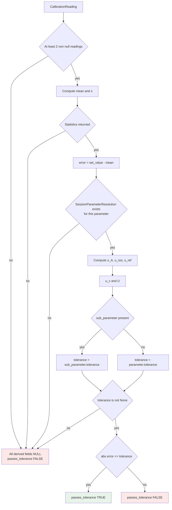

Every path that is not a clean success terminates in the same fail closed state.

## 13.2 Session level verdict

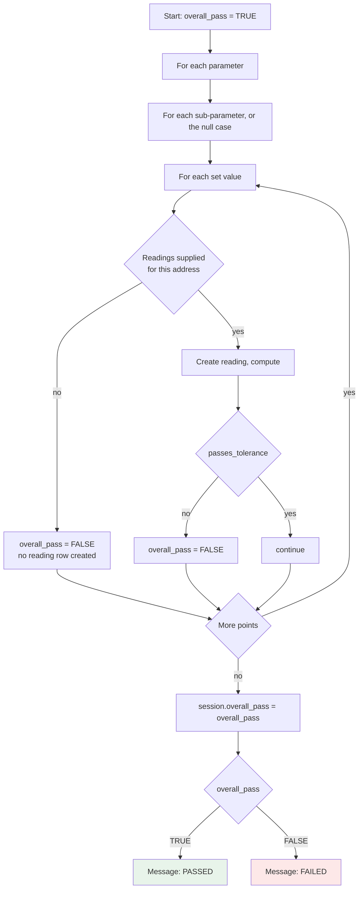

## 13.3 Certificate number allocation

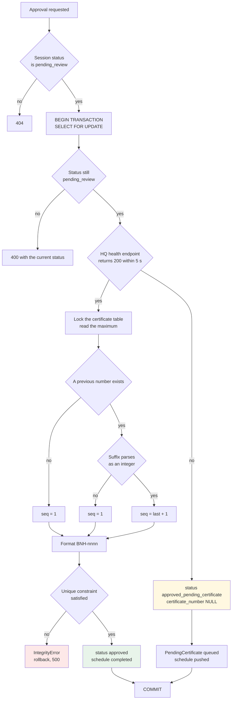

## 13.4 Approval or rejection

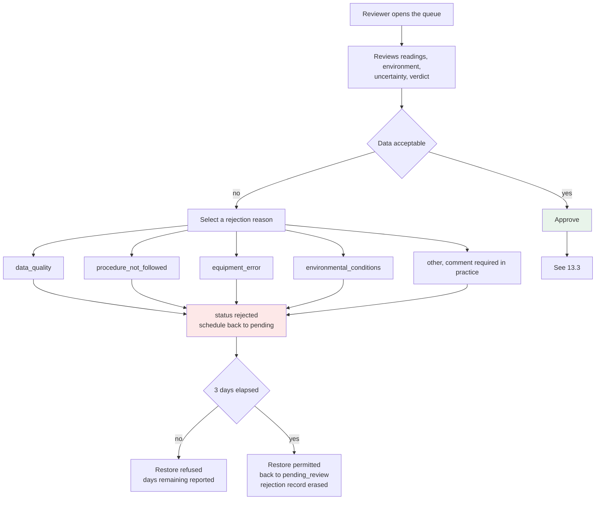

## 13.5 Reference standard validation, as it should be

The diagram below describes the check that section 12.3 recommends and that the system does not currently perform. It is included because a decision tree chapter that omitted it would misrepresent what a compliant workflow requires.

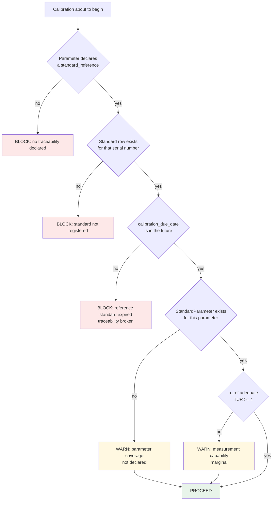

## 13.6 Group advance

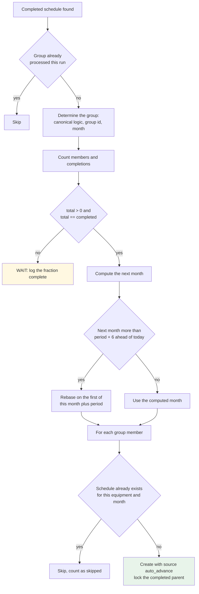

## 13.7 Schedule status transition guard

```mermaid
flowchart TD
    A[save called on an existing schedule] --> B{Status changed}
    B -->|no| C[Proceed]
    B -->|yes| D{Old is completed}
    D -->|yes| E[ValidationError:<br/>completed is terminal]
    D -->|no| F{New is overdue}
    F -->|yes| G{Old in pending,<br/>pushed, in_progress}
    G -->|no| H[ValidationError:<br/>overdue applies only<br/>to active schedules]
    G -->|yes| I[Allow]
    F -->|no| J{Old is overdue}
    J -->|yes| K{New in pending, pushed,<br/>in_progress, completed}
    K -->|no| L[ValidationError:<br/>invalid exit from overdue]
    K -->|yes| I
    J -->|no| M{New is pushed<br/>and old is completed}
    M -->|yes| N[ValidationError:<br/>cannot push a completed schedule]
    M -->|no| I
    I --> O{New is completed}
    O -->|yes| P[Set is_locked TRUE]
    O -->|no| C
    P --> C
    style E fill:#fde8e8
    style H fill:#fde8e8
    style L fill:#fde8e8
    style N fill:#fde8e8
```

## 13.8 Certificate access

```mermaid
flowchart TD
    A[Request for the certificate list] --> B{userprofile exists}
    B -->|no| C[403: profile not configured]
    B -->|yes| D{role}
    D -->|Tech| E{workshop assigned}
    E -->|no| F[403: no workshop]
    E -->|yes| G{workshop category}
    G -->|calibration_center| H[All sessions<br/>all equipment]
    G -->|maintenance| I[Sessions whose device_serial<br/>is in this workshop's departments]
    G -->|other| J[403: unknown category]
    D -->|NIC| K{department assigned}
    K -->|no| L[403: no department]
    K -->|yes| M[Sessions whose device_serial<br/>is in this department]
    D -->|other| N[403: unknown role]
    style C fill:#fde8e8
    style F fill:#fde8e8
    style J fill:#fde8e8
    style L fill:#fde8e8
    style N fill:#fde8e8
```

## 13.9 Failure report classification

```mermaid
flowchart TD
    A[Compute per reading verdicts] --> B[failure_rate = failed / total]
    B --> C{failure_rate >= 0.40}
    C -->|no| D[Standard certificate]
    C -->|yes| E[Failure report<br/>watermark and failure analysis]
    B --> F[For each parameter]
    F --> G{parameter rate >= 0.40}
    G -->|no| H[Not listed]
    G -->|yes| I{rate >= 0.80}
    I -->|yes| J[Critical: immediate repair required]
    I -->|no| K{rate >= 0.60}
    K -->|yes| L[Major issue: service needed]
    K -->|no| M[Minor issue: monitor closely]
    style D fill:#e8f4ea
    style E fill:#fde8e8
    style J fill:#fde8e8
```

# Chapter 14. Software Logic and Architecture

## 14.1 Backend architecture

The module is a Django application. Its layering, from the outside in:

```mermaid
flowchart TD
    subgraph Client
        BR[Browser<br/>calibration-perform.js]
    end
    subgraph URLs
        U["CalSoft/urls.py<br/>157 lines of routes"]
    end
    subgraph Views["View modules, CalSoft/view_modules/"]
        V1[calibration.py<br/>perform and submit]
        V2[pending_sessions.py<br/>approve, reject, restore]
        V3[certificates.py<br/>list, generate, bulk]
        V4[sessions.py<br/>detail and list]
        V5[procedures.py, parameters.py,<br/>standards.py, dashboard.py]
        V6[api.py<br/>JSON endpoints]
    end
    subgraph Domain
        M[models.py<br/>ORM and calculate_statistics]
        F[forms.py<br/>validation]
        UT[utils.py<br/>calculation engine]
    end
    subgraph Output
        P[pdf_generators/<br/>8 mixins]
        T[templates and templatetags]
    end
    subgraph Storage
        DB[(Database)]
    end
    BR --> U --> Views
    Views --> Domain
    Domain --> DB
    Views --> Output
    Output --> Domain
```

`views.py` at the top level is a thin re-export shim, 170 lines, that imports names from `view_modules` so that legacy imports keep working. New code should import from the specific view module.

## 14.2 The calculation engine

`CalSoft/utils.py` contains five classes and two module level functions:

| Object | Role | Stateful |
|---|---|---|
| `statistics_from_readings` | mean, sample standard deviation, count as floats | no |
| `calculate_uncertainties` | a complete budget in one call, returns floats | no |
| `CalibrationCalculator` | the engine used by the live paths | one boolean |
| `DriftAnalyzer` | historical drift, static methods | no |
| `ReportGenerator` | HTML certificate and uncertainty budget templates | no |
| `QualityAssurance` | reading validation, capability assessment | no |
| `TrendAnalysis` | monthly aggregation and slope | no |
| `CalibrationValidator` | procedure and session validation | no |
| `MetrologyUtils` | TUR, guard band, interval, k factors, degrees of freedom | no |

### 14.2.1 Divergence: two parallel implementations of the same budget

`calculate_uncertainties` at module level and `CalibrationCalculator` implement the same four calculations independently.

| | `calculate_uncertainties` | `CalibrationCalculator` |
|---|---|---|
| Arithmetic | float, with Decimal used decoratively | Decimal, one float excursion in the square root |
| Type A | `sample_std / math.sqrt(n)` | same |
| Resolution | `resolution / sqrt(12)` | same |
| Reference | divides by k only if `reference_is_expanded` is passed True; **defaults to False** | divides by k, `reference_is_expanded` **defaults to True** |
| Return | dict of floats | Decimals from individual methods |
| Used by the live workflow | no | yes |

The opposite defaults on `reference_is_expanded` are a trap. A developer who switches from one to the other, reasonably assuming equivalence, changes the reference component by a factor of k without any signal.

`calculate_uncertainties` is called only from `ReportGenerator.generate_uncertainty_budget_report`, `QualityAssurance.assess_measurement_capability` and `TrendAnalysis.analyze_procedure_trends`, all three of which access `reading.parameter.resolution`, a field that does not exist on `CalibrationParameter`. All three raise `AttributeError` and none is on a live path. They are dead code left behind when resolution moved from the parameter to the session, and they should be deleted or repaired.

### 14.2.2 The decimal precision setting

```python
getcontext().prec = 28     # line 10
...
getcontext().prec = 12     # line 104, after a duplicated import block
```

Module level statements execute top to bottom, so the effective precision is **12 significant digits**, not 28. Twelve significant digits is ample: values are stored to six decimal places on quantities of order 10⁰ to 10², so at most nine significant digits are ever needed. The duplication is untidy and the second assignment should be removed along with the duplicated imports, but there is no numerical consequence.

## 14.3 Database schema

### 14.3.1 Keys

Every model uses a UUID primary key with `default=uuid.uuid4, editable=False`. For a system that synchronises between isolated sites and a central server this is the correct choice: a site can create records offline without coordinating with anyone, and a merge cannot collide. The cost is a 16 byte key rather than 4 or 8, and a non sequential index insertion pattern, both of which are irrelevant at this data volume.

### 14.3.2 Constraints

| Model | Constraint | Purpose |
|---|---|---|
| `CalibrationReading` | unique on (session, parameter, sub_parameter, set_value) | one reading row per addressed point |
| `SessionParameterResolution` | unique on (session, parameter) | one resolution per parameter per session |
| `CalibrationSession` | unique on certificate_number | no duplicate certificates |
| `Standard` | unique on serial_number | the string reference resolves to one row |
| `StandardParameter` | unique on (standard, parameter) | one uncertainty per parameter per standard |
| `calSchedules.CalibrationSchedule` | unique on (equipment, scheduled_month) | one schedule per device per month |

The last is what makes the advance algorithm's existence check meaningful, and what would raise if two concurrent advances tried to create the same schedule.

### 14.3.3 Indexes

| Model | Index | Serves |
|---|---|---|
| `HistoricalCalibration` | (device_serial, parameter_name, sub_parameter_name) | drift series lookup |
| `HistoricalCalibration` | (calibration_date) | date range queries |
| `calSchedules.CalibrationSchedule` | (workshop, scheduled_month) | the monthly plan view |
| | (equipment, status) | per device status |
| | (generation_source, status) | normalizable set |
| | (is_locked) | protection queries |
| | (scheduled_month, status) | due and overdue counts |

### 14.3.4 The sync fields

Every syncable model carries `needs_sync`, `updated_at`, `created_at`, `active_status`, `pending_delete` and a class attribute `syncable = True`. Every `save()` sets `needs_sync = True`.

`active_status` and `pending_delete` implement soft deletion, which is necessary in a synchronising system: a hard delete cannot be propagated reliably because the other side has no row to match against. `updated_at` with `auto_now=True` supports last write wins conflict resolution, which is what `PendingCertificate.Meta.ordering = ['-updated_at']` is for.

**Note.** `save()` setting `needs_sync = True` unconditionally interacts badly with `save(update_fields=[...])`. If `needs_sync` is not in the list, the flag is set on the in memory instance and never written. Several call sites do remember to include it, for example `clear_logic_warning` and `mark_as_signal_created`, and several do not, for example the rejection path in `pending_sessions.py`. Those updates will not be picked up by the sync agent.

## 14.4 Transaction boundaries

| Operation | Atomic | Assessment |
|---|---|---|
| Session submission with all readings | **no** | should be, see 11.3.4 |
| Approval with number allocation | yes | correct |
| Certificate number allocation alone | yes | correct, nests as a savepoint |
| Group advance, per group | yes | correct |
| Historical data storage | no | best effort, individually caught |
| Audit log write | no | after the fact |
| Rejection | no | a single row update, atomic by default |

The submission gap is the significant one. A failure part way through leaves a partially populated session that looks complete.

## 14.5 Concurrency

| Race | Protection |
|---|---|
| Two reviewers approve the same session | `select_for_update` plus a status recheck inside the transaction |
| Two approvals allocate the same certificate number | `select_for_update` on the maximum row, within the enclosing transaction |
| Two HQ workers allocate the same number | `pg_advisory_xact_lock` |
| Two advance tasks create the same schedule | existence check plus the unique constraint |
| Two submissions for the same equipment | `get_or_create` on the schedule; sessions are independent |
| Certificate generation service re-entrancy | `threading.Lock` with a 300 second stuck lock recovery |

The HQ service's lock handling deserves note. It uses a real `threading.Lock` with `acquire(blocking=False)` rather than a boolean flag, closing a check then set race, and it force releases after five minutes so that a crashed run does not block certificate generation permanently. The comment in the source explains both decisions. This is careful work.

## 14.6 Error handling philosophy

Three distinct patterns appear, each appropriate to its context.

**Fail closed on calculation.** `calculate_statistics` catches everything, nulls every derived field, sets `passes_tolerance = False`, saves, and returns False. A calculation that could not complete must never present as a pass.

**Fail soft on presentation.** The PDF generators wrap chart generation, logo loading, QR generation and signature loading in try blocks that log and substitute a placeholder. A missing logo must not prevent a certificate being issued.

**Fail loud on integrity.** `CalibrationSchedule.save` raises `ValidationError` on an invalid status transition. Certificate number allocation raises `IntegrityError` on a duplicate. These are conditions that must not be papered over.

The one place the philosophy is misapplied is `_process_readings`, which fails loudly on a parse error by redirecting, but has already created database rows that the redirect leaves behind.

## 14.7 API surface

| Endpoint | Method | Returns | Auth |
|---|---|---|---|
| `api_schedule` | GET | equipment and procedure ids for a schedule | none |
| `api_equipment_procedure` | GET | the default procedure for equipment | none |
| `api_procedure` | GET | the full procedure tree | none |
| `api_parameters` | GET | parameter names and units | none |
| `api_standards` | GET | standards covering a parameter | none |
| `api_standard_parameters` | GET | uncertainty for a standard and parameter | none |
| `api_set_values` | GET | set values for a parameter | none |
| `api_procedure_detail` | GET | procedure with sub-parameters | `@login_required` |
| `api_standard_parameters_detail` | GET | all parameters of a standard | `@login_required` |
| `api_validate_readings` | POST | quality issues | `@login_required` |
| `api_calculate_uncertainty` | POST | a full budget | `@login_required` |
| `api_session_details` | GET | the complete session | `@login_required` |
| `session_details` | GET | session for the review modal | `@login_required` |

The first seven carry no authentication decorator. They expose procedure structure, tolerances, reference uncertainties and standard identities to any caller who can reach the URL. On an isolated clinical network the exposure is limited, and none of the data is personal, but there is no reason for the inconsistency. Adding `@login_required` to all of them is a one line change per view.

`api_standard_parameters` returns `'uncertainty': '0.001'` when no `StandardParameter` row exists, with `success: True`. A silently fabricated default uncertainty is worse than an error, because the client cannot distinguish a real 0.001 from a missing value.

## 14.8 Caching

There is none. No `cache_page`, no `cached_property` on the hot paths, no memoisation of procedure structure. Every page load re-queries.

The system's scale makes this defensible. The costly paths are PDF generation, which is on demand and inherently slow because matplotlib renders a chart to a 300 dpi PNG on disk for every certificate, and the dashboard aggregations.

Two easy wins if performance becomes a concern: cache the rendered linearity chart by session id, since it cannot change once readings are final, and add `select_related` on the reading queries in the PDF generators, which currently trigger a query per reading for `parameter`, `sub_parameter` and `set_value`.

## 14.9 Data integrity mechanisms

| Mechanism | Where | Protects |
|---|---|---|
| Unique constraints | six models | duplicate rows |
| Decimal storage | all measured and derived quantities | rounding drift |
| UUID keys | everywhere | merge collisions in sync |
| Soft delete | `active_status`, `pending_delete` | propagation of deletions |
| `updated_at` | everywhere | last write wins resolution |
| Status transition validation | `calSchedules` save | invalid state machine moves |
| Auto locking of completed schedules | `calSchedules` save | rewriting history |
| `select_for_update` | approval | lost updates |
| Advisory lock | HQ allocator | duplicate certificate numbers |
| Fail closed calculation | `calculate_statistics` | false passes |
| Raw readings retained | `CalibrationReading` | recomputability |

## 14.10 Offline and sync architecture

```mermaid
sequenceDiagram
    participant T as Technologist
    participant S as Site instance
    participant DB as Local database
    participant A as Sync agent
    participant HQ as hq_server

    T->>S: Submit calibration
    S->>DB: Session, resolutions, readings, history
    Note over S,DB: needs_sync = True on every row

    T->>S: Approve session
    S->>HQ: GET /api/sync/health (5 s timeout)

    alt HQ reachable
        HQ-->>S: 200
        S->>DB: SELECT FOR UPDATE max certificate
        S->>DB: certificate_number, status approved
        S->>DB: schedule completed
        S-->>T: BNH-nnnn issued
    else HQ unreachable
        HQ--xS: timeout or error
        S->>DB: status approved_pending_certificate
        S->>DB: PendingCertificate, machine id, pending
        S->>DB: schedule pushed
        S-->>T: Approved offline, number to follow
    end

    Note over A,HQ: later, connectivity restored
    A->>HQ: upload rows where needs_sync
    HQ->>HQ: pg_advisory_xact_lock
    HQ->>HQ: get_next_number, reusing gaps
    HQ-->>A: certificate numbers
    A->>DB: apply numbers, status approved
    A->>DB: PendingCertificate completed
```

The design principle is that **the certificate number is the only thing that requires central coordination**. Everything else, including the readings, the calculations and the verdict, is computed locally and synchronised opportunistically. This is the right decomposition: the calculation is deterministic and needs no coordination, while the number is a shared sequence and cannot avoid it.

## 14.11 PDF generation pipeline

```mermaid
flowchart TD
    A[generate_btwelve_certificate<br/>session, context] --> B[BtwelveHospitalCertificateGenerator]
    B --> C[setup_custom_styles<br/>StylesMixin]
    B --> D{is_declined}
    D -->|yes| E[reference_number = DECLINED-pk<br/>certificate_number = None]
    D -->|no| F[_get_certificate_number_from_session]
    E --> G[calculate_failure_statistics]
    F --> G
    G --> H{failure rate >= 0.40}
    H -->|yes| I[is_failed_report = True]
    H -->|no| J[is_failed_report = False]
    I --> K[Resolve the logo path once]
    J --> K
    K --> L[Build the header]
    L --> M[Device and environment sections]
    M --> N[Results tables, grouped<br/>by parameter and sub-parameter]
    N --> O[Uncertainty budget tables]
    O --> P[Linearity chart via matplotlib<br/>saved to MEDIA_ROOT/charts]
    P --> Q[Drift section]
    Q --> R{is_failed_report}
    R -->|yes| S[Failure analysis table<br/>with escalating recommendations]
    R -->|no| T[Skip]
    S --> U[QR verification code]
    T --> U
    U --> V[Signature blocks]
    V --> W[Watermark canvas]
    W --> X[BytesIO buffer returned]
```

The chart is written to `MEDIA_ROOT/charts/linearity_{session_id}.png` on every generation and is never cleaned up. Regenerating a certificate overwrites the same path, so the directory grows by one file per session rather than per generation, which is bounded but unbounded over years.

## 14.12 Validation order

The complete order for a submission, first to last:

1. Browser: `checkAllRequiredFields` disables submit until every field is present and valid.
2. Django: CSRF token verification.
3. View: equipment id present, equipment exists.
4. View: procedure resolution by the four step order of section 12.1.
5. View: schedule resolution or creation.
6. Form: `CalibrationSessionForm.is_valid()`, which checks field types and ranges for the environmental values.
7. View: environmental deviation warnings, non blocking.
8. View: session row created. **Everything after this point can leave an orphan.**
9. View: POST key parsing, per key, with a redirect on failure.
10. View: resolution parsing, per parameter, with a silent default on failure.
11. Model: `Decimal` field limits on save.
12. Engine: reading count, resolution presence, tolerance presence.
13. Database: unique constraints.

The gap between step 6 and step 12 is where the missing server side validation lives. Nothing between them checks that the number of readings meets `num_readings`, that the resolution is positive, or that the readings are physically plausible.

## 14.13 Known defects, consolidated

| ID | Severity | Defect | Location | Effect |
|---|---|---|---|---|
| D-01 | **Critical** | The web path does not call `calculate_statistics` | `view_modules/calibration.py` `_calculate_stats` | no mean, no error, no verdict, every session fails, no drift history |
| D-02 | **Critical** | Reference uncertainty not divided by k on the web path | same | expanded uncertainty overstated by up to a factor near k |
| D-03 | **High** | No reference standard due date check | absent | traceability can silently lapse |
| D-04 | **High** | `clone_procedure` corrupts the original's set values | `models.py` | procedure versioning destroys the source |
| D-05 | **High** | Approver may be the performer, permission never checked | `pending_sessions.py` | no segregation of duties |
| D-06 | **High** | Certificate numbering breaks above BNH-9999 | `models.py` string ordering | certificate issuance stops |
| D-07 | Medium | Submission is not wrapped in a transaction | `view_modules/calibration.py` | orphan partial sessions |
| D-08 | Medium | Resolution silently defaults to 0.001 | `_process_readings` | grossly understated u_res if reached |
| D-09 | Medium | No audit log rows for approve, reject or restore | `pending_sessions.py` | incomplete audit trail |
| D-10 | Medium | Restore erases the rejection record entirely | `restore_rejected_session` | rejection history lost |
| D-11 | Medium | Error sign convention inverted relative to the VIM | `models.py` | misreadable certificates, inverted drift |
| D-12 | Medium | Two due date calculations disagree | `sections.py` and `certificates.py` | inconsistent dates |
| D-13 | Medium | `hasattr` on a model field is always True | `pdf_generators/results.py` | recomputation branch unreachable |
| D-14 | Low | `TrendAnalysis.calculate_linear_regression` does not exist | `view_modules/sessions.py` | linearity silently unavailable |
| D-15 | Low | `analyze_drift` return shape mismatched to its caller | `view_modules/sessions.py` | drift silently unavailable |
| D-16 | Low | `calculate_linearity` called unbound | `utils.py` `ReportGenerator` | TypeError on an unused path |
| D-17 | Low | Three functions reference `parameter.resolution` | `utils.py` | AttributeError, all dead code |
| D-18 | Low | `validate_readings` receives a SubParameter | `api.py` | endpoint broken for nested parameters |
| D-19 | Low | Seven API endpoints unauthenticated | `api.py` | procedure data readable without login |
| D-20 | Low | `set_reading` saves once per reading | `models.py` | roughly 5x the necessary write queries |
| D-21 | Low | Duplicate `save` method on `CalibrationParameter` | `models.py` | the first is shadowed, harmless |
| D-22 | Low | `getcontext().prec` assigned twice | `utils.py` | effective precision 12, harmless |
| D-23 | Low | Bare `except:` in the health probe | `pending_sessions.py` | catches KeyboardInterrupt |
| D-24 | Low | Linearity chart files never cleaned up | `analysis.py` | unbounded growth in MEDIA_ROOT |
| D-25 | Low | `needs_sync` lost under `update_fields` | several | some updates never synchronise |

# Chapter 15. Illustration Index

Every diagram and figure in this document, with its location and what it is for.

| Figure | Type | Section | Subject |
|---|---|---|---|
| 1.1 | Block diagram | 1.3 | Six layer module architecture |
| 1.2 | Flowchart | 1.4 | One measured point from display to certificate |
| 2.1 | Flowchart | 2.1 | The complete calibration workflow |
| 2.2 | Tree diagram | 2.4 | Flat and nested set value topologies |
| 2.3 | State diagram | 2.11.1 | Session status machine |
| 2.4 | State diagram | 2.11.2 | Schedule status machine |
| 3.1 | Flowchart | 3.9 | The mathematical pipeline end to end |
| 4.1 | ASCII plot | 4.6 | Quantiser staircase transfer characteristic |
| 4.2 | Table | 4.9 | Resolution contribution across eight decades |
| 4.3 | Flowchart | 4.13 | How resolution propagates into the budget |
| 5.1 | ASCII plot | 5.7 | Acceptance region for one point, error and indication space |
| 5.2 | ASCII plot | 5.8 | Acceptance corridor across a parameter |
| 5.3 | ASCII bars | 5.10.2 | Guard banding at three widths |
| 6.1 | Flowchart | 6.1 | The traceability chain |
| 6.2 | ASCII scatter | 6.7.2 | Random against systematic error, four cases |
| 6.3 | ASCII bars | 6.8 | Repeatability, intermediate precision, reproducibility |
| 7.1 | ASCII plot | 7.9 | Expanded uncertainty against n, with the Type B floor |
| 7.2 | Flowchart | 7.11 | Uncertainty propagation with the dashed unimplemented branch |
| 8.1 | ASCII curve | 8.3.4 | Normal density with coverage bands |
| 8.2 | ASCII bars | 8.4 | Coverage intervals at k of 1, 2 and 3 |
| 8.3 | ASCII histograms | 8.8 | Three diagnostic shapes of a population error distribution |
| 9.1 | ASCII plot | 9.3.2 | The rectangular density |
| 9.2 | ASCII diagram | 9.7 | The two equivalent divisor forms |
| 9.3 | ASCII comparison | 9.8 | Rectangular against normal coverage |
| 10.1 | ASCII diagram | 10.2 | The set of true values consistent with one display |
| 10.2 | ASCII diagram | 10.8 | Resolution bins, uniform density, candidate true values |
| 10.3 | Flowchart | 10.12 | The full resolution argument |
| 11.1 | Flowchart | 11.1.6 | Statistics algorithm |
| 13.1 | Decision tree | 13.1 | Point level pass or fail |
| 13.2 | Decision tree | 13.2 | Session level verdict |
| 13.3 | Decision tree | 13.3 | Certificate number allocation |
| 13.4 | Decision tree | 13.4 | Approval or rejection |
| 13.5 | Decision tree | 13.5 | Reference standard validation, as it should be |
| 13.6 | Decision tree | 13.6 | Group advance |
| 13.7 | Decision tree | 13.7 | Schedule status transition guard |
| 13.8 | Decision tree | 13.8 | Certificate access by role |
| 13.9 | Decision tree | 13.9 | Failure report classification |
| 14.1 | Block diagram | 14.1 | Backend layering |
| 14.2 | Sequence diagram | 14.10 | Offline approval and later synchronisation |
| 14.3 | Flowchart | 14.11 | PDF generation pipeline |
| 16.1 | Worked calculation | 16.2 | Complete session, three points, mixed verdicts |
| 17.1 | ASCII timeline | 17.7 | Equipment calibration lifecycle |

# Chapter 16. Worked Examples

Each example follows the same seven part structure: problem statement, known values, unknown values, step by step calculation, engineering interpretation, validation of the result, and the mistakes most likely to be made.

## 16.1 WE-1: A single point that passes

### Problem statement

A non invasive blood pressure simulator is used to present a systolic pressure of 120 mmHg to a patient monitor. Five readings are taken from the monitor's display. Determine the error, the complete uncertainty budget, and the pass or fail verdict.

### Known values

| Quantity | Symbol | Value | Unit | Source |
|---|---|---|---|---|
| Nominal set value | x_s | 120 | mmHg | `SetValue.value` |
| Readings | x_i | 118, 119, 119, 118, 119 | mmHg | `reading_1` to `reading_5` |
| Count | n | 5 | count | derived |
| Display resolution | d | 1 | mmHg | `SessionParameterResolution.resolution` |
| Tolerance | T | 3 | mmHg | `SubParameter.tolerance` |
| Reference expanded uncertainty | U_ref | 0.50 | mmHg | `CalibrationParameter.reference_uncertainty` |
| Coverage factor | k | 2 | | `CalibrationParameter.coverage_factor` |

### Unknown values

Mean, sample standard deviation, error, u_A, u_res, u_ref, u_c, U, verdict, TUR, effective degrees of freedom.

### Step by step

**Step 1. Mean.**

$$\bar{x} = \frac{118+119+119+118+119}{5} = \frac{593}{5} = 118.600000\ \text{mmHg}$$

**Step 2. Deviations and sum of squares.**

| i | x_i | x_i − x̄ | (x_i − x̄)² |
|---|---|---|---|
| 1 | 118 | −0.6 | 0.36 |
| 2 | 119 | +0.4 | 0.16 |
| 3 | 119 | +0.4 | 0.16 |
| 4 | 118 | −0.6 | 0.36 |
| 5 | 119 | +0.4 | 0.16 |
| | | **0.0** | **1.20** |

**Step 3. Variance and standard deviation.**

$$s^2 = \frac{1.20}{5-1} = 0.300000\ \text{mmHg}^2 \qquad s = \sqrt{0.30} = 0.547723\ \text{mmHg}$$

**Step 4. Error.**

$$e = x_s - \bar{x} = 120 - 118.6 = +1.400000\ \text{mmHg}$$

**Step 5. Type A standard uncertainty.**

$$u_A = \frac{0.547723}{\sqrt{5}} = \frac{0.547723}{2.236068} = 0.244949\ \text{mmHg}$$

**Step 6. Resolution standard uncertainty.**

$$u_{res} = \frac{1}{\sqrt{12}} = \frac{1}{3.464102} = 0.288675\ \text{mmHg}$$

**Step 7. Reference standard uncertainty.**

$$u_{ref} = \frac{0.50}{2} = 0.250000\ \text{mmHg}$$

**Step 8. Combined standard uncertainty.**

$$u_c = \sqrt{0.244949^2 + 0.288675^2 + 0.250000^2}$$
$$= \sqrt{0.060000 + 0.083333 + 0.062500} = \sqrt{0.205833} = 0.453688\ \text{mmHg}$$

**Step 9. Expanded uncertainty.**

$$U = 2 \times 0.453688 = 0.907376\ \text{mmHg}$$

**Step 10. Verdict.**

$$\left|+1.400000\right| = 1.400000 \le 3 \implies \textbf{PASS}$$

**Step 11. Test uncertainty ratio.**

$$\text{TUR} = \frac{3}{0.907376} = 3.31$$

**Step 12. Effective degrees of freedom.**

$$\nu_{eff} = \frac{\left(0.205833\right)^2}{\left(0.060000\right)^2 / 4} = \frac{0.0423672}{0.0009} = 47$$

### Result summary

| Quantity | Value | Unit |
|---|---|---|
| Mean | 118.600000 | mmHg |
| Standard deviation | 0.547723 | mmHg |
| Error | +1.400000 | mmHg |
| u_A | 0.244949 | mmHg |
| u_res | 0.288675 | mmHg |
| u_ref | 0.250000 | mmHg |
| u_c | 0.453688 | mmHg |
| U (k = 2) | 0.907376 | mmHg |
| Verdict | PASS | |

### Engineering interpretation

The monitor reads 1.4 mmHg low at 120 mmHg, which is 1.17 percent of reading. This is within the 3 mmHg limit with 1.6 mmHg of margin, so the device is fit for clinical use at this point.

The uncertainty budget is dominated by resolution at 40.5 percent of the variance, with repeatability and the reference standard contributing roughly 30 percent each. The instrument's 1 mmHg display is the limiting factor. Taking more readings would help very little, as section 7.9 shows.

The TUR of 3.31 is below the customary 4:1 target. The measurement is adequate but not comfortable. Improving it requires either a better reference standard or, more effectively, a device with finer resolution.

### Validation

Three independent checks:

1. The deviations sum to exactly zero, confirming the mean.
2. The variance contributions sum to the combined variance: 0.060000 + 0.083333 + 0.062500 = 0.205833, and 0.453688² = 0.205833. Agreement to six places.
3. The error is smaller than the tolerance and larger than the expanded uncertainty, which is the normal and expected regime for a device that is genuinely somewhat off but functional.

### Likely mistakes

| Mistake | Wrong result | Magnitude of the error |
|---|---|---|
| Dividing d by √3 instead of √12 | u_res = 0.577350, u_c = 0.669162, U = 1.338 | U overstated by 47 % |
| Using n instead of n − 1 for the variance | s = 0.489898, u_A = 0.219089, U = 0.891 | U understated by 1.8 % |
| Forgetting to divide the reference by k | u_ref = 0.5, u_c = 0.627160, U = 1.254 | U overstated by 38 % |
| Using s instead of s/√n for Type A | u_A = 0.547723, u_c = 0.686412, U = 1.373 | U overstated by 51 % |
| Adding the components linearly | u_c = 0.783624, U = 1.567 | U overstated by 73 % |
| Omitting u_res because the readings look tight | u_c = 0.350000, U = 0.700 | U understated by 23 % |

## 16.2 WE-2: A complete session with a mixed verdict

### Problem statement

A patient monitor is calibrated for non invasive blood pressure at three systolic points. Determine each point's verdict and the session verdict.

### Known values

Tolerance 3 mmHg on all points, d = 1 mmHg, U_ref = 0.50 mmHg at k = 2, five readings per point.

| Point | Set value | Readings |
|---|---|---|
| P1 | 80 | 79, 80, 79, 80, 79 |
| P2 | 120 | 118, 119, 119, 118, 119 |
| P3 | 200 | 205, 204, 205, 205, 204 |

### Step by step

**Point P1.**

$$\bar{x} = \frac{79+80+79+80+79}{5} = \frac{397}{5} = 79.400000$$

Deviations: −0.4, +0.6, −0.4, +0.6, −0.4. Squares: 0.16, 0.36, 0.16, 0.36, 0.16. Sum 1.20.

$$s = \sqrt{1.20/4} = \sqrt{0.30} = 0.547723 \qquad u_A = 0.244949$$

$$e = 80 - 79.4 = +0.600000 \qquad \left|0.6\right| \le 3 \implies \textbf{PASS}$$

$$u_c = \sqrt{0.060000+0.083333+0.062500} = 0.453688 \qquad U = 0.907376$$

**Point P2.** As WE-1: e = +1.400000, U = 0.907376, **PASS**.

**Point P3.**

$$\bar{x} = \frac{205+204+205+205+204}{5} = \frac{1023}{5} = 204.600000$$

Deviations: +0.4, −0.6, +0.4, +0.4, −0.6. Squares: 0.16, 0.36, 0.16, 0.16, 0.36. Sum 1.20.

$$s = 0.547723 \qquad u_A = 0.244949 \qquad u_c = 0.453688 \qquad U = 0.907376$$

$$e = 200 - 204.6 = -4.600000 \qquad \left|-4.6\right| = 4.6 > 3 \implies \textbf{FAIL}$$

**Session verdict.** `overall_pass` starts True, is unaffected by P1 and P2, and is set False by P3.

$$\text{overall\_pass} = \text{TRUE} \wedge \text{TRUE} \wedge \text{FALSE} = \textbf{FALSE}$$

### Result summary

| Point | Set | Mean | s | Error | U (k=2) | Verdict |
|---|---|---|---|---|---|---|
| P1 | 80 | 79.400000 | 0.547723 | +0.600000 | 0.907376 | PASS |
| P2 | 120 | 118.600000 | 0.547723 | +1.400000 | 0.907376 | PASS |
| P3 | 200 | 204.600000 | 0.547723 | −4.600000 | 0.907376 | **FAIL** |
| **Session** | | | | | | **FAIL** |

Failure statistics: 1 failed of 3 total, rate 0.333. Since 0.333 < 0.40, the certificate is rendered as a standard certificate with one failed point highlighted, not as a failure report. The parameter's own rate is also 0.333, so it is not listed in the failure analysis table.

### Engineering interpretation

The error pattern is the diagnostic finding here, and it is more informative than any single verdict.

| Set value | Error under the implemented convention | Instrument reads |
|---|---|---|
| 80 | +0.6 | low by 0.6 |
| 120 | +1.4 | low by 1.4 |
| 200 | −4.6 | **high by 4.6** |

The sign reverses between 120 and 200. An instrument with a pure offset would show a constant error. One with a pure gain error would show an error growing linearly and monotonically with the set value. This instrument does neither: it reads slightly low at the bottom and substantially high at the top, which is the signature of a **combined gain and offset error**, or of **non linearity at the top of the range**.

Fit a straight line to indication against set value to separate the two. Using the least squares machinery of section 3.7 with x = (80, 120, 200) and y = (79.4, 118.6, 204.6):

Σx = 400, Σy = 402.6, Σxy = 80(79.4) + 120(118.6) + 200(204.6) = 6352 + 14232 + 40920 = 61504, Σx² = 6400 + 14400 + 40000 = 60800.

$$a = \frac{3(61504) - 400(402.6)}{3(60800) - 400^2} = \frac{184512 - 161040}{182400 - 160000} = \frac{23472}{22400} = 1.047857$$

$$b = \frac{402.6 - 1.047857(400)}{3} = \frac{402.6 - 419.142857}{3} = \frac{-16.542857}{3} = -5.514286$$

The instrument has a gain of 1.0479, that is 4.8 percent high, combined with an offset of −5.51 mmHg. Residuals from that line:

| Set | Fitted | Measured | Residual |
|---|---|---|---|
| 80 | 78.314 | 79.400 | +1.086 |
| 120 | 92.229 → recompute | | |

Recomputing carefully: 1.047857(120) − 5.514286 = 125.742857 − 5.514286 = 120.228571, residual 118.600000 − 120.228571 = −1.628571. And 1.047857(80) − 5.514286 = 83.828571 − 5.514286 = 78.314286, residual +1.085714. And 1.047857(200) − 5.514286 = 209.571429 − 5.514286 = 204.057143, residual +0.542857.

Residuals: +1.086, −1.629, +0.543. They sum to zero as required. The maximum linearity error is 1.63 mmHg, or 1.36 percent of the 120 mmHg span.

**Conclusion for the clinical engineer.** The device has a substantial gain error of nearly 5 percent, a large negative offset, and a residual non linearity of about 1.6 mmHg. The gain and offset are both adjustable on most monitors. The correct disposition is adjustment followed by recalibration, not replacement, provided the 1.6 mmHg residual non linearity is acceptable once the gain and offset are trimmed. If the device has no adjustment, it fails and must be withdrawn.

### Validation

Each point's deviations sum to zero. The three points have identical dispersion by construction, which lets the reader confirm that u_c depends only on s, d and U_ref and not on the set value or the error. The regression residuals sum to zero.

### Likely mistakes

Concluding from the session verdict alone that the device is broken. The verdict is FAIL and the useful information is entirely in the pattern of the three errors. A reviewer who reads only the PASS or FAIL column learns nothing actionable.

Assuming the sign reversal is a data entry error. It is a real and common instrument behaviour.

## 16.3 WE-3: Zero standard deviation, resolution dominated

### Problem statement

A digital multimeter is calibrated at 5.000 V. All five readings are identical. Determine the budget and comment on the apparent perfect repeatability.

### Known values

x_s = 5.000 V, readings all 4.998 V, n = 5, d = 0.001 V, T = 0.005 V, U_ref = 0.0002 V at k = 2.

### Step by step

**Step 1.** Mean = 4.998000 V exactly.

**Step 2.** Every deviation is zero, so the sum of squares is zero.

**Step 3.** s² = 0/4 = 0, s = 0.000000 V.

**Step 4.** e = 5.000 − 4.998 = **+0.002000 V**.

**Step 5.** u_A = 0/√5 = **0.000000 V**.

**Step 6.** u_res = 0.001/3.464102 = **0.000288675 V**.

**Step 7.** u_ref = 0.0002/2 = **0.000100000 V**.

**Step 8.**

$$u_c = \sqrt{0 + \left(2.88675\times10^{-4}\right)^2 + \left(1.0\times10^{-4}\right)^2} = \sqrt{8.33333\times10^{-8} + 1.0\times10^{-8}}$$
$$= \sqrt{9.33333\times10^{-8}} = 3.05505\times10^{-4}\ \text{V}$$

**Step 9.** U = 2 × 3.05505e-4 = **6.11010e-4 V**, or 0.000611 V.

**Step 10.** |0.002| ≤ 0.005 → **PASS**.

**Step 11.** TUR = 0.005/0.000611 = **8.18**, comfortably above 4.

**Step 12.** Effective degrees of freedom: with u_A = 0 the Welch–Satterthwaite denominator is zero and ν_eff is infinite. The code path `if type_a_uncertainty <= 0: return float('inf')` gives the right answer for the right reason here. With infinite degrees of freedom, k = 2 corresponds to 95.45 percent exactly.

### Result summary

| Quantity | Value | Unit | Share of variance |
|---|---|---|---|
| Mean | 4.998000 | V | |
| s | 0.000000 | V | |
| Error | +0.002000 | V | |
| u_A | 0.000000 | V | 0.0 % |
| u_res | 0.000289 | V | 89.3 % |
| u_ref | 0.000100 | V | 10.7 % |
| u_c | 0.000306 | V | 100 % |
| U (k = 2) | 0.000611 | V | |

### Engineering interpretation

The instrument shows no scatter at this resolution. This does **not** mean it has zero repeatability error. It means the underlying scatter is smaller than the 1 mV display step, so every sample landed in the same bin. Section 4.10 gives the full argument.

The budget is nevertheless correct and defensible because u_res carries the entire burden of the invisible scatter. Resolution contributes 89 percent of the variance, which is exactly what one expects from a resolution limited measurement.

The instrument reads 2 mV low at 5 V, which is 0.04 percent of reading. That is well within the 5 mV tolerance and the measurement capability is excellent at 8.18:1.

### Validation

The variance contributions sum correctly: 8.33333e-8 + 1.0e-8 = 9.33333e-8, and (3.05505e-4)² = 9.33333e-8.

A useful sanity check: u_res exceeds u_ref by a factor of 2.89, so the combined uncertainty should be only slightly above u_res. It is: 3.055e-4 against 2.887e-4, a ratio of 1.058.

### Likely mistakes

**Reporting zero uncertainty.** The tempting inference from five identical readings is that the measurement is perfect. Omitting u_res entirely would give u_c = 1.0e-4 and U = 2.0e-4, understating the expanded uncertainty by a factor of three.

**Entering the ADC resolution instead of the display resolution.** If this meter has a 16 bit converter on a 10 V range, its intrinsic step is 152 microvolts. Entering 0.000152 rather than 0.001 would give u_res = 4.39e-5, u_c = 1.09e-4, U = 2.19e-4, understating by a factor of 2.8. The operator can only read the display, so the display step is what matters.

**Concluding the instrument needs no calibration next cycle.** Excellent repeatability says nothing about drift.

## 16.4 WE-4: The effect of improving resolution

### Problem statement

A department is considering replacing its 1 mmHg resolution blood pressure simulators with 0.1 mmHg units. Quantify the benefit using the Dataset A measurement.

### Known values

As WE-1, with d varied. Note that changing the resolution also changes what the readings would look like, since the finer display would reveal the underlying scatter. Two scenarios are computed: an optimistic one where the observed scatter is unchanged, and a realistic one where the finer display reveals scatter of s = 0.55 mmHg that was previously partly hidden.

### Step by step

**Scenario 1, s held at 0.547723.**

| d | u_res | u_A | u_ref | u_c | U | TUR |
|---|---|---|---|---|---|---|
| 1.0 | 0.288675 | 0.244949 | 0.25 | 0.453688 | 0.907376 | 3.31 |
| 0.5 | 0.144338 | 0.244949 | 0.25 | 0.373318 | 0.746636 | 4.02 |
| 0.1 | 0.028868 | 0.244949 | 0.25 | 0.351179 | 0.702358 | 4.27 |
| 0.01 | 0.002887 | 0.244949 | 0.25 | 0.350012 | 0.700024 | 4.29 |

Working for d = 0.1:

$$u_c = \sqrt{0.060000 + 0.000833 + 0.062500} = \sqrt{0.123333} = 0.351189$$

**Scenario 2, the finer display reveals slightly larger scatter, s = 0.60.**

At d = 0.1 with s = 0.60: u_A = 0.60/2.236068 = 0.268328, u_A² = 0.072000.

$$u_c = \sqrt{0.072000 + 0.000833 + 0.062500} = \sqrt{0.135333} = 0.367877 \qquad U = 0.735754$$

TUR = 3/0.735754 = 4.08.

### Result summary

Moving from 1 mmHg to 0.1 mmHg resolution reduces the expanded uncertainty from 0.907 to between 0.702 and 0.736 mmHg, a reduction of 19 to 23 percent, and lifts the TUR from 3.31 to just above 4.

Moving further to 0.01 mmHg buys almost nothing, because at that point the budget is dominated by repeatability at 51 percent and the reference standard at 49 percent.

### Engineering interpretation

The purchase is justified if the goal is to reach a 4:1 TUR, which it achieves. It is not justified as a general improvement, because the gain saturates immediately afterwards. Beyond 0.1 mmHg resolution, the way to improve this measurement is a better reference standard, which would attack the 49 percent contribution that resolution improvement cannot touch.

This is the general lesson of uncertainty budgets: **improve the largest contributor, and stop when it is no longer the largest.**

### Validation

At d = 0.01, u_res² = 8.3e-6 against a total of 0.1225, or 0.007 percent. The combined uncertainty should be indistinguishable from the d = 0 limit of √(0.06 + 0.0625) = 0.350000. It is: 0.350012.

### Likely mistakes

Assuming the benefit continues to scale. It does not; the curve flattens hard once u_res drops below about one third of the other components.

Ignoring Scenario 2. A finer display often reveals scatter that was previously quantised away, so part of the theoretical benefit is consumed by a larger Type A term. The realistic benefit is always somewhat less than the optimistic calculation.

## 16.5 WE-5: Decision risk near the tolerance limit

### Problem statement

A calibration point yields a measured error of 2.85 mmHg against a tolerance of 3.00 mmHg, with u_c = 0.453688 mmHg. The system reports PASS. Quantify the probability that the instrument does not actually conform, and determine what guard band would be required to hold that probability below 2.5 percent.

### Known values

e = 2.85 mmHg, T = 3.00 mmHg, u_c = 0.453688 mmHg, U = 0.907376 mmHg at k = 2.

### Step by step

**Step 1. System verdict.** |2.85| ≤ 3.00, so PASS.

**Step 2. Standardise the distance to the limit.**

$$z = \frac{T - e}{u_c} = \frac{3.00 - 2.85}{0.453688} = \frac{0.15}{0.453688} = 0.3306$$

**Step 3. Probability of false accept.**

$$P(e_{true} > T) = 1 - \Phi(0.3306) = 1 - 0.6295 = 0.3705$$

There is a **37 percent probability** that the true error exceeds the tolerance, and the system has issued a PASS.

**Step 4. Required guard band for a 2.5 percent risk.** We need

$$\frac{T - g - e}{u_c} \ge 1.960 \quad\text{is not the right form; instead we need the accepted region such that}$$

$$P(e_{true} > T \mid e_{measured} \le T - g) \le 0.025$$

The binding case is a measured error exactly at the guarded limit, e = T − g. Then

$$z = \frac{T - (T-g)}{u_c} = \frac{g}{u_c} \ge 1.960 \implies g \ge 1.960 \times 0.453688 = 0.889\ \text{mmHg}$$

A guard band of 0.889 mmHg is required, giving an acceptance limit of

$$T_{eff} = 3.000 - 0.889 = 2.111\ \text{mmHg}$$

Note that 1.960·u_c = 0.889 is very close to U = 2·u_c = 0.907. Guard banding by one expanded uncertainty, which is the common ILAC-G8 rule, delivers a false accept probability of

$$1 - \Phi(2.000) = 0.0228$$

or 2.3 percent, marginally better than the 2.5 percent target. This is why "guard band by U" is the standard advice: it is the round number closest to the 95 percent one sided requirement.

**Step 5. Verdict under guard banding.** e = 2.85 > 2.111, so the point would **FAIL** under a guard banded rule.

### Result summary

| Rule | Limit applied | Verdict | Probability of false accept |
|---|---|---|---|
| Simple acceptance, as implemented | 3.000 | PASS | 37.1 % |
| Guard band g = U | 2.093 | FAIL | 2.3 % at the limit |
| Guard band g = 1.96 u_c | 2.111 | FAIL | 2.5 % at the limit |

### Engineering interpretation

This example is the practical argument for everything in section 5.10. The system's simple acceptance rule passes an instrument that has a better than one in three chance of being out of tolerance. That is a legitimate decision rule only if it is declared and if the customer accepts the shared risk.

The 37 percent figure is not a defect in the arithmetic. It is the unavoidable consequence of measuring a 3 mmHg tolerance with a 0.9 mmHg expanded uncertainty and then judging a point that sits 2.85 mmHg from nominal. The remedy is either a better measurement, which raises the TUR and shrinks the ambiguous zone, or a guard band, which shifts the risk onto the laboratory and away from the patient.

### Validation

At e = 1.4, the WE-1 case, the same calculation gives z = (3 − 1.4)/0.453688 = 3.527 and a false accept probability of 0.02 percent. The risk is negligible when the measured error is well inside the band and becomes serious only in the last expanded uncertainty or so before the limit. That is exactly the behaviour one expects and it validates the model.

### Likely mistakes

Using U rather than u_c in the z calculation. That would give z = 0.15/0.907376 = 0.165 and a probability of 43 percent, which overstates the risk because the coverage interval has been used where a standard deviation belongs.

Applying the guard band on both sides and halving it. The risk is one sided at each limit; the full guard band applies at each.

## 16.6 WE-6: Certificate number allocation

### Problem statement

Trace the allocation of a certificate number for a session approved on 1 August 2026, with the register in four different states.

### Case A: empty register

`last_cert` is None. `last_seq = 0`. Result: **BNH-0001**.

### Case B: highest is BNH-0042

`"BNH-0042".split("-")[-1]` gives `"0042"`, `int("0042")` gives 42. Result: **BNH-0043**.

### Case C: register contains a gap

Register: BNH-0001, BNH-0002, BNH-0004, BNH-0005. BNH-0003 was deleted.

Local allocator: string maximum is BNH-0005, sequence 5, result **BNH-0006**. The gap remains.

HQ allocator with `reuse_gaps=True`: `existing = {1, 2, 4, 5}`, `max_seq = 5`. The scan finds 3 missing and returns **BNH-0003** with `is_gap_reuse=True`.

The two allocators produce different answers from identical data. Both are internally consistent; they implement different policies.

### Case D: register contains BNH-10000

Register: BNH-0001 through BNH-9999 and BNH-10000.

String descending order places BNH-9999 first, because at the fifth character `'9' > '1'`. The allocator reads BNH-9999, computes 9999 + 1 = 10000, and formats it as BNH-10000. That number already exists. The `unique=True` constraint raises `IntegrityError`, the enclosing transaction rolls back, and the approval endpoint returns a 500 with the message "Failed to generate certificate".

**Every subsequent approval fails identically.** The system stops issuing certificates.

### Validation

The failure mode can be confirmed without a database by evaluating the string comparison:

```
sorted(["BNH-0001", "BNH-9999", "BNH-10000"], reverse=True)
  → ["BNH-9999", "BNH-10000", "BNH-0001"]
```

### Engineering interpretation

The zero padding to four digits is what makes string ordering coincide with numeric ordering, and it works perfectly until the sequence needs a fifth digit. The defect is latent and time triggered. At a rate of a thousand certificates a year it appears in the tenth year; at four thousand a year, in the third.

### Remedy

Order by the parsed integer, using the expression already present in `certificates.py`:

```python
from django.db.models.functions import Cast, Substr
from django.db.models import IntegerField

last_cert = (cls.objects.select_for_update()
    .filter(certificate_number__regex=r"^BNH-\d+$")
    .annotate(seq=Cast(Substr("certificate_number", 5), output_field=IntegerField()))
    .order_by("-seq")
    .values_list("certificate_number", flat=True)
    .first())
```

and widen the format to at least five digits, or drop the fixed width entirely once the ordering no longer depends on it.

## 16.7 WE-7: Group advance date arithmetic

### Problem statement

A department group of four devices is scheduled for March 2026 on a twelve month cycle. Three complete in March, the fourth in April. Determine when each device's next schedule is created and for what month.

### Known values

Group: four devices, `planning_logic = 'date_based'` which canonicalises to `department`, `calibration_period = 12`, `scheduled_month = 2026-03-01`.

### Step by step

**Step 1. After the third completion, on 2026-03-28.**

`check_group_completion_status` returns total 4, completed 3.

$$\text{all\_completed} = (4 > 0) \wedge (4 = 3) = \text{FALSE}$$

No advance occurs. The task logs "Waiting: 3/4 done in March 2026 (department)". The three completed schedules stay completed and unlocked by this path, though the locker may lock them separately.

**Step 2. After the fourth completion, on 2026-04-06.**

$$\text{all\_completed} = (4 > 0) \wedge (4 = 4) = \text{TRUE}$$

**Step 3. Next month.**

$$\text{next} = \text{2026-03-01} + 12\ \text{months} = \text{2027-03-01}$$

**Step 4. Far future clamp.** Today is 2026-04-06.

$$\text{max future} = \text{2026-04-06} + (12+6)\ \text{months} = \text{2027-10-06}$$

2027-03-01 is not later than 2027-10-06, so no clamp. Target confirmed as **2027-03-01**.

**Step 5. Creation.** For each of the four members, if no schedule exists for (equipment, 2027-03-01), create one with `status='pending'`, `calibration_period=12`, `generation_source='auto_advance'`, and lock the completed parent.

### Result summary

| Device | Completed | Next scheduled month | Source |
|---|---|---|---|
| A | 2026-03-12 | 2027-03-01 | auto_advance |
| B | 2026-03-19 | 2027-03-01 | auto_advance |
| C | 2026-03-28 | 2027-03-01 | auto_advance |
| D | 2026-04-06 | 2027-03-01 | auto_advance |

### Engineering interpretation

The critical property is that device D, calibrated in April, is still scheduled for March next year. Its `scheduled_month` for the 2026 cycle remains 2026-03-01, and its `completed_date` records 2026-04-06. The group does not disperse.

The actual interval for device D is 2026-04-06 to some date in March 2027, which is about eleven months rather than twelve. This is a deliberate and correct trade: the small variation in the realised interval is worth less than the preservation of the group. A device whose drift genuinely requires a full twelve months should be on a six month cycle or should be given an individual schedule.

### Validation

Advancing from the scheduled month rather than the completion date is what makes the result identical for all four devices. Advancing from the completion date would give A a March 2027 date and D an April 2027 date, and after five cycles the group would be spread across two months.

### Likely mistakes

Assuming the advance fires per device. It fires per group, once, when the last member completes. Any device whose group has an outstanding member will show no next schedule, and this looks like a bug when it is the intended behaviour.

## 16.8 WE-8: Reading quality warnings

### Problem statement

Apply the quality checks of `QualityAssurance.validate_readings` to three reading sets, all against a tolerance of 3 mmHg with `num_readings = 5`.

| Set | Readings |
|---|---|
| A | 118, 119, 119, 118, 119 |
| B | 117, 118, 119, 120, 121 |
| C | 118, 119, 131, 118, 119 |

### Set A

Sufficiency: 5 readings supplied, 5 required, satisfied.

Median: sorted is 118, 118, 119, 119, 119; index 5//2 = 2 gives **119**.

Absolute deviations from 119: 1, 0, 0, 1, 0. Sorted: 0, 0, 0, 1, 1; index 2 gives MAD = **0**.

MAD is zero, so the outlier test is skipped by the `if mad > 0` guard.

Variation: s = 0.547723, threshold = 3 × 0.1 = 0.3. Since 0.547723 > 0.3, the check **fires**: "High variation in readings, check measurement conditions".

Monotonic: 118 ≤ 119 ≤ 119 is satisfied but 119 ≤ 118 is not, so not increasing. Similarly not decreasing. No warning.

**Result: one warning, on variation.**

### Set B

Median: sorted 117, 118, 119, 120, 121; index 2 gives **119**.

Deviations: 2, 1, 0, 1, 2. Sorted: 0, 1, 1, 2, 2; index 2 gives MAD = **1**.

Modified Z scores, M = 0.6745(x − 119)/1:

| x | x − 119 | M |
|---|---|---|
| 117 | −2 | −1.349 |
| 118 | −1 | −0.675 |
| 119 | 0 | 0 |
| 120 | +1 | +0.675 |
| 121 | +2 | +1.349 |

None exceeds 3.5. No outlier flagged.

Variation: mean = 119, sum of squares = 4 + 1 + 0 + 1 + 4 = 10, s² = 2.5, s = 1.581139. Since 1.581139 > 0.3, the variation check **fires**.

Monotonic: 117 ≤ 118 ≤ 119 ≤ 120 ≤ 121, strictly increasing throughout, so the check **fires**: "Systematic trend detected in readings, possible drift or warm-up issue".

**Result: two warnings.** This is the diagnostically valuable case. A perfectly monotonic ramp across five readings has a probability of about 1.7 percent under random scatter and is far more likely to indicate that the instrument or the reference had not settled. The correct action is to allow a longer stabilisation period and repeat.

### Set C

Median: sorted 118, 118, 119, 119, 131; index 2 gives **119**.

Deviations: 1, 1, 0, 0, 12. Sorted: 0, 0, 1, 1, 12; index 2 gives MAD = **1**.

Modified Z scores:

| x | x − 119 | M | Flagged |
|---|---|---|---|
| 118 | −1 | −0.675 | no |
| 119 | 0 | 0 | no |
| 131 | +12 | **+8.094** | **yes** |
| 118 | −1 | −0.675 | no |
| 119 | 0 | 0 | no |

The third reading is flagged: "Potential outlier detected in reading 3: 131".

Variation: mean = 121, deviations −3, −2, +10, −3, −2, squares 9, 4, 100, 9, 4, sum 126, s² = 31.5, s = 5.612486. The variation check fires strongly.

Monotonic: no.

**Result: two warnings, one naming the specific reading.**

### Contrast with the ordinary Z score

Had the ordinary Z score been used on Set C, with s = 5.612486 and mean 121:

$$Z_3 = \frac{131 - 121}{5.612486} = 1.782$$

which is well below any conventional threshold of 3. **The outlier would have masked itself**, because it inflated the very standard deviation used to judge it. The modified Z score, built on the median and the MAD, is unaffected by the outlier's presence and returns 8.09. This single comparison is the practical justification for the robust estimator derived in section 3.8.

### Likely mistakes

Deleting a flagged outlier and recomputing. An outlier is evidence, not noise. The correct action is to investigate why it occurred, to record the finding, and to repeat the measurement set if the cause is identified and corrected. Silently discarding the value produces a certificate that misrepresents the instrument's behaviour.

# Chapter 17. Engineering Notes

## 17.1 Common misconceptions

**"Accuracy and precision are the same thing."** They are orthogonal. An instrument can be precisely wrong. Section 6.8 gives the four cases.

**"More readings always improve the result."** Only the Type A component responds to n, and it does so as 1/√n. Section 7.9 shows the saturation.

**"Identical readings mean zero uncertainty."** They mean the scatter is below the resolution. Section 4.10 gives the argument and section 16.3 the worked case.

**"The resolution divisor is √3."** It is √3 applied to the **half width**, which equals √12 applied to the full resolution. Section 9.7. This is the single most common arithmetic error in bench level uncertainty work.

**"Uncertainty is the same as error."** Error is a signed, correctable estimate of a systematic effect. Uncertainty is an unsigned description of how well that estimate is known. Section 7.1.

**"A PASS means the instrument is within tolerance."** It means the measured error was within tolerance. Under simple acceptance the probability that the true error is within tolerance can be as low as 50 percent at the limit. Sections 8.9 and 16.5.

**"Type A means random and Type B means systematic."** The classification is by method of evaluation. Section 7.2.1.

**"The reference standard is exact."** It carries its own uncertainty, contributing 30 percent of the variance in Dataset A. Section 6.1.

**"Calibration adjusts the instrument."** Calibration measures. Adjustment is a separate act, and an instrument adjusted after calibration must be recalibrated, because the calibration describes the state before the adjustment.

**"A certificate with N/A in the mean column means the parameter was not applicable."** In this system it currently means the calculation did not run. Section 6.10.

## 17.2 Practical bench considerations

**Warm up.** Most electronic instruments drift for fifteen to thirty minutes after power on. A monotonic trend across five readings, which `QualityAssurance` flags, is the usual signature. Power up both the UUT and the reference and leave them.

**Settling.** Allow the reference to settle at each set point before recording. The time constant of a pressure system or a temperature bath is often tens of seconds.

**Approach direction.** Approach every set point from the same direction throughout a calibration. Mixing directions folds hysteresis into what will be reported as repeatability, inflating s and the Type A component.

**Reading order.** Where the procedure permits, do not always ascend the set points. A systematic drift during the session becomes indistinguishable from a gain error if the points are always taken in ascending order.

**Do not adjust mid session.** An adjustment part way through invalidates every point taken before it. If an adjustment is necessary, abandon the session, adjust, and start again.

**Record what happened.** `CalibrationSession.notes` is free text and is the only place to record that the ward air conditioning failed, that the device had been dropped, or that the display flickered.

## 17.3 Laboratory best practice

**Calibrate the reference standards on schedule and check the due date before every use.** The system does not check this, so it must be a procedural control until section 12.3 is implemented.

**Maintain intermediate checks.** A check standard measured at the start of each session, with results plotted over time, detects a drifting reference far sooner than the annual recalibration will.

**Segregate performing and reviewing.** The system does not enforce it, so the laboratory must. Section 12.7.

**Version procedures by cloning, never by editing.** Section 5.2 and 12.14. Note the defect in `clone_procedure` documented in 12.14 before relying on it.

**Retain raw data.** The system does this automatically by design. Do not build any process that depends on deleting readings.

**Review the reject reasons quarterly.** The coded rejection vocabulary of section 12.8 exists so that this analysis is possible. A cluster of `procedure_not_followed` is a training problem; a cluster of `environmental_conditions` is a facilities problem.

## 17.4 Measurement pitfalls

| Pitfall | Symptom | Remedy |
|---|---|---|
| Insufficient warm up | monotonic trend across readings | wait, repeat |
| Hysteresis | error depends on approach direction | fix the direction, or characterise both |
| Loading | the measurement changes the measurand | higher impedance, lower restriction |
| Self heating | drift during a sustained measurement | duty cycle the excitation |
| Thermal EMF | small offsets in low level DC | matched junctions, reverse and average |
| Ground loops | mains frequency noise inflating s | single point earth, isolate |
| Parallax | analogue reading depends on eye position | read square on, use a mirror scale |
| Interpolation inconsistency | different operators read the same scale differently | document the interpolation convention |
| Digit fixation | operator records the expected value | blind recording where practical |
| Wrong range | resolution far coarser than necessary | select the lowest range that accommodates the value |

## 17.5 Resolution limitations

Resolution bounds what any amount of care can achieve. Three rules of thumb:

The resolution should be no coarser than one tenth of the tolerance, which keeps u_res below about 0.029T and its contribution to the variance below about 0.1 percent of T².

For Dataset A, T = 3 mmHg calls for a resolution of 0.3 mmHg or finer. The actual 1 mmHg is three times coarser than the guideline, which is why resolution dominates the budget.

An instrument whose resolution exceeds one third of the tolerance cannot support a 4:1 TUR from resolution alone, since u_res = T/(3√12) = 0.096T gives U = 0.192T and a TUR of 5.2 before any other component is added. Adding a comparable repeatability and reference contribution takes it below 4.

## 17.6 Reference standard considerations

**Uncertainty budget.** Aim for the reference standard's expanded uncertainty to be no more than one quarter of the UUT's tolerance, which contributes a TUR of at least 4 from that component alone.

**Interval.** Reference standards should be on a shorter interval than the equipment they calibrate, because their drift propagates into every calibration performed with them.

**Coverage.** A standard must actually cover the parameter and the range. `StandardParameter` records which parameters a standard covers, and nothing checks it at calibration time.

**Redundancy.** A laboratory with one reference standard per quantity has no way to detect that standard drifting. Two standards, intercompared periodically, detect a drift in either.

## 17.7 The equipment calibration lifecycle

```
   Acquisition        First calibration      Routine cycles           Disposal
        │                     │                    │                      │
        ▼                     ▼                    ▼                      ▼
   ┌─────────┐         ┌────────────┐      ┌──────────────┐        ┌───────────┐
   │Register │────────▶│ Baseline   │─────▶│ Schedule     │───┬───▶│ Withdraw  │
   │Inventory│         │ calibration│      │ 6 or 12 mo   │   │    │ from use  │
   │         │         │ as received│      │              │   │    │           │
   └─────────┘         └────────────┘      └──────┬───────┘   │    └───────────┘
        │                     │                   │           │
        │              ┌──────▼──────┐     ┌──────▼──────┐    │
        │              │ Map to a    │     │  Perform    │    │
        └─────────────▶│ procedure   │     │  calibration│    │
                       └─────────────┘     └──────┬──────┘    │
                                                  │           │
                                    ┌─────────────▼─────┐     │
                                    │  Review, approve  │     │
                                    │  or reject        │     │
                                    └─────────┬─────────┘     │
                                              │               │
                            ┌─────────────────┼───────────┐   │
                            ▼                 ▼           ▼   │
                       ┌────────┐       ┌──────────┐  ┌───────┴────┐
                       │  PASS  │       │  FAIL    │  │ Repeated   │
                       │        │       │          │  │ failures   │
                       └───┬────┘       └────┬─────┘  └────────────┘
                           │                 │
                           │            ┌────▼─────┐
                           │            │ Adjust,  │
                           │            │ repair,  │
                           │            │ or       │
                           │            │ restrict │
                           │            └────┬─────┘
                           │                 │
                           └────────┬────────┘
                                    ▼
                            ┌───────────────┐
                            │ Certificate,  │
                            │ next schedule │
                            └───────────────┘

   Drift history accumulates across cycles and informs interval decisions.
```

**The as received calibration matters.** A device calibrated for the first time after a period in service should be recorded as found, before any adjustment. Only the as found data tells the department whether measurements taken during the preceding period were valid. A device found out of tolerance triggers a review of everything it was used for.

The system has no as found and as left distinction. A session records one set of readings. If a device is adjusted, the correct practice within the current data model is to record two separate sessions with a note in each, and to make the note explicit.

## 17.8 Environmental effects

### 17.8.1 Temperature

Temperature is the dominant environmental influence on most measurements. Its effect enters through the temperature coefficient of the instrument, the reference standard, and where relevant the measurand itself.

$$\Delta e_{temp} = \alpha \times \Delta T \times x_s$$

for a coefficient expressed as a fraction of reading per degree.

**Worked example.** A pressure transducer with α = 0.02 percent per degC, calibrated at 28 degC against a nominal 23 degC, at 200 mmHg:

$$\Delta e = 0.0002 \times 5 \times 200 = 0.2\ \text{mmHg}$$

Treated as a Type B component with a rectangular distribution over ±0.2 mmHg:

$$u_{temp} = \frac{0.2}{\sqrt{3}} = 0.1155\ \text{mmHg}$$

The system warns at a 2 degC deviation and computes nothing. Section 12.15.

### 17.8.2 Humidity

Humidity affects hygroscopic materials, surface leakage in high impedance circuits, and any measurement involving gas density. Below about 30 percent relative humidity, static charge accumulation becomes a problem for high impedance measurements. Above about 80 percent, surface leakage and condensation risk rise. The system warns at a 10 percent deviation from nominal.

### 17.8.3 Atmospheric pressure

Pressure matters directly for gauge and absolute pressure measurements, for gas flow, and for anything involving buoyancy. A 1 kPa deviation is about 7.5 mmHg, which for a gauge pressure measurement referenced to atmosphere is a first order effect. The system warns at 1 kPa.

### 17.8.4 Other influences

Vibration, mains quality, electromagnetic interference and illumination all affect specific measurements and none is recorded by the system. Where they matter for a particular procedure, record the conditions in `CalibrationSession.notes`.

## 17.9 Instrument drift

Drift is the slow change of an instrument's characteristics over time. It is what makes periodic calibration necessary; an instrument that never drifted would need calibrating once.

Mechanisms include component ageing, particularly in resistors and voltage references, mechanical relaxation in springs and diaphragms, contamination of sensor surfaces, and cumulative mechanical or thermal shock.

Drift is usually approximately linear over a single calibration interval, which is what justifies the linear model of section 11.7, and is often non linear over the life of the instrument, typically fast in the first year as components settle and slower thereafter.

**Using drift data.** Three calibration cycles are the practical minimum before the drift rate means anything, since two points define a line with no residual and no way to assess fit. After three or four cycles the slope, its scatter about the fit, and the projection to the tolerance limit all become meaningful. Section 12.5 shows the projection.

**The system currently collects no drift data** because of the defect in section 6.10, which prevents any `HistoricalCalibration` row being written. Fixing that defect is a prerequisite for every drift based capability.

## 17.10 Repeatability and reproducibility studies

The system measures repeatability on every point. It cannot measure reproducibility. A laboratory that wants a reproducibility figure must run a designed study outside the system:

1. Select a stable artefact and a representative set point.
2. Have three operators each take five readings, on three separate days, on the same instrument. That is 45 readings in a 3 by 3 by 5 design.
3. Compute the within cell variance, which estimates σ_r².
4. Compute the between operator and between day variances by analysis of variance.
5. Combine: σ_R² = σ_r² + σ_operator² + σ_day².

The result feeds the uncertainty budget as an additional Type A component when the calibration will be performed by different operators on different days, which in a clinical engineering department it always will.

A rough shortcut, adequate for a first estimate, is to compute the standard deviation of the means from each cell. If the between cell standard deviation is comparable to the within cell standard deviation, reproducibility is roughly √2 times repeatability and the budget should be inflated accordingly.

## 17.11 Operator effects

Operator variation enters through interpolation on analogue scales, timing of when a reading is taken relative to settling, seating and connection technique, and expectation bias.

The last is the most insidious. An operator who knows the expected value tends to read toward it. Where the procedure permits, have the reference set by one person and read by another, or record readings before comparing them with the nominal.

The system records `performed_by` on every session, which makes an operator effect detectable in principle: group the historical errors for one equipment class by operator and compare the means. Nothing in the module performs that analysis, and the data to do it is present once the defect of section 6.10 is fixed.

## 17.12 Interpreting a failed calibration

A FAIL is a beginning, not a conclusion. The diagnostic sequence:

**Is it a real failure or a measurement problem?** Check the TUR. If U is a large fraction of T, the measurement may not be capable of resolving the question. Check the environmental conditions and the warnings.

**What is the pattern across set points?** Constant error indicates an offset. Error proportional to the set value indicates a gain error. Sign reversal or curvature indicates non linearity. Section 16.2 works through a real case.

**Which parameters failed?** A single parameter failing while others pass points to one sensor or one signal chain. Everything failing points to a shared reference, a power supply, or an environmental cause.

**What does the history say?** A device that has drifted steadily toward the limit over three cycles has a different prognosis from one that has jumped suddenly. The former is ageing; the latter has been damaged.

**Disposition.** Adjust if the device is adjustable and the residual non linearity is acceptable. Repair if a component has failed. Restrict to a less demanding application if the device is out of tolerance for its current use but adequate elsewhere, with the restriction documented and labelled. Withdraw if none of these applies.

**Impact review.** A device found out of tolerance was probably out of tolerance for some time before it was found. Determine what it was used for since its last calibration and whether any of those uses is affected. This is a requirement of most quality systems and is the single most often neglected step.

## 17.13 Reading a certificate produced by this system

For an auditor or a clinical engineer receiving one of these documents, the specific things to check:

| Check | Where to look | What it should say |
|---|---|---|
| Certificate number present and in the BNH series | header | not blank, not DECLINED |
| Device identity matches the physical device | device section | serial number in particular |
| Calibration and due dates | device section | due date consistent with the interval |
| Reference standards named, with their own certificate numbers and due dates | standards section | due dates after the calibration date |
| Environmental conditions recorded | environment section | within the procedure's nominal band |
| Every declared set point has a row | results table | count matches the procedure |
| Mean, standard deviation and error populated | results table | **N/A here indicates the defect of section 6.10** |
| Uncertainty stated with its coverage factor | uncertainty table | k stated, normally 2 |
| Tolerance stated per point | results table | matches the procedure |
| Verdict per point and overall | results and header | consistent with the errors and tolerances |
| Signatures for performed and approved | signature blocks | different people |
| Sign convention for the error | legend | currently absent, see section 6.9 |
| Decision rule | legend | currently absent, see section 8.9 |

## 17.14 Prioritised remediation list

### 17.14.1 Critical: restore the calculation path

Replace `_calculate_stats` in `CalSoft/view_modules/calibration.py` with a call to `reading.calculate_statistics()`. This single change restores the mean, the standard deviation, the error, the correct reference uncertainty component, the correct combined and expanded uncertainties, the per point verdict, the session verdict, and the historical drift series. Defects D-01 and D-02.

After the change, existing sessions can be recomputed with a management command that iterates `CalibrationReading` and calls the model method, then rebuilds `HistoricalCalibration`. Recomputation is safe because the raw readings were preserved.

### 17.14.2 High: validate reference standards

Implement the check of section 12.3 and call it before creating a session. Block on an expired or missing standard. Defect D-03.

### 17.14.3 High: enforce segregation of duties

Add `@permission_required('CalSoft.approve_session', raise_exception=True)` and refuse approval when `performed_by` equals the requesting user. Defect D-05.

### 17.14.4 High: fix certificate numbering above 9999

Order by the parsed integer rather than the string, and raise rather than reset on an unparseable suffix. Defect D-06.

### 17.14.5 High: fix `clone_procedure`

Assign the new sub-parameter to the new set value instead of mutating the original. Defect D-04.

### 17.14.6 Medium: transaction and validation on submission

Wrap `_handle_calibration_post` in `transaction.atomic()`, reject rather than default an unparseable resolution, and validate the reading count server side. Defects D-07 and D-08.

### 17.14.7 Medium: audit the approval workflow

Write `CalibrationAuditLog` rows for approve, reject and restore. Preserve the rejection history on restore rather than nulling it. Defects D-09 and D-10.

### 17.14.8 Medium: correct the error sign convention

Change to `error = mean - set_value`, migrate existing data, and add a legend to the certificate. Defect D-11.

### 17.14.9 Medium: unify the due date calculation

One helper, `relativedelta(months=schedule.calibration_period)`, used everywhere. Defect D-12.

### 17.14.10 Medium: state the decision rule on the certificate

Print the TUR and a sentence describing simple acceptance, as required by ISO/IEC 17025 clause 7.8.6.

### 17.14.11 Low: delete or repair the dead code

The three functions referencing `parameter.resolution`, the unbound `calculate_linearity` call, the non existent `TrendAnalysis.calculate_linear_regression`, and the mismatched `analyze_drift` consumer. Defects D-14 through D-18.

### 17.14.12 Low: authenticate the open API endpoints

Add `@login_required` to the seven unprotected views in `api.py`, and return an explicit error rather than a fabricated 0.001 default from `api_standard_parameters`. Defect D-19.

### 17.14.13 Low: performance and hygiene

Batch the reading saves, add `select_related` to the PDF queries, cache or clean up the linearity charts, remove the duplicate `getcontext` assignment and the duplicate `save` method, narrow the bare `except`, and include `needs_sync` in every `update_fields` list. Defects D-20 through D-25.

### 17.14.14 Enhancement backlog

| Enhancement | Value |
|---|---|
| Effective degrees of freedom by Welch–Satterthwaite | correct coverage factor rather than a fixed 2 |
| Guard banding as a configurable decision rule | quantified decision risk |
| Relative and combined tolerance forms | matches manufacturer specifications directly |
| Temperature coefficient field and an environmental uncertainty component | completes the budget |
| Significant figure reduction in reporting | metrologically correct presentation |
| As found and as left session types | supports impact review after a failure |
| Drift based interval recommendation | risk based intervals |
| Dimensionless drift stability classification | meaningful across parameters |
| Error distribution report by equipment class | detects population level systematic effects |
| Operator effect analysis from `performed_by` | reproducibility insight from routine data |
| Procedure versioning with an immutable published state | protects historical certificates |

# Chapter 18. Appendices

## Appendix A. Symbols

| Symbol | Meaning | Unit | Field or function |
|---|---|---|---|
| x_i | individual reading i | parameter unit | `reading_1` to `reading_10` |
| n | count of non null readings | dimensionless | `stats['count']` |
| x̄ | arithmetic mean of the readings | parameter unit | `mean` |
| x_s | nominal set value | parameter unit | `SetValue.value` |
| x̂ | displayed value | parameter unit | not stored |
| x̃ | median of the readings | parameter unit | local in `validate_readings` |
| s | sample standard deviation | parameter unit | `standard_deviation` |
| s² | sample variance | (parameter unit)² | local |
| s(x̄) | standard deviation of the mean | parameter unit | `type_a_uncertainty` |
| σ | population standard deviation | parameter unit | not observable |
| σ² | population variance | (parameter unit)² | not observable |
| μ | population mean, or true indication | parameter unit | not observable |
| e | error of indication | parameter unit | `error` |
| e_rel | relative error | dimensionless | not stored |
| e_% | percentage error | percent | not stored |
| b | bias, systematic error | parameter unit | conceptual |
| ε | random perturbation or quantisation error | parameter unit | conceptual |
| T | tolerance, maximum permissible error | parameter unit | `tolerance` |
| T_eff | guard banded effective tolerance | parameter unit | `effective_tolerance` |
| g | guard band | parameter unit | `guard_band` |
| d | resolution, one display count | parameter unit | `SessionParameterResolution.resolution` |
| a | half width of a rectangular interval | parameter unit | d/2, implicit |
| q | ADC quantisation step | parameter unit | not stored |
| u | generic standard uncertainty | parameter unit | |
| u_A | Type A standard uncertainty | parameter unit | `type_a_uncertainty` |
| u_res | resolution standard uncertainty | parameter unit | `type_b_uncertainty` |
| u_ref | reference standard uncertainty | parameter unit | `reference_uncertainty_component` |
| u_B | quadrature sum of Type B components | parameter unit | not stored |
| u_c | combined standard uncertainty | parameter unit | `combined_uncertainty` |
| U | expanded uncertainty | parameter unit | `expanded_uncertainty` |
| U_ref | expanded uncertainty of the reference | parameter unit | `reference_uncertainty` |
| k | coverage factor | dimensionless | `coverage_factor` |
| k_ref | coverage factor of the reference certificate | dimensionless | same field |
| ν | degrees of freedom | dimensionless | conceptual |
| ν_eff | effective degrees of freedom | dimensionless | `calculate_degrees_of_freedom`, stub |
| c_i | sensitivity coefficient | varies | unity in this model |
| a (fit) | slope of a least squares line | varies | `slope`, `drift_rate_per_day` |
| b (fit) | intercept of a least squares line | varies | `intercept` |
| δ_i | linearity residual | parameter unit | `errors_units` |
| M_i | modified Z score | dimensionless | local |
| MAD | median absolute deviation | parameter unit | local |
| p(x) | probability density function | reciprocal of x unit | conceptual |
| Φ(z) | standard normal cumulative distribution | dimensionless | conceptual |
| TUR | test uncertainty ratio, T/U | dimensionless | `calculate_measurement_capability` |
| TAR | test accuracy ratio | dimensionless | conceptual |
| FS | full scale | parameter unit | `full_scale` |

## Appendix B. Units used in the module

| Quantity | Unit | Symbol | Where |
|---|---|---|---|
| Temperature | degree Celsius | degC | `actual_temperature`, procedure nominal |
| Relative humidity | percent | %RH | `actual_humidity` |
| Atmospheric pressure | kilopascal | kPa | `actual_pressure` |
| Blood pressure | millimetre of mercury | mmHg | parameter unit |
| Voltage | volt | V | parameter unit |
| Current | ampere | A | parameter unit |
| Time | second | s | parameter unit |
| Frequency | hertz | Hz | parameter unit |
| Flow | millilitre per hour | mL/h | parameter unit |
| Mass | kilogram | kg | parameter unit |
| Length | metre | m | parameter unit |
| Energy | joule | J | parameter unit |
| Interval | month | | `calibration_period` |
| Elapsed time | day | | drift analysis |

`CalibrationParameter.unit` is a free text field of at most twenty characters. No unit validation, no dimensional analysis and no unit conversion is performed anywhere in the module. A parameter declared in millivolts and a reference uncertainty entered in volts will combine silently and produce a result wrong by a factor of one thousand. The only defence is care at procedure authoring time.

## Appendix C. Numerical constants

| Constant | Value to 10 places | Where used |
|---|---|---|
| √2 | 1.4142135624 | U shaped distribution divisor |
| √3 | 1.7320508076 | rectangular divisor on a half width |
| √6 | 2.4494897428 | triangular divisor on a half width |
| √12 | 3.4641016151 | rectangular divisor on a full width |
| 1/√3 | 0.5773502692 | rectangular u as a fraction of half width |
| 1/√12 | 0.2886751346 | rectangular u as a fraction of full width |
| 1/12 | 0.0833333333 | rectangular variance as a fraction of width squared |
| 0.6745 | 0.6744897502 | normal consistency factor for the MAD |
| 3.5 | | modified Z score threshold |
| 1.645 | | k for 90 percent, normal |
| 1.960 | | k for 95 percent, normal |
| 2.000 | | k for 95.45 percent, normal, the module default |
| 2.576 | | k for 99 percent, normal |
| 3.000 | | k for 99.73 percent, normal |
| 4.0 | | conventional minimum TUR |
| 0.40 | | failure report threshold |
| 0.60, 0.80 | | recommendation escalation thresholds |
| 0.1 | | maximum s as a fraction of tolerance in the QA check |
| 0.25 | | maximum U as a fraction of tolerance in the capability check |
| 2.0 degC, 10 %RH, 1.0 kPa | | environmental warning thresholds |
| 0.1, 0.5, 1.0 per year | | drift stability thresholds |
| 1.2, 0.8 | | uncertainty trend thresholds |
| 3 days | | rejection cooling off period |
| 30, 1095 days | | interval estimator clamp |
| 6 months | | far future clamp slack |
| 9999 | | maximum certificate sequence before the ordering defect |

## Appendix D. Mathematical identities used

**Sum of squares decomposition.**

$$\sum_{i=1}^{n}(x_i - \bar{x})^2 = \sum_{i=1}^{n}(x_i - \mu)^2 - n(\bar{x}-\mu)^2$$

Used in the derivation of Bessel's correction, section 3.2.4. Exact, not asymptotic.

**Variance shortcut.**

$$\operatorname{Var}(X) = E[X^2] - \left(E[X]\right)^2$$

Used in the second derivation of the rectangular variance, section 9.5.2.

**Variance of a scaled sum of independent variables.**

$$\operatorname{Var}\left(\sum_{i} c_i X_i\right) = \sum_i c_i^2 \operatorname{Var}(X_i) \quad \text{for independent } X_i$$

The basis of quadrature combination, section 3.5.2.

**Variance of the mean.**

$$\operatorname{Var}(\bar{X}) = \frac{\sigma^2}{n}$$

**Difference of cubes.**

$$\beta^3 - \alpha^3 = (\beta-\alpha)\left(\beta^2 + \alpha\beta + \alpha^2\right)$$

Used in section 9.5.2.

**Power rule for integration.**

$$\int x^m\,dx = \frac{x^{m+1}}{m+1} + C \quad (m \ne -1)$$

**Definite integral of an odd function over a symmetric interval.**

$$\int_{-a}^{a} f(x)\,dx = 0 \quad \text{when } f(-x) = -f(x)$$

Used to establish that the rectangular mean is zero without evaluating the integral, section 9.4.

**First order Taylor expansion of a function of several variables.**

$$f(\mathbf{x}) \approx f(\mathbf{x}_0) + \sum_i \frac{\partial f}{\partial x_i}\bigg|_{\mathbf{x}_0}(x_i - x_{0i})$$

The basis of the law of propagation of uncertainty, section 3.5.2.

**Normal equations of least squares.**

$$\sum y_i = a\sum x_i + nb \qquad \sum x_i y_i = a\sum x_i^2 + b\sum x_i$$

Section 3.7.3.

**Lagrange multiplier stationarity.**

$$\nabla f = \lambda \nabla g \quad \text{at a constrained extremum of } f \text{ subject to } g = 0$$

Used for the minimum variance property of the mean, section 3.1.5, and for the maximum entropy derivation, section 10.3.1.

## Appendix E. Probability identities

**Normalisation.**

$$\int_{-\infty}^{\infty} p(x)\,dx = 1$$

**Expectation and variance of a uniform distribution on [α, β].**

$$E[X] = \frac{\alpha+\beta}{2} \qquad \operatorname{Var}(X) = \frac{(\beta-\alpha)^2}{12}$$

**Standard uncertainty from a rectangular half width.**

$$u = \frac{a}{\sqrt{3}}$$

**Standard uncertainty from a rectangular full width.**

$$u = \frac{w}{\sqrt{12}}$$

**Standard uncertainty from an expanded uncertainty.**

$$u = \frac{U}{k}$$

**Coverage of a rectangular distribution.**

$$P(|X| \le ku) = \frac{k}{\sqrt{3}} \quad \text{for } 0 \le k \le \sqrt{3}, \quad 1 \text{ otherwise}$$

**Chi squared sampling distribution of the sample variance.**

$$\frac{(n-1)s^2}{\sigma^2} \sim \chi^2_{n-1}$$

**Relative uncertainty of the sample standard deviation.**

$$\frac{u(s)}{s} \approx \frac{1}{\sqrt{2(n-1)}}$$

**Welch–Satterthwaite effective degrees of freedom.**

$$\nu_{eff} = \frac{u_c^4}{\sum_i u_i^4/\nu_i}$$

**Normal consistency factor for the MAD.**

$$\text{MAD} = \Phi^{-1}(0.75)\,\sigma = 0.6745\,\sigma$$

**Sheppard's correction for grouped data.**

$$\sigma^2 = s^2 - \frac{d^2}{12}$$

## Appendix F. Glossary

**Accuracy.** Closeness of agreement between a measured value and a true value. Qualitative.

**Adjustment.** The operation of bringing an instrument into a state of performance suitable for its use. Distinct from calibration, and requires recalibration afterwards.

**As found.** The condition of an instrument on receipt, before any adjustment.

**As left.** The condition of an instrument after adjustment, at the end of the calibration.

**Bias.** The estimate of a systematic measurement error.

**Calibration.** An operation establishing the relation between quantity values provided by measurement standards and the corresponding indications of an instrument, together with their measurement uncertainties.

**Combined standard uncertainty.** The standard uncertainty of a result obtained from the values of several other quantities, equal to the positive square root of a sum of terms.

**Conventional true value.** A value attributed to a quantity and accepted as having an uncertainty appropriate for a given purpose, in this system the set value delivered by the reference standard.

**Coverage factor.** The number by which a combined standard uncertainty is multiplied to obtain an expanded uncertainty.

**Coverage interval.** An interval containing the value of a measurand with a stated probability, based on the available information.

**Decision rule.** The documented rule describing how measurement uncertainty is accounted for when stating conformity with a specified requirement.

**Discrimination.** The largest change in a stimulus that produces no detectable change in the response.

**Drift.** A continuous or incremental change over time in an indication, due to changes in the metrological properties of the instrument.

**Error.** Measured quantity value minus reference quantity value. In this implementation, the sign is reversed; see section 6.9.

**Expanded uncertainty.** The product of a combined standard uncertainty and a coverage factor.

**Guard band.** An interval by which an acceptance limit is reduced relative to a tolerance limit, to control the probability of an incorrect conformity decision.

**Least count.** The smallest value that can be read directly from a scale.

**Maximum permissible error.** The extreme value of measurement error permitted by specification or regulation.

**Measurand.** The quantity intended to be measured.

**Metrological traceability.** The property of a result whereby it can be related to a reference through a documented unbroken chain of calibrations, each contributing to the measurement uncertainty.

**Precision.** Closeness of agreement between indications obtained by replicate measurements under specified conditions.

**Quantisation.** The mapping of a continuous quantity onto a discrete set of representable values.

**Repeatability.** Precision under conditions where the same procedure, operator, instrument, location and conditions are used over a short period.

**Reproducibility.** Precision under conditions where one or more of location, operator or instrument differ.

**Resolution.** The smallest change in a measured quantity that causes a perceptible change in the corresponding indication.

**Sensitivity.** The quotient of the change in an indication and the corresponding change in the value of the quantity measured.

**Simple acceptance.** A decision rule in which conformity is decided by comparing the measured value directly with the specification limit, without accounting for measurement uncertainty.

**Standard uncertainty.** The uncertainty of a result expressed as a standard deviation.

**Systematic error.** A component of measurement error that in replicate measurements remains constant or varies predictably.

**Test uncertainty ratio.** The ratio of the tolerance to the expanded measurement uncertainty.

**Tolerance.** The permitted magnitude of error. In this system, always absolute and symmetric.

**True value.** A value consistent with the definition of a quantity. Not knowable in practice.

**Type A evaluation.** Evaluation of uncertainty by the statistical analysis of a series of observations.

**Type B evaluation.** Evaluation of uncertainty by means other than statistical analysis of a series of observations.

**Uncertainty.** A non negative parameter characterising the dispersion of the values attributed to a measurand.

## Appendix G. Abbreviations

| Abbreviation | Expansion |
|---|---|
| ADC | analogue to digital converter |
| API | application programming interface |
| CMC | calibration and measurement capability |
| EAT | East Africa Time, the timezone used for certificate dates |
| FS | full scale |
| GUM | Guide to the Expression of Uncertainty in Measurement |
| HQ | headquarters server, the certificate authority |
| ILAC | International Laboratory Accreditation Cooperation |
| ISO | International Organization for Standardization |
| LSB | least significant bit |
| MAD | median absolute deviation |
| MPE | maximum permissible error |
| NIBP | non invasive blood pressure |
| NMI | national metrology institute |
| ORM | object relational mapper |
| QA | quality assurance |
| RH | relative humidity |
| RSS | root sum of squares |
| TAR | test accuracy ratio |
| TUR | test uncertainty ratio |
| UUID | universally unique identifier |
| UUT | unit under test |
| VIM | International Vocabulary of Metrology |

## Appendix H. Standards referenced

| Standard | Title | Relevance to this module |
|---|---|---|
| JCGM 100:2008 (GUM) | Evaluation of measurement data, Guide to the expression of uncertainty in measurement | The source of Type A and Type B classification, the law of propagation, the rectangular divisor, coverage factors, and Welch–Satterthwaite |
| JCGM 200:2012 (VIM) | International vocabulary of metrology, basic and general concepts | The definitions in Appendix F, and the error sign convention discussed in section 6.9 |
| ISO/IEC 17025:2017 | General requirements for the competence of testing and calibration laboratories | Clause 6.4 on equipment and its calibration status, clause 6.5 on metrological traceability, clause 7.1.3 and 7.8.6 on decision rules and statements of conformity, clause 8.4 on records |
| ILAC-G8:09/2019 | Guidelines on decision rules and statements of conformity | Guard banding, simple acceptance, the treatment of measurement uncertainty in conformity decisions |
| ISO 5725 parts 1 to 6 | Accuracy, trueness and precision of measurement methods and results | Repeatability and reproducibility, the R and r framework of sections 6.8 and 17.10 |
| IEC 80601-2-30 | Particular requirements for the basic safety and essential performance of automated non invasive sphygmomanometers | Source of maximum permissible errors for the NIBP examples used throughout |
| IEC 60601-1 | Medical electrical equipment, general requirements for basic safety and essential performance | General safety framework for the equipment classes calibrated |
| ISO 10012 | Measurement management systems, requirements for measurement processes and measuring equipment | Calibration interval determination and the measurement management framework |
| OIML D 10 | Guidelines for the determination of calibration intervals of measuring instruments | Methods behind the interval estimation discussed in section 12.5 |
| NIST Technical Note 1297 | Guidelines for evaluating and expressing the uncertainty of NIST measurement results | Accessible treatment of the same material as the GUM |

## Appendix I. Bibliography and further reading

Iglewicz, B. and Hoaglin, D. C., *How to Detect and Handle Outliers*, ASQC Quality Press, 1993. The source of the modified Z score and the 3.5 threshold implemented in `QualityAssurance.validate_readings`.

Taylor, J. R., *An Introduction to Error Analysis: The Study of Uncertainties in Physical Measurements*, 2nd edition, University Science Books, 1997. The standard undergraduate treatment of error propagation and the statistics of repeated measurement.

Bell, S., *A Beginner's Guide to Uncertainty of Measurement*, NPL Measurement Good Practice Guide No. 11, National Physical Laboratory. A short and accessible introduction to the material of Chapters 7 through 10.

Birch, K., *Estimating Uncertainties in Testing*, British Measurement and Testing Association. Practical uncertainty budgets for testing laboratories.

Dietrich, C. F., *Uncertainty, Calibration and Probability*, 2nd edition, Adam Hilger, 1991. A deeper treatment of the probabilistic foundations, including the distributions of Appendix E.

Widrow, B. and Kollár, I., *Quantization Noise: Roundoff Error in Digital Computation, Signal Processing, Control, and Communications*, Cambridge University Press, 2008. The definitive treatment of the quantisation model derived in Chapter 10, including the conditions under which the uniform assumption holds.

Sheppard, W. F., "On the calculation of the most probable values of frequency constants for data arranged according to equidistant divisions of a scale", *Proceedings of the London Mathematical Society*, 1898. The original derivation of the correction discussed in section 10.11.

Welch, B. L., "The generalization of Student's problem when several different population variances are involved", *Biometrika*, 1947, and Satterthwaite, F. E., "An approximate distribution of estimates of variance components", *Biometrics Bulletin*, 1946. The two papers behind the effective degrees of freedom formula of section 7.8.

## Appendix J. Source file index

| File | Lines | Role |
|---|---|---|
| `CalSoft/models.py` | 1142 | Data model and the complete calculation method |
| `CalSoft/utils.py` | 881 | Calculation engine, drift, quality assurance, validators, metrology helpers |
| `CalSoft/forms.py` | 880 | Form validation |
| `CalSoft/calibration_filters.py` | 1045 | Template filters and embedded template fragments |
| `CalSoft/view_modules/calibration.py` | 408 | The calibration submission path |
| `CalSoft/view_modules/pending_sessions.py` | 546 | Approval, rejection, restoration |
| `CalSoft/view_modules/certificates.py` | 522 | Certificate listing, generation, bulk download |
| `CalSoft/view_modules/sessions.py` | 263 | Session detail and list |
| `CalSoft/view_modules/api.py` | 396 | JSON endpoints |
| `CalSoft/view_modules/procedures.py` | 357 | Procedure management |
| `CalSoft/view_modules/parameters.py` | 335 | Parameter management |
| `CalSoft/view_modules/standards.py` | 245 | Reference standard management |
| `CalSoft/view_modules/dashboard.py` | 324 | Dashboard aggregation |
| `CalSoft/view_modules/calibration_helpers.py` | 117 | Historical storage and grouped schedule lookup |
| `CalSoft/pdf_generators/certificate.py` | 257 | Generator composed from eight mixins |
| `CalSoft/pdf_generators/results.py` | 409 | Results and uncertainty tables, failure statistics |
| `CalSoft/pdf_generators/signatures.py` | 579 | Signature image loading |
| `CalSoft/pdf_generators/drift.py` | 533 | Drift section |
| `CalSoft/pdf_generators/header.py` | 427 | Header |
| `CalSoft/pdf_generators/sections.py` | 294 | Device, environment, due date, standards |
| `CalSoft/pdf_generators/analysis.py` | 186 | Linearity chart and failure analysis |
| `CalSoft/pdf_generators/verification.py` | 240 | Verification section |
| `CalSoft/pdf_generators/qr.py` | 195 | QR code |
| `calSchedules/models.py` | 576 | Schedule model with generation tracking and transition guards |
| `calSchedules/grouping.py` | 231 | Pure group, date and numbering helpers |
| `calSchedules/reconciliation.py` | 591 | Reconciliation |
| `calSchedules/locker/core.py` | 448 | Completion locking and rescheduling |
| `calSchedules/tasks/advance.py` | 151 | Group aware auto advance |
| `calSchedules/tasks/normalize.py` | 338 | Schedule normalisation |
| `calSchedules/tasks/initialize.py` | 147 | Initial schedule generation |
| `calSchedules/tasks/helpers.py` | 124 | Shared task helpers |
| `calSchedules/instant_reconciliation/*` | 927 | Group completion and month determination |
| `hq_server/certificate_normalizer.py` | | Serialised certificate number allocation with gap reuse |
| `hq_server/certificate_service_base.py` | | Background certificate generation service |
| `static/calibrition/calibration-perform.js` | | Measurement form generation and client validation |
| `templates/Calibrition/calibration_page.html` | 840 | Live calculation preview |

## Appendix K. Document control

| Field | Value |
|---|---|
| Document | Calibration Module Technical, Mathematical and Metrological Documentation |
| Scope | `CalSoft`, `calSchedules`, and the certificate authority in `hq_server` |
| Basis | Direct reading of the source at the state present in the working tree |
| Method | Every formula traced to its implementing line; every worked example computed independently and cross checked |
| Verification | Numerical results in Chapters 3, 7, 9, 10 and 16 were computed by hand from first principles and reconciled against the formulas in the source |
| Known divergences | Twenty five defects catalogued in section 14.13, prioritised in section 17.14 |
| Status of the calculation path | Defect D-01 means the live submission path does not populate mean, standard deviation, error or the pass verdict. The mathematics documented here describes the correct implementation present in `CalibrationReading.calculate_statistics`, which is the method that should be, and once was intended to be, called. |


